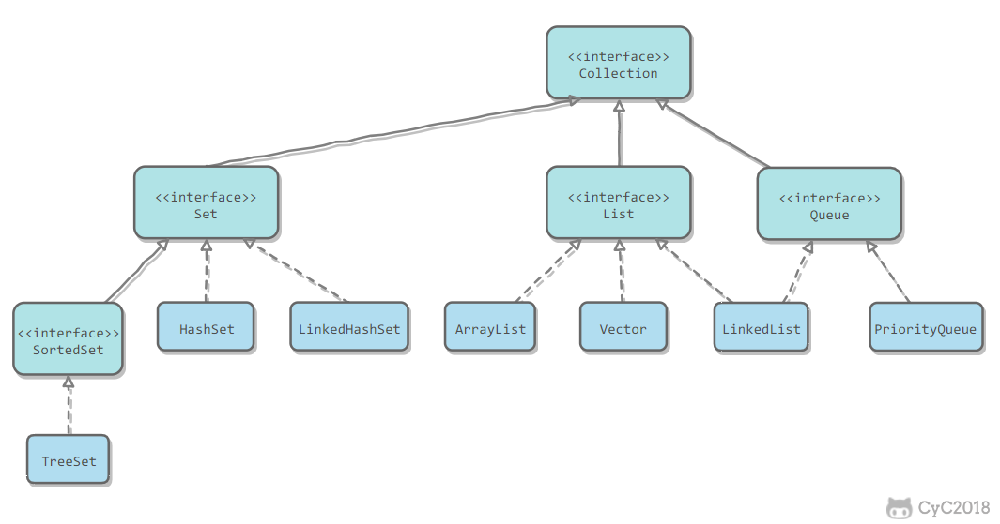
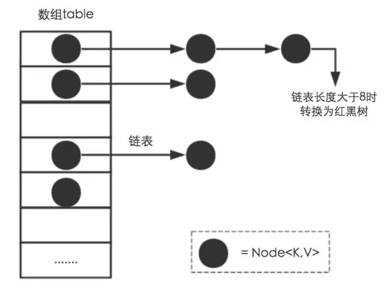
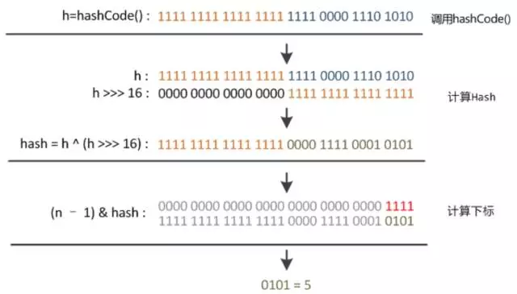
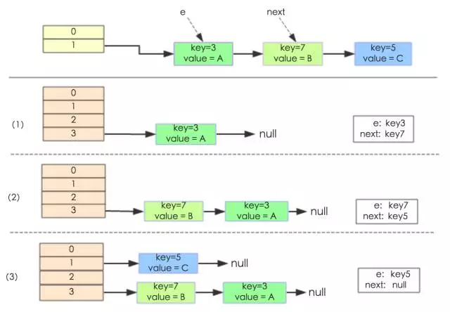
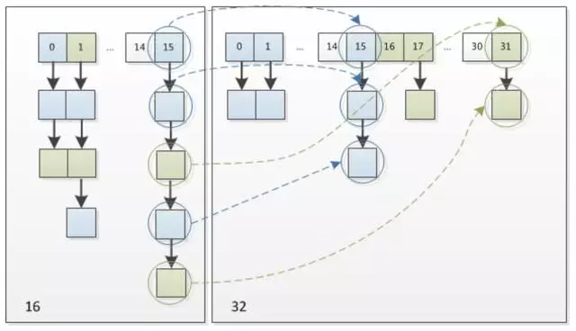
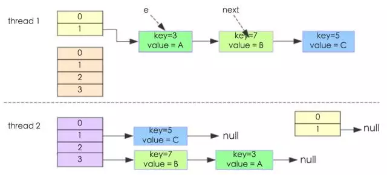
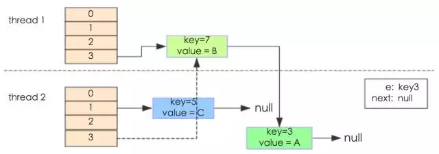
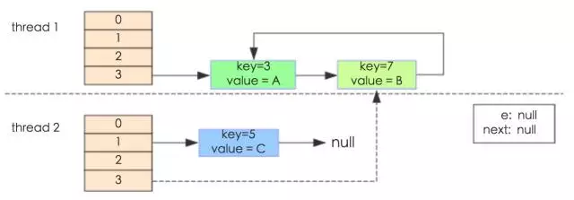

# Java容器

## 概览

容器主要包括 Collection 和 Map 两种，Collection 存储着对象的集合，而 Map 存储着键值对（两个对象）的映射表。

### Collection



#### Set

- TreeSet：基于红黑树实现，支持元素大小有序，例如根据一个范围查找元素的操作。但是查找效率不如 HashSet，HashSet 查找的时间复杂度为 O(1)，TreeSet 则为 O(logN)。
- HashSet：基于哈希表实现，支持快速查找，但不支持有序性操作。并且失去了元素的插入顺序信息，也就是说使用 Iterator 遍历 HashSet 得到的结果是不确定的。
- LinkedHashSet：具有 HashSet 的查找效率，且内部使用双向链表维护元素的插入顺序。

#### List

- ArrayList：基于动态数组实现，支持随机访问。
- Vector：和 ArrayList 类似，但它是线程安全的。
- LinkedList：基于双向链表实现，只能顺序访问，但是可以快速地在链表中间插入和删除元素。不仅如此，LinkedList 还可以用作栈、队列和双向队列。

#### Queue

- LinkedList：可以用它来实现双向队列。
- PriorityQueue：基于堆结构实现，可以用它来实现优先队列。

### Map

[]

- TreeMap：基于红黑树实现。TreeMap实现SortedMap接口，能够把它保存的记录根据键排序，默认是按键值的升序排序，也可以指定排序的比较器，当用Iterator遍历TreeMap时，得到的记录是排过序的。如果使用排序的映射，建议使用TreeMap。在使用TreeMap时，key必须实现Comparable接口或者在构造TreeMap传入自定义的Comparator，否则会在运行时抛出java.lang.ClassCastException类型的异常。
- HashMap：基于哈希表实现。HashMap最多只允许一条记录的键为null，允许多条记录的值为null。HashMap非线程安全，即任一时刻可以有多个线程同时写HashMap，可能会导致数据的不一致。如果需要满足线程安全，可以用 Collections的synchronizedMap方法使HashMap具有线程安全的能力，或者使用ConcurrentHashMap。
- HashTable：和 HashMap 类似，但它是线程安全的，这意味着同一时刻多个线程可以同时写入 HashTable 并且不会导致数据不一致。它是遗留类，不应该去使用它。现在可以使用 ConcurrentHashMap 来支持线程安全，并且 ConcurrentHashMap 的效率会更高，因为 ConcurrentHashMap 引入了分段锁。
- LinkedHashMap：使用双向链表来维护元素的顺序，顺序为插入顺序或者最近最少使用（LRU）顺序（在构造时带参数）。

## 比较器Comparable和Comparator的区别

- Comparable接口实际上是出自java.lang包 它有一个 `compareTo(Object obj)`方法用来排序
- Comparator接口实际上是出自 java.util包它有一个`compare(Object obj1, Object obj2)`方法用来排序

一般我们需要对一个集合使用自定义排序时，我们就要重写`compareTo()`方法或`compare()`方法，当我们需要对某一个集合实现两种排序方式，比如一个song对象中的歌名和歌手名分别采用一种排序方法的话，我们可以重写`compareTo()`方法和使用自制的Comparator方法或者以两个Comparator来实现歌名排序和歌星名排序，第二种代表我们只能使用两个参数版的 `Collections.sort()`.

### Comparator定制排序

```Java
        ArrayList<Integer> arrayList = new ArrayList<Integer>();
        arrayList.add(-1);
        arrayList.add(3);
        arrayList.add(3);
        arrayList.add(-5);
        arrayList.add(7);
        arrayList.add(4);
        arrayList.add(-9);
        arrayList.add(-7);
        System.out.println("原始数组:");
        System.out.println(arrayList);
        // void reverse(List list)：反转
        Collections.reverse(arrayList);
        System.out.println("Collections.reverse(arrayList):");
        System.out.println(arrayList);

        // void sort(List list),按自然排序的升序排序
        Collections.sort(arrayList);
        System.out.println("Collections.sort(arrayList):");
        System.out.println(arrayList);
        // 定制排序的用法
        Collections.sort(arrayList, new Comparator<Integer>() {

            @Override
            public int compare(Integer o1, Integer o2) {
                return o2.compareTo(o1);
            }
        });
        System.out.println("定制排序后：");
        System.out.println(arrayList);
```

Output:

```Java
原始数组:
[-1, 3, 3, -5, 7, 4, -9, -7]
Collections.reverse(arrayList):
[-7, -9, 4, 7, -5, 3, 3, -1]
Collections.sort(arrayList):
[-9, -7, -5, -1, 3, 3, 4, 7]
定制排序后：
[7, 4, 3, 3, -1, -5, -7, -9]
```

### 重写compareTo方法实现按年龄来排序

```Java
// person对象没有实现Comparable接口，所以必须实现，这样才不会出错，才可以使treemap中的数据按顺序排列
// 前面一个例子的String类已经默认实现了Comparable接口，详细可以查看String类的API文档，另外其他
// 像Integer类等都已经实现了Comparable接口，所以不需要另外实现了

public  class Person implements Comparable<Person> {
    private String name;
    private int age;

    public Person(String name, int age) {
        super();
        this.name = name;
        this.age = age;
    }

    public String getName() {
        return name;
    }

    public void setName(String name) {
        this.name = name;
    }

    public int getAge() {
        return age;
    }

    public void setAge(int age) {
        this.age = age;
    }

    /**
     * TODO重写compareTo方法实现按年龄来排序
     */
    @Override
    public int compareTo(Person o) {
        // TODO Auto-generated method stub
        if (this.age > o.getAge()) {
            return 1;
        } else if (this.age < o.getAge()) {
            return -1;
        }
        return age;
    }
}
    public static void main(String[] args) {
        TreeMap<Person, String> pdata = new TreeMap<Person, String>();
        pdata.put(new Person("张三", 30), "zhangsan");
        pdata.put(new Person("李四", 20), "lisi");
        pdata.put(new Person("王五", 10), "wangwu");
        pdata.put(new Person("小红", 5), "xiaohong");
        // 得到key的值的同时得到key所对应的值
        Set<Person> keys = pdata.keySet();
        for (Person key : keys) {
            System.out.println(key.getAge() + "-" + key.getName());

        }
    }
```

Output：

```Java
5-小红
10-王五
20-李四
30-张三
```

## 快速失败和安全失败

我们都接触 HashMap、ArrayList 这些集合类，这些在 java.util 包的集合类就都是快速失败的；而 java.util.concurrent 包下的类都是安全失败，比如：ConcurrentHashMap。

**快速失败（fail-fast）**

在使用迭代器对集合对象进行遍历的时候，如果 A 线程正在对集合进行遍历，此时 B 线程对集合进行修改（**增加、删除、修改**），或者 A 线程在遍历过程中对集合进行修改，都会导致 A 线程抛出 ConcurrentModificationException 异常。

原因是迭代器在遍历时直接访问集合中的内容，并且在遍历过程中使用一个 modCount 变量。集合在被遍历期间如果内容发生变化，就会改变 modCount 的值。

每当迭代器使用 hashNext()/next() 遍历下一个元素之前，都会检测 modCount 变量是否为 expectedModCount 值，是的话就返回遍历；否则抛出异常，终止遍历。

**安全失败（fail-safe）**

明白了什么是快速失败之后，安全失败也是非常好理解的。

采用安全失败机制的集合容器，在遍历时不是直接在集合内容上访问的，而是先复制原有集合内容，在拷贝的集合上进行遍历。

由于迭代时是对原集合的拷贝进行遍历，所以在遍历过程中对原集合所作的修改并不能被迭代器检测到，故不会抛 ConcurrentModificationException 异常。

最后说明一下，**快速失败和安全失败是对迭代器而言的**。并发环境下建议使用 java.util.concurrent 包下的容器类，除非没有修改操作。

## HashMap

### 摘要

HashMap是Java程序员使用频率最高的用于映射(键值对)处理的数据类型。随着JDK版本的更新，JDK1.8对HashMap底层的实现进行了优化，例如引入红黑树的数据结构和扩容的优化等。

### 简介

**存储结构-字段**

从结构实现来讲，HashMap是数组+链表+红黑树（JDK1.8增加了红黑树部分）实现的，如下如所示。



这里需要讲明白两个问题：数据底层具体存储的是什么？这样的存储方式有什么优点呢？

(1) 从源码可知，HashMap类中有一个非常重要的字段，就是 Node[] table，即哈希桶数组，明显它是一个Node的数组。我们来看Node[JDK1.8]是何物。

```Java
static class Node<K,V> implements Map.Entry<K,V> {
        final int hash;    //用来定位数组索引位置
        final K key;
        V value;
        Node<K,V> next;   //链表的下一个node

        Node(int hash, K key, V value, Node<K,V> next) { ... }
        public final K getKey(){ ... }
        public final V getValue() { ... }
        public final String toString() { ... }
        public final int hashCode() { ... }
        public final V setValue(V newValue) { ... }
        public final boolean equals(Object o) { ... }
}
```

Node是HashMap的一个内部类，实现了Map.Entry接口，本质是就是一个映射(键值对)。上图中的每个黑色圆点就是一个Node对象。

(2) HashMap就是使用哈希表来存储的。哈希表为解决冲突，可以采用开放地址法和链地址法等来解决问题，Java中HashMap采用了链地址法。链地址法，简单来说，就是数组加链表的结合。在每个数组元素上都一个链表结构，当数据被Hash后，得到数组下标，把数据放在对应下标元素的链表上。例如程序执行下面代码：

```Java
 map.put("美团","小美");
```

系统将调用"美团"这个key的hashCode()方法得到其hashCode 值（该方法适用于每个Java对象），然后再通过Hash算法的后两步运算（高位运算和取模运算，下文有介绍）来定位该键值对的存储位置，有时两个key会定位到相同的位置，表示发生了Hash碰撞。当然Hash算法计算结果越分散均匀，Hash碰撞的概率就越小，map的存取效率就会越高。

如果哈希桶数组很大，即使较差的Hash算法也会比较分散，如果哈希桶数组数组很小，即使好的Hash算法也会出现较多碰撞，所以就需要在空间成本和时间成本之间权衡，其实就是在根据实际情况确定哈希桶数组的大小，并在此基础上设计好的hash算法减少Hash碰撞。那么通过什么方式来控制map使得Hash碰撞的概率又小，哈希桶数组（Node[] table）占用空间又少呢？答案就是好的Hash算法和扩容机制。

在理解Hash和扩容流程之前，我们得先了解下HashMap的几个字段。从HashMap的默认构造函数源码可知，构造函数就是对下面几个字段进行初始化，源码如下：

```Java
int threshold;             //所能容纳的key-value对极限 
final float loadFactor;    //负载因子
int modCount;  			   //记录HashMap内部结构发生变化的次数
int size;				   //HashMap中实际存在的键值对数量
```

首先，Node[] table的初始化长度length(默认值是16)，Load factor为负载因子(默认值是0.75)，threshold是HashMap所能容纳的最大数据量的Node(键值对)个数。threshold = length * Load factor。也就是说，在数组定义好长度之后，负载因子越大，所能容纳的键值对个数越多。

结合负载因子的定义公式可知，threshold就是在此Load factor和length(数组长度)对应下允许的最大元素数目，超过这个数目就重新resize(扩容)，扩容后的HashMap容量是之前容量的两倍。默认的负载因子0.75是对空间和时间效率的一个平衡选择，建议大家不要修改，除非在时间和空间比较特殊的情况下，如果内存空间很多而又对时间效率要求很高，可以降低负载因子Load factor的值；相反，如果内存空间紧张而对时间效率要求不高，可以增加负载因子loadFactor的值，这个值可以大于1。

size这个字段其实很好理解，就是HashMap中实际存在的键值对数量。注意和table的长度length、容纳最大键值对数量threshold的区别。而modCount字段主要用来记录HashMap内部结构发生变化的次数，主要用于迭代的快速失败。强调一点，内部结构发生变化指的是结构发生变化，例如put新键值对，但是某个key对应的value值被覆盖不属于结构变化。

在HashMap中，哈希桶数组table的长度length大小必须为2的n次方(一定是合数)，这是一种非常规的设计，常规的设计是把桶的大小设计为素数。相对来说素数导致冲突的概率要小于合数，具体证明可以参考http://blog.csdn.net/liuqiyao_01/article/details/14475159，Hashtable初始化桶大小为11，就是桶大小设计为素数的应用（Hashtable扩容后不能保证还是素数）。HashMap采用这种非常规设计，主要是为了在取模和扩容时做优化，同时为了减少冲突，HashMap定位哈希桶索引位置时，也加入了高位参与运算的过程。

这里存在一个问题，即使负载因子和Hash算法设计的再合理，也免不了会出现拉链过长的情况，一旦出现拉链过长，则会严重影响HashMap的性能。于是，在JDK1.8版本中，对数据结构做了进一步的优化，引入了红黑树。而当链表长度太长（默认超过8）时，链表就转换为红黑树，利用红黑树快速增删改查的特点提高HashMap的性能，其中会用到红黑树的插入、删除、查找等算法。本文不再对红黑树展开讨论，想了解更多红黑树数据结构的工作原理可以参考http://blog.csdn.net/v_july_v/article/details/6105630。

**功能实现-方法**

HashMap的内部功能实现很多，本文主要从根据key获取哈希桶数组索引位置、put方法的详细执行、扩容过程三个具有代表性的点深入展开讲解。

1、确定哈希桶数组索引位置

不管增加、删除、查找键值对，定位到哈希桶数组的位置都是很关键的第一步。前面说过HashMap的数据结构是数组和链表的结合，所以我们当然希望这个HashMap里面的元素位置尽量分布均匀些，尽量使得每个位置上的元素数量只有一个，那么当我们用hash算法求得这个位置的时候，马上就可以知道对应位置的元素就是我们要的，不用遍历链表，大大优化了查询的效率。HashMap定位数组索引位置，直接决定了hash方法的离散性能。先看看源码的实现(方法一+方法二):

```Java
方法一：
static final int hash(Object key) {   //jdk1.8 & jdk1.7
     int h;
     // h = key.hashCode() 为第一步 取hashCode值
     // h ^ (h >>> 16)  为第二步 高位参与运算
     return (key == null) ? 0 : (h = key.hashCode()) ^ (h >>> 16);
}
方法二：
static int indexFor(int h, int length) {  //jdk1.7的源码，jdk1.8没有这个方法，但是实现原理一样的
     return h & (length-1);  //第三步 取模运算
}
```

这里的Hash算法本质上就是三步：取key的hashCode值、高位运算、取模运算。

对于任意给定的对象，只要它的hashCode()返回值相同，那么程序调用方法一所计算得到的Hash码值总是相同的。我们首先想到的就是把hash值对数组长度取模运算，这样一来，元素的分布相对来说是比较均匀的。但是，模运算的消耗还是比较大的，在HashMap中是这样做的：调用方法二来计算该对象应该保存在table数组的哪个索引处。

这个方法非常巧妙，它通过h & (table.length -1)来得到该对象的保存位，而HashMap底层数组的长度总是2的n次方，这是HashMap在速度上的优化。当length总是2的n次方时，h& (length-1)运算等价于对length取模，也就是h%length，但是&比%具有更高的效率。

在JDK1.8的实现中，优化了高位运算的算法，通过hashCode()的高16位异或低16位实现的：(h = k.hashCode()) ^ (h >>> 16)，主要是从速度、功效、质量来考虑的，这么做可以在数组table的length比较小的时候，也能保证考虑到高低Bit都参与到Hash的计算中，同时不会有太大的开销。

下面举例说明下，n为table的长度。



2、分析HashMap的put方法

HashMap的put方法执行过程可以通过下图来理解，自己有兴趣可以去对比源码更清楚地研究学习。


①.判断键值对数组table[i]是否为空或为null，否则执行resize()进行扩容；

②.根据键值key计算hash值得到插入的数组索引i，如果table[i]==null，直接新建节点添加，转向⑥，如果table[i]不为空，转向③；

③.判断table[i]的首个元素是否和key一样，如果相同直接覆盖value，否则转向④，这里的相同指的是hashCode以及equals；

④.判断table[i] 是否为treeNode，即table[i] 是否是红黑树，如果是红黑树，则直接在树中插入键值对，否则转向⑤；

⑤.遍历table[i]，判断链表长度是否大于8，大于8的话把链表转换为红黑树，在红黑树中执行插入操作，否则进行链表的插入操作；遍历过程中若发现key已经存在直接覆盖value即可；

⑥.插入成功后，判断实际存在的键值对数量size是否超多了最大容量

threshold，如果超过，进行扩容。

JDK1.8HashMap的put方法源码如下:

```Java
public V put(K key, V value) {
     // 对key的hashCode()做hash
     return putVal(hash(key), key, value, false, true);
 }
 
 final V putVal(int hash, K key, V value, boolean onlyIfAbsent,
                boolean evict) {
     Node<K,V>[] tab; Node<K,V> p; int n, i;
     // 步骤①：tab为空则创建
     if ((tab = table) == null || (n = tab.length) == 0)
         n = (tab = resize()).length;
     // 步骤②：计算index，并对null做处理 
     if ((p = tab[i = (n - 1) & hash]) == null) 
         tab[i] = newNode(hash, key, value, null);
     else {
         Node<K,V> e; K k;
         // 步骤③：节点key存在，直接覆盖value
         if (p.hash == hash &&
             ((k = p.key) == key || (key != null && key.equals(k))))
             e = p;
         // 步骤④：判断该链为红黑树
         else if (p instanceof TreeNode)
             e = ((TreeNode<K,V>)p).putTreeVal(this, tab, hash, key, value);
         // 步骤⑤：该链为链表
         else {
             for (int binCount = 0; ; ++binCount) {
                 if ((e = p.next) == null) {
                     p.next = newNode(hash, key,value,null);
                        //链表长度大于8转换为红黑树进行处理
                     if (binCount >= TREEIFY_THRESHOLD - 1) // -1 for 1st  
                         treeifyBin(tab, hash);
                     break;
                 }
                 // key已经存在直接覆盖value
                 if (e.hash == hash &&
                     ((k = e.key) == key || (key != null && key.equals(k)))) 
							break;
                 p = e;
             }
         }
         
         if (e != null) { // existing mapping for key
             V oldValue = e.value;
             if (!onlyIfAbsent || oldValue == null)
                 e.value = value;
             afterNodeAccess(e);
             return oldValue;
         }
     }

     ++modCount;
     // 步骤⑥：超过最大容量 就扩容
     if (++size > threshold)
         resize();
     afterNodeInsertion(evict);
     return null;
}
```

3、扩容机制

扩容(resize)就是重新计算容量，向HashMap对象里不停的添加元素，而HashMap对象内部的数组无法装载更多的元素时，对象就需要扩大数组的长度，以便能装入更多的元素。当然Java里的数组是无法自动扩容的，方法是使用一个新的数组代替已有的容量小的数组，就像我们用一个小桶装水，如果想装更多的水，就得换大水桶。

我们分析下resize的源码，鉴于JDK1.8融入了红黑树，较复杂，为了便于理解我们仍然使用JDK1.7的代码，好理解一些，本质上区别不大，具体区别后文再说。

```Java
void resize(int newCapacity) {   //传入新的容量
     Entry[] oldTable = table;    //引用扩容前的Entry数组
     int oldCapacity = oldTable.length;         
     if (oldCapacity == MAXIMUM_CAPACITY) {  //扩容前的数组大小如果已经达到最大(2^30)了
         threshold = Integer.MAX_VALUE; //修改阈值为int的最大值(2^31-1)，这样以后就不会扩容了
         return;
     }
  
     Entry[] newTable = new Entry[newCapacity];  //初始化一个新的Entry数组
     transfer(newTable);                         //！！将数据转移到新的Entry数组里
     table = newTable;                           //HashMap的table属性引用新的Entry数组
     threshold = (int)(newCapacity * loadFactor);//修改阈值
}
```

这里就是使用一个容量更大的数组来代替已有的容量小的数组，transfer()方法将原有Entry数组的元素拷贝到新的Entry数组里。

```Java
void transfer(Entry[] newTable) {
    Entry[] src = table;                   //src引用了旧的Entry数组
    int newCapacity = newTable.length;
    for (int j = 0; j < src.length; j++) { //遍历旧的Entry数组
        Entry<K,V> e = src[j];             //取得旧Entry数组的每个元素
        if (e != null) {
            src[j] = null;//释放旧Entry数组的对象引用（for循环后，旧的Entry数组不再引用任何对象）
            do {
                Entry<K,V> next = e.next;
                int i = indexFor(e.hash, newCapacity); //！！重新计算每个元素在数组中的位置
                e.next = newTable[i]; //标记[1]
                newTable[i] = e;      //将元素放在数组上
                e = next;             //访问下一个Entry链上的元素
            } while (e != null);
        }
    }
} 
```

newTable[i]的引用赋给了e.next，也就是使用了单链表的头插入方式，同一位置上新元素总会被放在链表的头部位置；这样先放在一个索引上的元素终会被放到Entry链的尾部(如果发生了hash冲突的话），这一点和Jdk1.8有区别，下文详解。在旧数组中同一条Entry链上的元素，通过重新计算索引位置后，有可能被放到了新数组的不同位置上。

下面举个例子说明下扩容过程。假设了我们的hash算法就是简单的用key mod 一下表的大小（也就是数组的长度）。其中的哈希桶数组table的size=2， 所以key = 3、7、5，put顺序依次为 5、7、3。在mod 2以后都冲突在table[1]这里了。这里假设负载因子 loadFactor=1，即当键值对的实际大小size 大于 table的实际大小时进行扩容。接下来的三个步骤是哈希桶数组 resize成4，然后所有的Node重新rehash的过程。



下面我们讲解下JDK1.8做了哪些优化。经过观测可以发现，我们使用的是2次幂的扩展(指长度扩为原来2倍)，所以，元素的位置要么是在原位置，要么是在原位置再移动2次幂的位置。看下图可以明白这句话的意思，n为table的长度，图（a）表示扩容前的key1和key2两种key确定索引位置的示例，图（b）表示扩容后key1和key2两种key确定索引位置的示例，其中hash1是key1对应的哈希与高位运算结果。


元素在重新计算hash之后，因为n变为2倍，那么n-1的mask范围在高位多1bit(红色)，因此新的index就会发生这样的变化：


因此，我们在扩充HashMap的时候，不需要像JDK1.7的实现那样重新计算hash，只需要看看原来的hash值新增的那个bit是1还是0就好了，是0的话索引没变，是1的话索引变成“原索引+oldCap”，可以看看下图为16扩充为32的resize示意图：



这个设计确实非常的巧妙，既省去了重新计算hash值的时间，而且同时，由于新增的1bit是0还是1可以认为是随机的，因此resize的过程，均匀的把之前的冲突的节点分散到新的bucket了。这一块就是JDK1.8新增的优化点。有一点注意区别，JDK1.7中rehash的时候，旧链表迁移新链表的时候，如果在新表的数组索引位置相同，则链表元素会倒置，但是从上图可以看出，JDK1.8不会倒置。有兴趣的同学可以研究下JDK1.8的resize源码，写的很赞。

**线程安全性**

在多线程使用场景中，应该尽量避免使用线程不安全的HashMap，而使用线程安全的ConcurrentHashMap。那么为什么说HashMap是线程不安全的，下面举例子说明在并发的多线程使用场景中使用HashMap可能造成死循环。代码例子如下(便于理解，仍然使用JDK1.7的环境)：

```Java
public class HashMapInfiniteLoop {  
    private static HashMap<Integer,String> map = new HashMap<Integer,String>(2，0.75f); 
    public static void main(String[] args) {  
        map.put(5， "C");  

        new Thread("Thread1") {  
            public void run() {  
                map.put(7, "B");  
                System.out.println(map);  
            };  
        }.start();  
        new Thread("Thread2") {  
            public void run() {  
                map.put(3, "A);  
                System.out.println(map);  
            };  
        }.start();        
    }  
} 
```

其中，map初始化为一个长度为2的数组，loadFactor=0.75，threshold=2*0.75=1，也就是说当put第二个key的时候，map就需要进行resize。

通过设置断点让线程1和线程2同时debug到transfer方法的首行。注意此时两个线程已经成功添加数据。放开thread1的断点至transfer方法的“Entry next = e.next;” 这一行；然后放开线程2的的断点，让线程2进行resize。结果如下图。



注意，Thread1的 e 指向了key(3)，而next指向了key(7)，其在线程二rehash后，指向了线程二重组后的链表。

线程一被调度回来执行，先是执行 newTalbe[i] = e， 然后是e = next，导致了e指向了key(7)，而下一次循环的next = e.next导致了next指向了key(3)。



e.next = newTable[i] 导致 key(3).next 指向了 key(7)。注意：此时的key(7).next 已经指向了key(3)， 环形链表就这样出现了。



于是，当我们用线程一调用map.get(11)时，悲剧就出现了——Infinite Loop。这种情况下死循环发生的根本原因在于头插的方式变化了同种链表节点的顺序。

**JDK1.8与JDK1.7的性能对比**

hash碰撞的情况下，多个键值对都集中到一个桶中，或者在一个链表中，或者在一个红黑树中，时间复杂度分别为O(n)和O(lgn)。 鉴于JDK1.8做了多方面的优化，总体性能优于JDK1.7。

## LinkedHashMap

以下是使用 LinkedHashMap 实现的一个 LRU 缓存：

- 设定最大缓存空间 MAX_ENTRIES 为 3；
- 使用 LinkedHashMap 的构造函数将 accessOrder 设置为 true，开启 LRU 顺序；
- 覆盖 removeEldestEntry() 方法实现，在节点多于 MAX_ENTRIES 就会将最近最久未使用的数据移除。

```Java
class LRUCache<K, V> extends LinkedHashMap<K, V> {
    private static final int MAX_ENTRIES = 3;

    protected boolean removeEldestEntry(Map.Entry eldest) {
        return size() > MAX_ENTRIES;
    }

    LRUCache() {
        super(MAX_ENTRIES, 0.75f, true);
    }
}
public static void main(String[] args) {
    LRUCache<Integer, String> cache = new LRUCache<>();
    cache.put(1, "a");
    cache.put(2, "b");
    cache.put(3, "c");
    cache.get(1);
    cache.put(4, "d");
    System.out.println(cache.keySet());
}
```
```Java
[3, 1, 4]
```

## ConcurrentHashMap

**存储结构**

```Java
static final class HashEntry<K,V> {
    final int hash;
    final K key;
    volatile V value;
    volatile HashEntry<K,V> next;
}
```

ConcurrentHashMap 和 HashMap 实现上类似，最主要的差别是 ConcurrentHashMap 采用了分段锁（Segment），每个分段锁维护着几个桶（HashEntry），多个线程可以同时访问不同分段锁上的桶，从而使其并发度更高（并发度就是 Segment 的个数）。

Segment 继承自 ReentrantLock。

```Java
static final class Segment<K,V> extends ReentrantLock implements Serializable {

    private static final long serialVersionUID = 2249069246763182397L;

    static final int MAX_SCAN_RETRIES =
        Runtime.getRuntime().availableProcessors() > 1 ? 64 : 1;

    transient volatile HashEntry<K,V>[] table;

    transient int count;

    transient int modCount;

    transient int threshold;

    final float loadFactor;
}
final Segment<K,V>[] segments;
```

默认的并发级别为 16，也就是说默认创建 16 个 Segment。

```Java
static final int DEFAULT_CONCURRENCY_LEVEL = 16;
```


**size 操作**

每个 Segment 维护了一个 count 变量来统计该 Segment 中的键值对个数。在执行 size 操作时，需要遍历所有 Segment 然后把 count 累计起来。

ConcurrentHashMap 在执行 size 操作时先尝试不加锁，如果连续两次不加锁操作得到的结果一致，那么可以认为这个结果是正确的。

尝试次数使用 RETRIES_BEFORE_LOCK 定义，该值为 2，retries 初始值为 -1，因此尝试次数为 3。

如果尝试的次数超过 3 次，就需要对每个 Segment 加锁。

**JDK 1.8 的改动**

JDK 1.7 使用分段锁机制来实现并发更新操作，核心类为 Segment，它继承自重入锁 ReentrantLock，并发度与 Segment 数量相等。

JDK 1.8 使用了 CAS 操作来支持更高的并发度，在 CAS 操作失败时使用内置锁 synchronized。

并且 JDK 1.8 的实现也在链表过长时会转换为红黑树。

