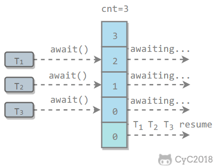

# Java并发

## 线程状态转换


## sleep和wait的区别

* sleep是Thread类的方法，wait是Object类中定义的方法
* sleep方法可以在任何地方使用
* wait只能在synchronized方法或synchronized块中使用
* sleep只会让出CPU，不会导致锁行为的改变；wait不仅让出CPU，还会释放已经占有的同步资源锁

## 创建线程

有三种使用线程的方法：

- 实现 Runnable 接口；
- 实现 Callable 接口；
- 继承 Thread 类。

实现 Runnable 和 Callable 接口的类只能当做一个可以在线程中运行的任务，不是真正意义上的线程，因此最后还需要通过 Thread 来调用。可以说任务是通过线程驱动从而执行的。

### 实现 Runnable 接口

需要实现 run() 方法。

通过 Thread 调用 start() 方法来启动线程。

```Java
public class MyRunnable implements Runnable {
    public void run() {
        // ...
    }
}
public static void main(String[] args) {
    MyRunnable instance = new MyRunnable();
    Thread thread = new Thread(instance);
    thread.start();
}
```

### 实现 Callable 接口

与 Runnable 相比，Callable 可以有返回值，返回值通过 FutureTask 进行封装。

```Java
public class MyCallable implements Callable<Integer> {
    public Integer call() {
        return 123;
    }
}
public static void main(String[] args) throws ExecutionException, InterruptedException {
    MyCallable mc = new MyCallable();
    FutureTask<Integer> ft = new FutureTask<>(mc);
    Thread thread = new Thread(ft);
    thread.start();
    System.out.println(ft.get());
}
```

### 继承 Thread 类

同样也是需要实现 run() 方法，因为 Thread 类也实现了 Runable 接口。

当调用 start() 方法启动一个线程时，虚拟机会将该线程放入就绪队列中等待被调度，当一个线程被调度时会执行该线程的 run() 方法。

```Java
public class MyThread extends Thread {
    public void run() {
        // ...
    }
}
public static void main(String[] args) {
    MyThread mt = new MyThread();
    mt.start();
}
```

## Daemon

守护线程是程序运行时在后台提供服务的线程（如垃圾回收线程），不属于程序中不可或缺的部分。

当所有非守护线程结束时，程序也就终止，同时会杀死所有守护线程。

main() 属于非守护线程。

使用 setDaemon() 方法将一个线程设置为守护线程。

```Java
public static void main(String[] args) {
    Thread thread = new Thread(new MyRunnable());
    thread.setDaemon(true);
}
```

## 线程池

### 研读ThreadPoolExecutor

看一下该类的构造器：

```Java
public ThreadPoolExecutor(int paramInt1, int paramInt2, long paramLong, TimeUnit paramTimeUnit, BlockingQueue<Runnable> paramBlockingQueue, ThreadFactory paramThreadFactory, RejectedExecutionHandler paramRejectedExecutionHandler) {
		this.ctl = new AtomicInteger(ctlOf(-536870912, 0));
		this.mainLock = new ReentrantLock();
		this.workers = new HashSet();
		this.termination = this.mainLock.newCondition();
		if ((paramInt1 < 0) || (paramInt2 <= 0) || (paramInt2 < paramInt1) || (paramLong < 0L))
			throw new IllegalArgumentException();
		if ((paramBlockingQueue == null) || (paramThreadFactory == null) || (paramRejectedExecutionHandler == null))
			throw new NullPointerException();
		this.corePoolSize = paramInt1;
		this.maximumPoolSize = paramInt2;
		this.workQueue = paramBlockingQueue;
		this.keepAliveTime = paramTimeUnit.toNanos(paramLong);
		this.threadFactory = paramThreadFactory;
		this.handler = paramRejectedExecutionHandler;
	}
```

**corePoolSize**：线程池的核心池大小，在创建线程池之后，线程池默认没有任何线程。

当有任务过来的时候才会去创建线程执行任务。换个说法，线程池创建之后，线程池中的线程数为0，当任务过来就会创建一个线程去执行，直到线程数达到corePoolSize 之后，就会被到达的任务放在队列中。（注意是到达的任务）。换句更精炼的话：corePoolSize 表示线程池中允许同时运行的最大线程数。即便是线程池里没有任何任务，也会有corePoolSize个线程在候着等任务。

如果执行了线程池的prestartAllCoreThreads()方法，线程池会提前创建并启动所有核心线程。

**maximumPoolSize** ：线程池允许的最大线程数，他表示最大能创建多少个线程。maximumPoolSize肯定是大于等于corePoolSize。

**keepAliveTime** :表示线程没有任务时最多保持多久然后停止。默认情况下，只有线程池中线程数大于corePoolSize 时，keepAliveTime 才会起作用。换句话说，当线程池中的线程数大于corePoolSize，并且一个线程空闲时间达到了keepAliveTime，那么就是shutdown。

**Unit**：keepAliveTime 的单位。

**workQueue**：一个阻塞队列，用来存储等待执行的任务，当线程池中的线程数超过它的corePoolSize的时候，线程会进入阻塞队列进行阻塞等待。通过workQueue，线程池实现了阻塞功能。

**threadFactory**：线程工厂，用来创建线程。

**handler**：表示当拒绝处理任务时的策略。

#### 任务缓存队列

在前面我们多次提到了任务缓存队列，即workQueue，它用来存放等待执行的任务。

workQueue的类型为BlockingQueue<Runnable>，通常可以取下面三种类型：

1）有界任务队列ArrayBlockingQueue：基于数组的先进先出队列，此队列创建时必须指定大小；

2）无界任务队列LinkedBlockingQueue：基于链表的先进先出队列，如果创建时没有指定此队列大小，则默认为Integer.MAX_VALUE；

3）直接提交队列synchronousQueue：这个队列比较特殊，它不会保存提交的任务，而是将直接新建一个线程来执行新来的任务。

#### 拒绝策略

AbortPolicy：丢弃任务并抛出RejectedExecutionException

CallerRunsPolicy：只要线程池未关闭，该策略直接在调用者线程中，运行当前被丢弃的任务。显然这样做不会真的丢弃任务，但是，任务提交线程的性能极有可能会急剧下降。

DiscardOldestPolicy：丢弃队列中最老的一个请求，也就是即将被执行的一个任务，并尝试再次提交当前任务。

DiscardPolicy：丢弃任务，不做任何处理。

#### 线程池的任务处理策略：

如果当前线程池中的线程数目小于corePoolSize，则每来一个任务，就会创建一个线程去执行这个任务；

如果当前线程池中的线程数目>=corePoolSize，则每来一个任务，会尝试将其添加到任务缓存队列当中，若添加成功，则该任务会等待空闲线程将其取出去执行；若添加失败（一般来说是任务缓存队列已满），则会尝试创建新的线程去执行这个任务；如果当前线程池中的线程数目达到maximumPoolSize，则会采取任务拒绝策略进行处理；

如果线程池中的线程数量大于 corePoolSize时，如果某线程空闲时间超过keepAliveTime，线程将被终止，直至线程池中的线程数目不大于corePoolSize；如果允许为核心池中的线程设置存活时间，那么核心池中的线程空闲时间超过keepAliveTime，线程也会被终止。

#### 线程池的关闭

ThreadPoolExecutor提供了两个方法，用于线程池的关闭，分别是shutdown()和shutdownNow()，其中：

shutdown()：不会立即终止线程池，而是要等**所有任务缓存队列中的任务都执行完**后才终止，但再**也不会接受新的任务**

shutdownNow()：立即终止线程池，并尝试打断正在执行的任务，并且清空任务缓存队列，返回尚未执行的任务

#### 常见的四种线程池

**newFixedThreadPool**

```Java
public static ExecutorService newFixedThreadPool(int var0) {
		return new ThreadPoolExecutor(var0, var0, 0L, TimeUnit.MILLISECONDS, new LinkedBlockingQueue());
	}

	public static ExecutorService newFixedThreadPool(int var0, ThreadFactory var1) {
		return new ThreadPoolExecutor(var0, var0, 0L, TimeUnit.MILLISECONDS, new LinkedBlockingQueue(), var1);
	}
```

固定大小的线程池，可以指定线程池的大小，该线程池corePoolSize和maximumPoolSize相等，阻塞队列使用的是LinkedBlockingQueue，大小为整数最大值。

该线程池中的线程数量始终不变，当有新任务提交时，线程池中有空闲线程则会立即执行，如果没有，则会暂存到阻塞队列。对于固定大小的线程池，不存在线程数量的变化。同时使用无界的LinkedBlockingQueue来存放执行的任务。当任务提交十分频繁的时候，LinkedBlockingQueue迅速增大，存在着耗尽系统资源的问题。而且在线程池空闲时，即线程池中没有可运行任务时，它也不会释放工作线程，还会占用一定的系统资源，需要shutdown。

**newSingleThreadExecutor**

```Java
public static ExecutorService newSingleThreadExecutor() {
		return new Executors.FinalizableDelegatedExecutorService(
				new ThreadPoolExecutor(1, 1, 0L, TimeUnit.MILLISECONDS, new LinkedBlockingQueue()));
	}

	public static ExecutorService newSingleThreadExecutor(ThreadFactory var0) {
		return new Executors.FinalizableDelegatedExecutorService(
				new ThreadPoolExecutor(1, 1, 0L, TimeUnit.MILLISECONDS, new LinkedBlockingQueue(), var0));
	}
```

单个线程线程池，只有一个线程的线程池，阻塞队列使用的是LinkedBlockingQueue,若有多余的任务提交到线程池中，则会被暂存到阻塞队列，待空闲时再去执行。按照先入先出的顺序执行任务。

**newCachedThreadPool**

```Java
public static ExecutorService newCachedThreadPool() {
		return new ThreadPoolExecutor(0, 2147483647, 60L, TimeUnit.SECONDS, new SynchronousQueue());
	}

	public static ExecutorService newCachedThreadPool(ThreadFactory var0) {
		return new ThreadPoolExecutor(0, 2147483647, 60L, TimeUnit.SECONDS, new SynchronousQueue(), var0);
	}
```

缓存线程池，缓存的线程默认存活60秒。线程的核心池corePoolSize大小为0，核心池最大为Integer.MAX_VALUE,阻塞队列使用的是SynchronousQueue。是一个直接提交的阻塞队列，他总会迫使线程池增加新的线程去执行新的任务。在没有任务执行时，当线程的空闲时间超过keepAliveTime（60秒），则工作线程将会终止被回收，当提交新任务时，如果没有空闲线程，则创建新线程执行任务，会导致一定的系统开销。如果同时有大量任务被提交，而且任务执行的时间不是特别快，那么线程池便会新增出等量的线程池处理任务，这很可能会很快耗尽系统的资源。

**newScheduledThreadPool**

```Java
public static ScheduledExecutorService newScheduledThreadPool(int var0) {
        return new ScheduledThreadPoolExecutor(var0);
    }

    public static ScheduledExecutorService newScheduledThreadPool(int var0, ThreadFactory var1) {
        return new ScheduledThreadPoolExecutor(var0, var1);
    }
```

定时线程池，该线程池可用于周期性地去执行任务，通常用于周期性的同步数据。

scheduleAtFixedRate:是以固定的频率去执行任务，周期是指每次执行任务成功执行之间的间隔。

schedultWithFixedDelay:是以固定的延时去执行任务，延时是指上一次执行成功之后和下一次开始执行的之前的时间。

#### 如何选择线程池线程数量

**线程池的大小决定着系统的性能，过大或者过小的线程池数量都无法发挥最优的系统性能。**

当然线程池的大小也不需要做的太过于精确，只需要避免过大和过小的情况。一般来说，确定线程池的大小需要考虑CPU的数量，内存大小，任务是计算密集型还是IO密集型等因素

**NCPU = CPU的数量**

**UCPU = 期望对CPU的使用率 0 ≤ UCPU ≤ 1**

**W/C = 等待时间与计算时间的比率**

**如果希望处理器达到理想的使用率，那么线程池的最优大小为：**

**线程池大小=NCPU \*UCPU(1+W/C)**

## 控制线程执行的顺序

**方法一：join**
```Java
public class Test {
	public static void main(String[] args) throws InterruptedException {
		Thread t1 = new Thread(new MyThread1());
		Thread t2 = new Thread(new MyThread2());
		Thread t3 = new Thread(new MyThread3());
		t1.start();
		t1.join();
		t2.start();
		t2.join();
		t3.start();
	}
}

class MyThread1 implements Runnable {
	@Override
	public void run() {
		System.out.println("I am thread 1");
	}
}

class MyThread2 implements Runnable {
	@Override
	public void run() {
		System.out.println("I am thread 2");
	}
}

class MyThread3 implements Runnable {
	@Override
	public void run() {
		System.out.println("I am thread 3");
	}
}
```
join方法：让主线程等待子线程运行结束后再继续运行

有了join方法的帮忙，线程123就能按照指定的顺序执行了。

我们来看看示例当中主线程与子线程的执行顺序。在main方法中，先是调用了t1.start方法，启动t1线程，随后调用t1的join方法，main所在的主线程就需要等待t1子线程中的run方法运行完成后才能继续运行，所以主线程卡在t2.start方法之前等待t1程序。等t1运行完后，主线程重新获得主动权，继续运行t2.start和t2.join方法，与t1子线程类似，main主线程等待t2完成后继续执行，如此执行下去，join方法就有效的解决了执行顺序问题。因为在同一个时间点，各个线程是同步状态。

当然解决方法不止一个：

**方法二：Excutors.newSingleThreadExecutor()**

```Java
import java.util.concurrent.ExecutorService;
import java.util.concurrent.Executors;

public class Test {
	private static ExecutorService executor = Executors.newSingleThreadExecutor();

	public static void main(String[] args) throws InterruptedException {
		Thread t1 = new Thread(new MyThread1());
		Thread t2 = new Thread(new MyThread2());
		Thread t3 = new Thread(new MyThread3());
		executor.submit(t1);
		executor.submit(t2);
		executor.submit(t3);
		executor.shutdown();
	}
}

class MyThread1 implements Runnable {
	@Override
	public void run() {
		System.out.println("I am thread 1");
	}
}

class MyThread2 implements Runnable {
	@Override
	public void run() {
		System.out.println("I am thread 2");
	}
}

class MyThread3 implements Runnable {
	@Override
	public void run() {
		System.out.println("I am thread 3");
	}
}
```
利用并发包里的Excutors的newSingleThreadExecutor产生一个单线程的线程池，而这个线程池的底层原理就是一个先进先出（FIFO）的队列。代码中executor.submit依次添加了123线程，按照FIFO的特性，执行顺序也就是123的执行结果，从而保证了执行顺序。

**方法三：wait()和notify()**
```Java
public class QueueThread implements Runnable{
	private Object current;
	private Object next;
	private int max=100;
	private String word;
	public QueueThread(Object current, Object next, String word) {
		this.current = current;
		this.next = next;
		this.word = word;
	}
	@Override
	public void run() {
		// TODO Auto-generated method stub
		for(int i=0;i<max;i++){
			synchronized (current) {
				synchronized (next) {
					System.out.println(word);
					next.notify();
				}
				try {
					current.wait();
				} catch (InterruptedException e) {
					// TODO Auto-generated catch block
					e.printStackTrace();
				}
			}
		}
		//必须做一下这样处理，否则thread1-thread4停不了
		synchronized (next) {
			next.notify();
			System.out.println(Thread.currentThread().getName()+"执行完毕");
		}
	}
	
    public static void main(String[] args) throws InterruptedException {
		long startTime = System.currentTimeMillis();
		Object a = new Object();
		Object b = new Object();
		Object c = new Object();
		Object d = new Object();
		Object e = new Object();
		//之所以每次当前线程都要sleep(10)是为了保证线程的执行顺序
		new Thread(new QueueThread(a,b,"a")).start();
		Thread.sleep(10);
		new Thread(new QueueThread(b,c,"b")).start();
		Thread.sleep(10);
		new Thread(new QueueThread(c,d,"c")).start();
		Thread.sleep(10);
		new Thread(new QueueThread(d,e,"d")).start();
		Thread.sleep(10);
		Thread thread4 = new Thread(new QueueThread(e,a,"e"));
		thread4.start();
		thread4.join();
        //因为线程0-4停止是依次执行的，所以如果保证主线程在线程4后停止，那么就能保证主线程是最后关闭的
		System.out.println("程序耗时："+ (System.currentTimeMillis()-startTime ));
	}
}
```
首先，我们保证了线程0-线程4依次启动，并设置了Thread.sleep(10)，保证线程0-4依次执行他们的run方法。

其次，我们看QueueThread的run()便可知：1.线程获得current锁，2.获得next锁。3.打印并notify拥有next锁的一个对象4.线程执行current.wait(),释放current锁对象，并使线程处于阻塞状态。

然后，假设已经执行到了thread-4的run方法，那么此时的情况是这样的：

线程0处于阻塞状态，需要a.notify()才能使其回到runnale状态

线程1处于阻塞状态，需要b.notify()才能使其回到runnale状态

线程2处于阻塞状态，需要c.notify()才能使其回到runnale状态

线程3处于阻塞状态，需要d.notify()才能使其回到runnale状态

而线程4恰好可以需要执行a.notify()，所以能够使线程0回到runnale状态。然后执行e,wait()方法，使自身线程阻塞，需要e.notify()才能唤醒。

## 互斥同步（synchronized和ReentrantLock）

Java 提供了两种锁机制来控制多个线程对共享资源的互斥访问，第一个是 JVM 实现的 synchronized，而另一个是 JDK 实现的 ReentrantLock。

### synchronized

**1. 同步一个代码块**

```Java
public void func() {
    synchronized (this) {
        // ...
    }
}
```

它只作用于同一个对象，如果调用两个对象上的同步代码块，就不会进行同步。

对于以下代码，使用 ExecutorService 执行了两个线程，由于调用的是同一个对象的同步代码块，因此这两个线程会进行同步，当一个线程进入同步语句块时，另一个线程就必须等待。

```Java
public class SynchronizedExample {

    public void func1() {
        synchronized (this) {
            for (int i = 0; i < 10; i++) {
                System.out.print(i + " ");
            }
        }
    }
}
public static void main(String[] args) {
    SynchronizedExample e1 = new SynchronizedExample();
    ExecutorService executorService = Executors.newCachedThreadPool();
    executorService.execute(() -> e1.func1());
    executorService.execute(() -> e1.func1());
}
```
```
0 1 2 3 4 5 6 7 8 9 0 1 2 3 4 5 6 7 8 9
```

对于以下代码，两个线程调用了不同对象的同步代码块，因此这两个线程就不需要同步。从输出结果可以看出，两个线程交叉执行。

```Java
public static void main(String[] args) {
    SynchronizedExample e1 = new SynchronizedExample();
    SynchronizedExample e2 = new SynchronizedExample();
    ExecutorService executorService = Executors.newCachedThreadPool();
    executorService.execute(() -> e1.func1());
    executorService.execute(() -> e2.func1());
}
```
```
0 0 1 1 2 2 3 3 4 4 5 5 6 6 7 7 8 8 9 9
```

**2. 同步一个方法**

```
public synchronized void func () {
    // ...
}
```

它和同步代码块一样，作用于同一个对象。

**3. 同步一个类**

```Java
public void func() {
    synchronized (SynchronizedExample.class) {
        // ...
    }
}
```

作用于整个类，也就是说两个线程调用同一个类的不同对象上的这种同步语句，也会进行同步。

```Java
public class SynchronizedExample {

    public void func2() {
        synchronized (SynchronizedExample.class) {
            for (int i = 0; i < 10; i++) {
                System.out.print(i + " ");
            }
        }
    }
}
public static void main(String[] args) {
    SynchronizedExample e1 = new SynchronizedExample();
    SynchronizedExample e2 = new SynchronizedExample();
    ExecutorService executorService = Executors.newCachedThreadPool();
    executorService.execute(() -> e1.func2());
    executorService.execute(() -> e2.func2());
}
```
```
0 1 2 3 4 5 6 7 8 9 0 1 2 3 4 5 6 7 8 9
```

**4. 同步一个静态方法**

```
public synchronized static void fun() {
    // ...
}
```

作用于整个类。

### ReentrantLock

ReentrantLock 是 java.util.concurrent（J.U.C）包中的锁。

```Java
public class LockExample {

    private Lock lock = new ReentrantLock();

    public void func() {
        lock.lock();
        try {
            for (int i = 0; i < 10; i++) {
                System.out.print(i + " ");
            }
        } finally {
            lock.unlock(); // 确保释放锁，从而避免发生死锁。
        }
    }
}
public static void main(String[] args) {
    LockExample lockExample = new LockExample();
    ExecutorService executorService = Executors.newCachedThreadPool();
    executorService.execute(() -> lockExample.func());
    executorService.execute(() -> lockExample.func());
}
```
```
0 1 2 3 4 5 6 7 8 9 0 1 2 3 4 5 6 7 8 9
```

### 比较

**1. 锁的实现**

synchronized 是 JVM 实现的，而 ReentrantLock 是 JDK 实现的。

**2. 性能**

新版本 Java 对 synchronized 进行了很多优化，例如自旋锁等，synchronized 与 ReentrantLock 大致相同。

**3. 等待可中断**

当持有锁的线程长期不释放锁的时候，正在等待的线程可以选择放弃等待，改为处理其他事情。

ReentrantLock 可中断，而 synchronized 不行。

**4. 公平锁**

公平锁是指多个线程在等待同一个锁时，必须按照申请锁的时间顺序来依次获得锁。

synchronized 中的锁是非公平的，ReentrantLock 默认情况下也是非公平的，但是也可以是公平的。

**5. 锁绑定多个条件**

一个 ReentrantLock 可以同时绑定多个 Condition 对象。

### 使用选择

除非需要使用 ReentrantLock 的高级功能，否则优先使用 synchronized。这是因为 synchronized 是 JVM 实现的一种锁机制，JVM 原生地支持它，而 ReentrantLock 不是所有的 JDK 版本都支持。并且使用 synchronized 不用担心没有释放锁而导致死锁问题，因为 JVM 会确保锁的释放。

## J.U.C-AQS

java.util.concurrent（J.U.C）大大提高了并发性能，AQS 被认为是 J.U.C 的核心。

### CountDownLatch

用来控制一个线程等待多个线程。

维护了一个计数器 cnt，每次调用 countDown() 方法会让计数器的值减 1，减到 0 的时候，那些因为调用 await() 方法而在等待的线程就会被唤醒。


```Java
public class CountdownLatchExample {

    public static void main(String[] args) throws InterruptedException {
        final int totalThread = 10;
        CountDownLatch countDownLatch = new CountDownLatch(totalThread);
        ExecutorService executorService = Executors.newCachedThreadPool();
        for (int i = 0; i < totalThread; i++) {
            executorService.execute(() -> {
                System.out.print("run..");
                countDownLatch.countDown();
            });
        }
        countDownLatch.await();
        System.out.println("end");
        executorService.shutdown();
    }
}
```
```
run..run..run..run..run..run..run..run..run..run..end
```

### CyclicBarrier

用来控制多个线程互相等待，只有当多个线程都到达时，这些线程才会继续执行。

和 CountdownLatch 相似，都是通过维护计数器来实现的。线程执行 await() 方法之后计数器会减 1，并进行等待，直到计数器为 0，所有调用 await() 方法而在等待的线程才能继续执行。

CyclicBarrier 和 CountdownLatch 的一个区别是，CyclicBarrier 的计数器通过调用 reset() 方法可以循环使用，所以它才叫做循环屏障。

CyclicBarrier 有两个构造函数，其中 parties 指示计数器的初始值，barrierAction 在所有线程都到达屏障的时候会执行一次。

```Java
public CyclicBarrier(int parties, Runnable barrierAction) {
    if (parties <= 0) throw new IllegalArgumentException();
    this.parties = parties;
    this.count = parties;
    this.barrierCommand = barrierAction;
}

public CyclicBarrier(int parties) {
    this(parties, null);
}
```



```Java
public class CyclicBarrierExample {

    public static void main(String[] args) {
        final int totalThread = 10;
        CyclicBarrier cyclicBarrier = new CyclicBarrier(totalThread);
        ExecutorService executorService = Executors.newCachedThreadPool();
        for (int i = 0; i < totalThread; i++) {
            executorService.execute(() -> {
                System.out.print("before..");
                try {
                    cyclicBarrier.await();
                } catch (InterruptedException | BrokenBarrierException e) {
                    e.printStackTrace();
                }
                System.out.print("after..");
            });
        }
        executorService.shutdown();
    }
}
```
```
before..before..before..before..before..before..before..before..before..before..after..after..after..after..after..after..after..after..after..after..
```

### Semaphore

Semaphore 类似于操作系统中的信号量，可以控制对互斥资源的访问线程数。

以下代码模拟了对某个服务的并发请求，每次只能有 3 个客户端同时访问，请求总数为 10。

```Java
public class SemaphoreExample {

    public static void main(String[] args) {
        final int clientCount = 3;
        final int totalRequestCount = 10;
        Semaphore semaphore = new Semaphore(clientCount);
        ExecutorService executorService = Executors.newCachedThreadPool();
        for (int i = 0; i < totalRequestCount; i++) {
            executorService.execute(()->{
                try {
                    semaphore.acquire();
                    System.out.print(semaphore.availablePermits() + " ");
                } catch (InterruptedException e) {
                    e.printStackTrace();
                } finally {
                    semaphore.release();
                }
            });
        }
        executorService.shutdown();
    }
}
```
```
2 1 2 2 2 2 2 1 2 2
```

## 使用 BlockingQueue 实现生产者消费者问题

```Java
public class ProducerConsumer {

    private static BlockingQueue<String> queue = new ArrayBlockingQueue<>(5);

    private static class Producer extends Thread {
        @Override
        public void run() {
            try {
                queue.put("product");
            } catch (InterruptedException e) {
                e.printStackTrace();
            }
            System.out.print("produce..");
        }
    }

    private static class Consumer extends Thread {

        @Override
        public void run() {
            try {
                String product = queue.take();
            } catch (InterruptedException e) {
                e.printStackTrace();
            }
            System.out.print("consume..");
        }
    }
}
public static void main(String[] args) {
    for (int i = 0; i < 2; i++) {
        Producer producer = new Producer();
        producer.start();
    }
    for (int i = 0; i < 5; i++) {
        Consumer consumer = new Consumer();
        consumer.start();
    }
    for (int i = 0; i < 3; i++) {
        Producer producer = new Producer();
        producer.start();
    }
}
```
```
produce..produce..consume..consume..produce..consume..produce..consume..produce..consume..
```

## 非阻塞同步

互斥同步最主要的问题就是线程阻塞和唤醒所带来的性能问题，因此这种同步也称为阻塞同步。

互斥同步属于一种悲观的并发策略，总是认为只要不去做正确的同步措施，那就肯定会出现问题。无论共享数据是否真的会出现竞争，它都要进行加锁（这里讨论的是概念模型，实际上虚拟机会优化掉很大一部分不必要的加锁）、用户态核心态转换、维护锁计数器和检查是否有被阻塞的线程需要唤醒等操作。

### 1. CAS

随着硬件指令集的发展，我们可以使用基于冲突检测的乐观并发策略：先进行操作，如果没有其它线程争用共享数据，那操作就成功了，否则采取补偿措施（不断地重试，直到成功为止）。这种乐观的并发策略的许多实现都不需要将线程阻塞，因此这种同步操作称为非阻塞同步。

乐观锁需要操作和冲突检测这两个步骤具备原子性，这里就不能再使用互斥同步来保证了，只能靠硬件来完成。硬件支持的原子性操作最典型的是：比较并交换（Compare-and-Swap，CAS）。CAS 指令需要有 3 个操作数，分别是内存地址 V、旧的预期值 A 和新值 B。当执行操作时，只有当 V 的值等于 A，才将 V 的值更新为 B。

### 2. AtomicInteger

J.U.C 包里面的整数原子类 AtomicInteger 的方法调用了 Unsafe 类的 CAS 操作。

以下代码使用了 AtomicInteger 执行了自增的操作。

```Java
private AtomicInteger cnt = new AtomicInteger();

public void add() {
    cnt.incrementAndGet();
}
```

以下代码是 incrementAndGet() 的源码，它调用了 Unsafe 的 getAndAddInt() 。

```Java
public final int incrementAndGet() {
    return unsafe.getAndAddInt(this, valueOffset, 1) + 1;
}
```

以下代码是 getAndAddInt() 源码，var1 指示对象内存地址，var2 指示该字段相对对象内存地址的偏移，var4 指示操作需要加的数值，这里为 1。通过 getIntVolatile(var1, var2) 得到旧的预期值，通过调用 compareAndSwapInt() 来进行 CAS 比较，如果该字段内存地址中的值等于 var5，那么就更新内存地址为 var1+var2 的变量为 var5+var4。

可以看到 getAndAddInt() 在一个循环中进行，发生冲突的做法是不断的进行重试。

```Java
public final int getAndAddInt(Object var1, long var2, int var4) {
    int var5;
    do {
        var5 = this.getIntVolatile(var1, var2);
    } while(!this.compareAndSwapInt(var1, var2, var5, var5 + var4));

    return var5;
}
```

### 3. ABA

如果一个变量初次读取的时候是 A 值，它的值被改成了 B，后来又被改回为 A，那 CAS 操作就会误认为它从来没有被改变过。

J.U.C 包提供了一个带有标记的原子引用类 AtomicStampedReference 来解决这个问题，它可以通过控制变量值的版本来保证 CAS 的正确性。大部分情况下 ABA 问题不会影响程序并发的正确性，如果需要解决 ABA 问题，改用传统的互斥同步可能会比原子类更高效。

## JDK1.6 之后的底层优化

JDK1.6 对锁的实现引入了大量的优化，如偏向锁、轻量级锁、自旋锁、适应性自旋锁、锁消除、锁粗化等技术来减少锁操作的开销。

锁主要存在四种状态，依次是：无锁状态、偏向锁状态、轻量级锁状态、重量级锁状态，他们会随着竞争的激烈而逐渐升级。注意锁可以升级不可降级，这种策略是为了提高获得锁和释放锁的效率。

**①偏向锁**

**引入偏向锁的目的和引入轻量级锁的目的很像，他们都是为了没有多线程竞争的前提下，减少传统的重量级锁使用操作系统互斥量产生的性能消耗。但是不同是：轻量级锁在无竞争的情况下使用 CAS 操作去代替使用互斥量。而偏向锁在无竞争的情况下会把整个同步都消除掉**。

偏向锁的“偏”就是偏心的偏，它的意思是会偏向于第一个获得它的线程，如果在接下来的执行中，该锁没有被其他线程获取，那么持有偏向锁的线程就不需要进行同步！关于偏向锁的原理可以查看《深入理解Java虚拟机：JVM高级特性与最佳实践》第二版的13章第三节锁优化。

但是对于锁竞争比较激烈的场合，偏向锁就失效了，因为这样场合极有可能每次申请锁的线程都是不相同的，因此这种场合下不应该使用偏向锁，否则会得不偿失，需要注意的是，偏向锁失败后，并不会立即膨胀为重量级锁，而是先升级为轻量级锁。

**② 轻量级锁**

倘若偏向锁失败，虚拟机并不会立即升级为重量级锁，它还会尝试使用一种称为轻量级锁的优化手段(1.6之后加入的)。**轻量级锁不是为了代替重量级锁，它的本意是在没有多线程竞争的前提下，减少传统的重量级锁使用操作系统互斥量产生的性能消耗，因为使用轻量级锁时，不需要申请互斥量。另外，轻量级锁的加锁和解锁都用到了CAS操作。** 关于轻量级锁的加锁和解锁的原理可以查看《深入理解Java虚拟机：JVM高级特性与最佳实践》第二版的13章第三节锁优化。

**轻量级锁能够提升程序同步性能的依据是“对于绝大部分锁，在整个同步周期内都是不存在竞争的”，这是一个经验数据。如果没有竞争，轻量级锁使用 CAS 操作避免了使用互斥操作的开销。但如果存在锁竞争，除了互斥量开销外，还会额外发生CAS操作，因此在有锁竞争的情况下，轻量级锁比传统的重量级锁更慢！如果锁竞争激烈，那么轻量级将很快膨胀为重量级锁！**

**③ 自旋锁和自适应自旋**

轻量级锁失败后，虚拟机为了避免线程真实地在操作系统层面挂起，还会进行一项称为自旋锁的优化手段。

互斥同步对性能最大的影响就是阻塞的实现，因为挂起线程/恢复线程的操作都需要转入内核态中完成（用户态转换到内核态会耗费时间）。

**一般线程持有锁的时间都不是太长，所以仅仅为了这一点时间去挂起线程/恢复线程是得不偿失的。** 所以，虚拟机的开发团队就这样去考虑：“我们能不能让后面来的请求获取锁的线程等待一会而不被挂起呢？看看持有锁的线程是否很快就会释放锁”。**为了让一个线程等待，我们只需要让线程执行一个忙循环（自旋），这项技术就叫做自旋**。

百度百科对自旋锁的解释：

> 何谓自旋锁？它是为实现保护共享资源而提出一种锁机制。其实，自旋锁与互斥锁比较类似，它们都是为了解决对某项资源的互斥使用。无论是互斥锁，还是自旋锁，在任何时刻，最多只能有一个保持者，也就说，在任何时刻最多只能有一个执行单元获得锁。但是两者在调度机制上略有不同。对于互斥锁，如果资源已经被占用，资源申请者只能进入睡眠状态。但是自旋锁不会引起调用者睡眠，如果自旋锁已经被别的执行单元保持，调用者就一直循环在那里看是否该自旋锁的保持者已经释放了锁，"自旋"一词就是因此而得名。

自旋锁在 JDK1.6 之前其实就已经引入了，不过是默认关闭的，需要通过`--XX:+UseSpinning`参数来开启。JDK1.6及1.6之后，就改为默认开启的了。需要注意的是：自旋等待不能完全替代阻塞，因为它还是要占用处理器时间。如果锁被占用的时间短，那么效果当然就很好了！反之，相反！自旋等待的时间必须要有限度。如果自旋超过了限定次数任然没有获得锁，就应该挂起线程。**自旋次数的默认值是10次，用户可以修改--XX:PreBlockSpin来更改**。

另外,**在 JDK1.6 中引入了自适应的自旋锁。自适应的自旋锁带来的改进就是：自旋的时间不在固定了，而是和前一次同一个锁上的自旋时间以及锁的拥有者的状态来决定，虚拟机变得越来越“聪明”了**。

**④ 锁消除**

锁消除理解起来很简单，它指的就是虚拟机即使编译器在运行时，如果检测到那些共享数据不可能存在竞争，那么就执行锁消除。锁消除可以节省毫无意义的请求锁的时间。

**⑤ 锁粗化**

原则上，我们在编写代码的时候，总是推荐将同步块的作用范围限制得尽量小，——直在共享数据的实际作用域才进行同步，这样是为了使得需要同步的操作数量尽可能变小，如果存在锁竞争，那等待线程也能尽快拿到锁。

大部分情况下，上面的原则都是没有问题的，但是如果一系列的连续操作都对同一个对象反复加锁和解锁，那么会带来很多不必要的性能消耗。

## synchronized底层

**synchronized 关键字底层原理属于 JVM 层面。**

Monitor：每个Java对象天生自带了一把看不见的锁

**① synchronized 同步语句块的情况**

```Java
public class SynchronizedDemo {
	public void method() {
		synchronized (this) {
			System.out.println("synchronized 代码块");
		}
	}
}
```

通过 JDK 自带的 javap 命令查看 SynchronizedDemo 类的相关字节码信息：首先切换到类的对应目录执行 `javac SynchronizedDemo.java` 命令生成编译后的 .class 文件，然后执行`javap -c -s -v -l SynchronizedDemo.class`。


从上面我们可以看出：

**synchronized 同步语句块的实现使用的是 monitorenter 和 monitorexit 指令，其中 monitorenter 指令指向同步代码块的开始位置，monitorexit 指令则指明同步代码块的结束位置。** 当执行 monitorenter 指令时，线程试图获取锁也就是获取 monitor(monitor对象存在于每个Java对象的对象头中，synchronized 锁便是通过这种方式获取锁的，也是为什么Java中任意对象可以作为锁的原因) 的持有权.当计数器为0则可以成功获取，获取后将锁计数器设为1也就是加1。相应的在执行 monitorexit 指令后，将锁计数器设为0，表明锁被释放。如果获取对象锁失败，那当前线程就要阻塞等待，直到锁被另外一个线程释放为止。

**② synchronized 修饰方法的的情况**

```Java
public class SynchronizedDemo2 {
	public synchronized void method() {
		System.out.println("synchronized 方法");
	}
}
```


synchronized 修饰的方法并没有 monitorenter 指令和 monitorexit 指令，取得代之的确实是 ACC_SYNCHRONIZED 标识，该标识指明了该方法是一个同步方法，JVM 通过该 ACC_SYNCHRONIZED 访问标志来辨别一个方法是否声明为同步方法，从而执行相应的同步调用。

在 Java 早期版本中，synchronized 属于重量级锁，效率低下，因为监视器锁（monitor）是依赖于底层的操作系统的 Mutex Lock 来实现的，Java 的线程是映射到操作系统的原生线程之上的。如果要挂起或者唤醒一个线程，都需要操作系统帮忙完成，而操作系统实现线程之间的切换时需要从用户态转换到内核态，这个状态之间的转换需要相对比较长的时间，时间成本相对较高，这也是为什么早期的 synchronized 效率低的原因。庆幸的是在 Java 6 之后 Java 官方对从 JVM 层面对synchronized 较大优化，所以现在的 synchronized 锁效率也优化得很不错了。JDK1.6对锁的实现引入了大量的优化，如自旋锁、适应性自旋锁、锁消除、锁粗化、偏向锁、轻量级锁等技术来减少锁操作的开销。

## ThreadLocal

### 1. ThreadLocal简介

通常情况下，我们创建的变量是可以被任何一个线程访问并修改的。**如果想实现每一个线程都有自己的专属本地变量该如何解决呢？** JDK中提供的ThreadLocal类正是为了解决这样的问题。ThreadLocal类主要解决的就是让每个线程绑定自己的值，可以将ThreadLocal类形象的比喻成存放数据的盒子，盒子中可以存储每个线程的私有数据。

**如果你创建了一个ThreadLocal变量，那么访问这个变量的每个线程都会有这个变量的本地副本，这也是ThreadLocal变量名的由来。他们可以使用 get() 和 set() 方法来获取默认值或将其值更改为当前线程所存的副本的值，从而避免了线程安全问题。**

### 2. ThreadLocal示例

先通过下面这个实例来理解 ThreadLocal 的用法。先声明一个 ThreadLocal 对象，存储布尔类型的数值。然后分别在main线程、Thread1、Thread2中为 ThreadLocal 对象设置不同的数值：

```Java
public class ThreadLocalDemo {
    public static void main(String[] args) {

      	// 声明 ThreadLocal对象
        ThreadLocal<Boolean> mThreadLocal = new ThreadLocal<Boolean>();

        // 在主线程、子线程1、子线程2中去设置访问它的值
        mThreadLocal.set(true);

        System.out.println("Main " + mThreadLocal.get());

        new Thread("Thread#1"){
            @Override
            public void run() {
                mThreadLocal.set(false);
                System.out.println("Thread#1 " + mThreadLocal.get());
            }
        }.start();

        new Thread("Thread#2"){
            @Override
            public void run() {
                System.out.println("Thread#2 " + mThreadLocal.get());
            }
        }.start();
    }
}
```

打印的结果输出如下所示：

```
MainThread true
Thread#1 false
Thread#2 null
```

可以看见，在不同线程对同一个 ThreadLocal对象设置数值，在不同的线程中取出来的值不一样。接下来就分析一下源码，看看其内部结构。

### 3. ThreadLocal原理

从 `Thread`类源代码入手。

```Java
public class Thread implements Runnable {
	......
	//与此线程有关的ThreadLocal值。由ThreadLocal类维护
	ThreadLocal.ThreadLocalMap threadLocals = null;

	//与此线程有关的InheritableThreadLocal值。由InheritableThreadLocal类维护
	ThreadLocal.ThreadLocalMap inheritableThreadLocals = null;
	......
}
```

从上面`Thread`类 源代码可以看出`Thread` 类中有一个 `threadLocals` 和 一个 `inheritableThreadLocals` 变量，它们都是 `ThreadLocalMap` 类型的变量,我们可以把 `ThreadLocalMap` 理解为`ThreadLocal` 类实现的定制化的 `HashMap`。默认情况下这两个变量都是null，只有当前线程调用 `ThreadLocal` 类的 `set`或`get`方法时才创建它们，实际上调用这两个方法的时候，我们调用的是`ThreadLocalMap`类对应的 `get()`、`set() `方法。

`ThreadLocal`类的`set()`方法

```Java
    public void set(T value) {
        Thread t = Thread.currentThread();
        ThreadLocalMap map = getMap(t);
        if (map != null)
            map.set(this, value);
        else
            createMap(t, value);
    }
    ThreadLocalMap getMap(Thread t) {
        return t.threadLocals;
    }
```

通过上面这些内容，我们足以通过猜测得出结论：**最终的变量是放在了当前线程的 ThreadLocalMap 中，并不是存在 ThreadLocal 上，ThreadLocal 可以理解为只是ThreadLocalMap的封装，传递了变量值。**

**每个Thread中都具备一个ThreadLocalMap，而ThreadLocalMap可以存储以ThreadLocal为key的键值对。这里解释了为什么每个线程访问同一个ThreadLocal，得到的确是不同的数值。另外，ThreadLocal 是 map结构是为了让每个线程可以关联多个 ThreadLocal变量。**

`ThreadLocalMap`是`ThreadLocal`的静态内部类。


### 4. ThreadLocal 内存泄露问题

`ThreadLocalMap` 中使用的 key 为 `ThreadLocal` 的弱引用,而 value 是强引用。所以，如果 `ThreadLocal` 没有被外部强引用的情况下，在垃圾回收的时候会 key 会被清理掉，而 value 不会被清理掉。这样一来，`ThreadLocalMap` 中就会出现key为null的Entry。假如我们不做任何措施的话，value 永远无法被GC 回收，这个时候就可能会产生内存泄露。ThreadLocalMap实现中已经考虑了这种情况，在调用 `set()`、`get()`、`remove()` 方法的时候，会清理掉 key 为 null 的记录。使用完 `ThreadLocal`方法后 最好手动调用`remove()`方法

```Java
static class Entry extends WeakReference<ThreadLocal<?>> {
    /** The value associated with this ThreadLocal. */
    Object value;

    Entry(ThreadLocal<?> k, Object v) {
        super(k);
        value = v;
    }
}
```

**弱引用介绍：**

> 如果一个对象只具有弱引用，那就类似于**可有可无的生活用品**。弱引用与软引用的区别在于：只具有弱引用的对象拥有更短暂的生命周期。在垃圾回收器线程扫描它 所管辖的内存区域的过程中，一旦发现了只具有弱引用的对象，不管当前内存空间足够与否，都会回收它的内存。不过，由于垃圾回收器是一个优先级很低的线程， 因此不一定会很快发现那些只具有弱引用的对象。
>
> 弱引用可以和一个引用队列（ReferenceQueue）联合使用，如果弱引用所引用的对象被垃圾回收，Java虚拟机就会把这个弱引用加入到与之关联的引用队列中。

## Java 内存模型

Java内存模型试图屏蔽各种硬件和操作系统的内存访问差异，以实现让Java程序在各种平台下都能达到一致的内存访问效果。

### 主内存与工作内存

处理器上的寄存器的读写的速度比内存快几个数量级，为了解决这种速度矛盾，在它们之间加入了高速缓存。

加入高速缓存带来了一个新的问题：缓存一致性。如果多个缓存共享同一块主内存区域，那么多个缓存的数据可能会不一致，需要一些协议来解决这个问题。


所有的变量都存储在主内存中，每个线程还有自己的工作内存，工作内存存储在高速缓存或者寄存器中，保存了该线程使用的变量的主内存副本拷贝。

线程只能直接操作工作内存中的变量，不同线程之间的变量值传递需要通过主内存来完成。


## 内存间交互操作

Java 内存模型定义了 8 个操作来完成主内存和工作内存的交互操作。


- read：把一个变量的值从主内存传输到工作内存中
- load：在 read 之后执行，把 read 得到的值放入工作内存的变量副本中
- use：把工作内存中一个变量的值传递给执行引擎
- assign：把一个从执行引擎接收到的值赋给工作内存的变量
- store：把工作内存的一个变量的值传送到主内存中
- write：在 store 之后执行，把 store 得到的值放入主内存的变量中
- lock：作用于主内存的变量
- unlock

## 为什么wait()一定要放在循环中

在多线程的编程实践中，wait()的使用方法如下：

```Java
synchronized (monitor) {
    //  判断条件谓词是否得到满足
    while(!locked) {
        //  等待唤醒
        monitor.wait();
    }
    //  处理其他的业务逻辑
}
```

那为什么非要while判断，而不采用if判断呢？如下：

```Java
synchronized (monitor) {
    //  判断条件谓词是否得到满足
    if(!locked) {
        //  等待唤醒
        monitor.wait();
    }
    //  处理其他的业务逻辑
}
```

这是因为，如果采用if判断，当线程从wait中唤醒时，那么将直接执行处理其他业务逻辑的代码，但这时候可能出现另外一种可能，条件谓词已经不满足处理业务逻辑的条件了，从而出现错误的结果，于是有必要进行再一次判断，如下：

```Java
synchronized (monitor) {
    //  判断条件谓词是否得到满足
    if(!locked) {
        //  等待唤醒
        monitor.wait();
        if(locked) {
            //  处理其他的业务逻辑
        } else {
            //  跳转到monitor.wait(); 
        }
    }
}
```

## 乐观锁的缺点

#### 1 ABA 问题

如果一个变量V初次读取的时候是A值，并且在准备赋值的时候检查到它仍然是A值，那我们就能说明它的值没有被其他线程修改过了吗？很明显是不能的，因为在这段时间它的值可能被改为其他值，然后又改回A，那CAS操作就会误认为它从来没有被修改过。这个问题被称为CAS操作的 **"ABA"问题。**

JDK 1.5 以后的 `AtomicStampedReference 类`就提供了此种能力，其中的 `compareAndSet 方法`就是首先检查当前引用是否等于预期引用，并且当前标志是否等于预期标志，如果全部相等，则以原子方式将该引用和该标志的值设置为给定的更新值。

#### 2 循环时间长开销大

**自旋CAS（也就是不成功就一直循环执行直到成功）如果长时间不成功，会给CPU带来非常大的执行开销。** 如果JVM能支持处理器提供的pause指令那么效率会有一定的提升，pause指令有两个作用，第一它可以延迟流水线执行指令（de-pipeline）,使CPU不会消耗过多的执行资源，延迟的时间取决于具体实现的版本，在一些处理器上延迟时间是零。第二它可以避免在退出循环的时候因内存顺序冲突（memory order violation）而引起CPU流水线被清空（CPU pipeline flush），从而提高CPU的执行效率。

#### 3 只能保证一个共享变量的原子操作

CAS 只对单个共享变量有效，当操作涉及跨多个共享变量时 CAS 无效。但是从 JDK 1.5开始，提供了`AtomicReference类`来保证引用对象之间的原子性，你可以把多个变量放在一个对象里来进行 CAS 操作.所以我们可以使用锁或者利用`AtomicReference类`把多个共享变量合并成一个共享变量来操作。

## ReentrantLock中lock()和tryLock()

* public void lock()
  获取读取锁定。如果另一个线程没有保持写入锁定，则获取读取锁定并立即返回。如果另一个线程保持该写入锁定，出于线程调度目的，将禁用当前线程，并且在获取读取锁定之前，该线程将一直处于休眠状态。 

* public boolean tryLock()
  仅当写入锁定在调用期间未被另一个线程保持时获取读取锁定。 
  如果另一个线程没有保持写入锁定，则获取读取锁定并立即返回 true 值。即使已将此锁定设置为使用公平排序策略，但是调用 tryLock() 仍将 立即获取读取锁定（如果有可用的），不管其他线程当前是否正在等待该读取锁定。在某些情况下，此“闯入”行为可能很有用，即使它会打破公平性也如此。如果希望遵守此锁定的公平设置，则使用 tryLock(0, TimeUnit.SECONDS) ，它几乎是等效的（它也检测中断）。 如果写入锁定被另一个线程保持，则此方法将立即返回 false 值。 

  **可见最大的区别，就是会不会被休眠等待。**