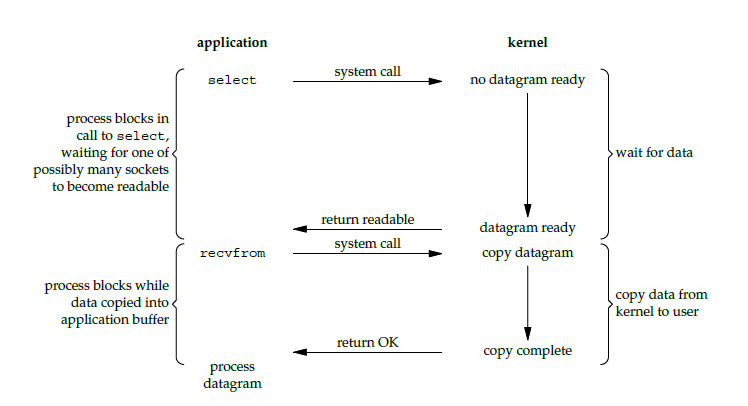

# Linux

## Linux IO模式及 select、poll、epoll

### I/O 模型

一个输入操作通常包括两个阶段：

- 等待数据准备好
- 从内核向进程复制数据

对于一个套接字上的输入操作，第一步通常涉及等待数据从网络中到达。当所等待数据到达时，它被复制到内核中的某个缓冲区。第二步就是把数据从内核缓冲区复制到应用进程缓冲区。

Unix 有五种 I/O 模型：

- 阻塞式 I/O
- 非阻塞式 I/O
- I/O 复用（select 和 poll）
- 信号驱动式 I/O（SIGIO）
- 异步 I/O（AIO）

#### 阻塞式 I/O

应用进程被阻塞，直到数据从内核缓冲区复制到应用进程缓冲区中才返回。

应该注意到，在阻塞的过程中，其它应用进程还可以执行，因此阻塞不意味着整个操作系统都被阻塞。因为其它应用进程还可以执行，所以不消耗 CPU 时间，这种模型的 CPU 利用率会比较高。

下图中，recvfrom() 用于接收 Socket 传来的数据，并复制到应用进程的缓冲区 buf 中。这里把 recvfrom() 当成系统调用。

ssize_t recvfrom(int sockfd, void *buf, size_t len, int flags, struct sockaddr *src_addr, socklen_t *addrlen);


#### 非阻塞式 I/O

应用进程执行系统调用之后，内核返回一个错误码。应用进程可以继续执行，但是需要不断的执行系统调用来获知 I/O 是否完成，这种方式称为轮询（polling）。

由于 CPU 要处理更多的系统调用，因此这种模型的 CPU 利用率比较低。


#### I/O 复用

使用 select 或者 poll 等待数据，并且可以等待多个套接字中的任何一个变为可读。这一过程会被阻塞，当某一个套接字可读时返回，之后再使用 recvfrom 把数据从内核复制到进程中。

它可以让单个进程具有处理多个 I/O 事件的能力。又被称为 Event Driven I/O，即事件驱动 I/O。

如果一个 Web 服务器没有 I/O 复用，那么每一个 Socket 连接都需要创建一个线程去处理。如果同时有几万个连接，那么就需要创建相同数量的线程。相比于多进程和多线程技术，I/O 复用不需要进程线程创建和切换的开销，系统开销更小。



#### 信号驱动 I/O

应用进程使用 sigaction 系统调用，内核立即返回，应用进程可以继续执行，也就是说等待数据阶段应用进程是非阻塞的。内核在数据到达时向应用进程发送 SIGIO 信号，应用进程收到之后在信号处理程序中调用 recvfrom 将数据从内核复制到应用进程中。

相比于非阻塞式 I/O 的轮询方式，信号驱动 I/O 的 CPU 利用率更高。


#### 异步 I/O

应用进程执行 aio_read 系统调用会立即返回，应用进程可以继续执行，不会被阻塞，内核会在所有操作完成之后向应用进程发送信号。

异步 I/O 与信号驱动 I/O 的区别在于，异步 I/O 的信号是通知应用进程 I/O 完成，而信号驱动 I/O 的信号是通知应用进程可以开始 I/O。


#### 五大 I/O 模型比较

- 同步 I/O：将数据从内核缓冲区复制到应用进程缓冲区的阶段，应用进程会阻塞。
- 异步 I/O：不会阻塞。

阻塞式 I/O、非阻塞式 I/O、I/O 复用和信号驱动 I/O 都是同步 I/O，它们的主要区别在第一个阶段。

非阻塞式 I/O 、信号驱动 I/O 和异步 I/O 在第一阶段不会阻塞。


### I/O 复用

select/poll/epoll 都是 I/O 多路复用的具体实现，select 出现的最早，之后是 poll，再是 epoll。

#### select
```c
int select(int n, fd_set *readfds, fd_set *writefds, fd_set *exceptfds, struct timeval *timeout);
```
有三种类型的描述符类型：readset、writeset、exceptset，分别对应读、写、异常条件的描述符集合。fd_set 使用数组实现，数组大小使用 FD_SETSIZE 定义。

timeout 为超时参数，调用 select 会一直阻塞直到有描述符的事件到达或者等待的时间超过 timeout。

成功调用返回结果大于 0，出错返回结果为 -1，超时返回结果为 0。

#### poll
```c
int poll(struct pollfd *fds, unsigned int nfds, int timeout);
```
pollfd 使用链表实现。

#### 比较

##### 1. 功能

select 和 poll 的功能基本相同，不过在一些实现细节上有所不同。

- select 会修改描述符，而 poll 不会；
- select 的描述符类型使用数组实现，FD_SETSIZE 大小默认为 1024，因此默认只能监听 1024 个描述符。如果要监听更多描述符的话，需要修改 FD_SETSIZE 之后重新编译；而 poll 的描述符类型使用链表实现，没有描述符数量的限制；
- poll 提供了更多的事件类型，并且对描述符的重复利用上比 select 高。
- 如果一个线程对某个描述符调用了 select 或者 poll，另一个线程关闭了该描述符，会导致调用结果不确定。

##### 2. 速度

select 和 poll 速度都比较慢。

- select 和 poll 每次调用都需要将全部描述符从应用进程缓冲区复制到内核缓冲区。
- select 和 poll 的返回结果中没有声明哪些描述符已经准备好，所以如果返回值大于 0 时，应用进程都需要使用轮询的方式来找到 I/O 完成的描述符。

##### 3. 可移植性

几乎所有的系统都支持 select，但是只有比较新的系统支持 poll。

#### epoll
```c
int epoll_create(int size);
int epoll_ctl(int epfd, int op, int fd, struct epoll_event *event);
int epoll_wait(int epfd, struct epoll_event * events, int maxevents, int timeout);
```
epoll_ctl() 用于向内核注册新的描述符或者是改变某个文件描述符的状态。已注册的描述符在内核中会被维护在一棵红黑树上，通过回调函数内核会将 I/O 准备好的描述符加入到一个链表中管理，进程调用 epoll_wait() 便可以得到事件完成的描述符。

从上面的描述可以看出，epoll 只需要将描述符从进程缓冲区向内核缓冲区拷贝一次，并且进程不需要通过轮询来获得事件完成的描述符。

epoll 仅适用于 Linux OS。

epoll 比 select 和 poll 更加灵活而且没有描述符数量限制。

epoll 对多线程编程更有友好，一个线程调用了 epoll_wait() 另一个线程关闭了同一个描述符也不会产生像 select 和 poll 的不确定情况。

##### 工作模式

epoll 的描述符事件有两种触发模式：LT（level trigger）和 ET（edge trigger）。

###### 1. LT 模式

当 epoll_wait() 检测到描述符事件到达时，将此事件通知进程，进程可以不立即处理该事件，下次调用 epoll_wait() 会再次通知进程。是默认的一种模式，并且同时支持 Blocking 和 No-Blocking。

###### 2. ET 模式

和 LT 模式不同的是，通知之后进程必须立即处理事件，下次再调用 epoll_wait() 时不会再得到事件到达的通知。

很大程度上减少了 epoll 事件被重复触发的次数，因此效率要比 LT 模式高。只支持 No-Blocking，以避免由于一个文件句柄的阻塞读/阻塞写操作把处理多个文件描述符的任务饿死。

### 应用场景

很容易产生一种错觉认为只要用 epoll 就可以了，select 和 poll 都已经过时了，其实它们都有各自的使用场景。

#### 1. select 应用场景

select 的 timeout 参数精度为 1ns，而 poll 和 epoll 为 1ms，因此 select 更加适用于实时性要求比较高的场景，比如核反应堆的控制。

select 可移植性更好，几乎被所有主流平台所支持。

#### 2. poll 应用场景

poll 没有最大描述符数量的限制，如果平台支持并且对实时性要求不高，应该使用 poll 而不是 select。

#### 3. epoll 应用场景

只需要运行在 Linux 平台上，有大量的描述符需要同时轮询，并且这些连接最好是长连接。

需要同时监控小于 1000 个描述符，就没有必要使用 epoll，因为这个应用场景下并不能体现 epoll 的优势。

需要监控的描述符状态变化多，而且都是非常短暂的，也没有必要使用 epoll。因为 epoll 中的所有描述符都存储在内核中，造成每次需要对描述符的状态改变都需要通过 epoll_ctl() 进行系统调用，频繁系统调用降低效率。并且 epoll 的描述符存储在内核，不容易调试。

#### 两句话总结

- `select和poll`都需要轮询每个文件描述符，`epoll`基于事件驱动，不用轮询
- `select和poll`每次都需要拷贝文件描述符，`epoll`不用
- `select`最大连接数受限，`epoll和poll`最大连接数不受限

> tips:epoll在内核中的实现，用红黑树管理事件块

## 用户态和内核态


### 概念

Linux的设计哲学之一就是：对不同的操作赋予不同的执行等级，就是所谓特权的概念，即与系统相关的一些特别关键的操作必须由最高特权的程序来完成。
Intel的X86架构的CPU提供了0到3四个特权级，数字越小，特权越高，Linux操作系统中主要采用了0和3两个特权级，分别对应的就是**内核态(Kernel Mode)**与**用户态(User Mode)**。

- 内核态：CPU可以访问内存所有数据，包括外围设备（硬盘、网卡），CPU也可以将自己从一个程序切换到另一个程序；
- 用户态：只能受限的访问内存，且不允许访问外围设备，占用CPU的能力被剥夺，CPU资源可以被其他程序获取；

Linux中任何一个用户进程被创建时都包含2个栈：内核栈，用户栈，并且是进程私有的，从用户态开始运行。内核态和用户态分别对应内核空间与用户空间，内核空间中存放的是内核代码和数据，而进程的用户空间中存放的是用户程序的代码和数据。不管是内核空间还是用户空间，它们都处于虚拟空间中。

### 内核空间相关

- 内核空间：存放的是内核代码和数据，处于虚拟空间；
- 内核态：当进程执行系统调用而进入内核代码中执行时，称进程处于内核态，此时CPU处于特权级最高的0级内核代码中执行，当进程处于内核态时，执行的内核代码会使用当前进程的内核栈，每个进程都有自己的内核栈；
- CPU堆栈指针寄存器指向：内核栈地址；
- 内核栈：进程处于内核态时使用的栈，存在于内核空间；
- 处于内核态进程的权利：处于内核态的进程，当它占有CPU的时候，可以访问内存所有数据和所有外设，比如硬盘，网卡等等；

### 用户空间相关

- 用户空间：存放的是用户程序的代码和数据，处于虚拟空间；
- 用户态：当进程在执行用户自己的代码（非系统调用之类的函数）时，则称其处于用户态，CPU在特权级最低的3级用户代码中运行，当正在执行用户程序而突然被中断程序中断时，此时用户程序也可以象征性地称为处于进程的内核态，因为中断处理程序将使用当前进程的内核栈；
- CPU堆栈指针寄存器指向：用户堆栈地址；
- 用户堆栈：进程处于用户态时使用的堆栈，存在于用户空间；
- 处于用户态进程的权利：处于用户态的进程，当它占有CPU的时候，只可以访问有限的内存，而且不允许访问外设，这里说的有限的内存其实就是用户空间，使用的是用户堆栈；

### 内核态和用户态的切换

* 系统调用

所有用户程序都是运行在用户态的，但是有时候程序确实需要做一些内核态的事情，例如从硬盘读取数据等。而唯一可以做这些事情的就是操作系统，所以此时程序就需要先操作系统请求以程序的名义来执行这些操作。这时需要一个这样的机制：用户态程序切换到内核态，但是不能控制在内核态中执行的指令。这种机制叫系统调用，在CPU中的实现称之为陷阱指令(Trap Instruction)。

* 异常事件

当CPU正在执行运行在用户态的程序时，突然发生某些预先不可知的异常事件，这个时候就会触发从当前用户态执行的进程转向内核态执行相关的异常事件，典型的如缺页异常。

* 外围设备的中断

当外围设备完成用户的请求操作后，会像CPU发出中断信号，此时，CPU就会暂停执行下一条即将要执行的指令，转而去执行中断信号对应的处理程序，如果先前执行的指令是在用户态下，则自然就发生从用户态到内核态的转换。

注意：系统调用的本质其实也是中断，相对于外围设备的硬中断，这种中断称为软中断，这是操作系统为用户特别开放的一种中断，如Linux int 80h中断。所以从触发方式和效果上来看，这三种切换方式是完全一样的，都相当于是执行了一个中断响应的过程。但是从触发的对象来看，系统调用是进程主动请求切换的，而异常和硬中断则是被动的。

| 类型     | 源头                     | 响应方式   | 处理机制                             |
| -------- | ------------------------ | ---------- | ------------------------------------ |
| 中断     | 外设                     | 异步       | 持续，对用户应用程序是透明的         |
| 异常     | 应用程序意想不到的行为   | 同步       | 杀死或重新执行意想不到的应用程序指令 |
| 系统调用 | 应用程序请求操作提供服务 | 异步或同步 | 等待和持续                           |