# MySQL

## REDO日志和UNDO日志

### Undo Log

Undo Log是为了实现事务的原子性，在MySQL数据库InnoDB存储引擎中，还用了Undo Log来实现多版本并发控制(简称：MVCC)。

事务的原子性(Atomicity)事务中的所有操作，要么全部完成，要么不做任何操作，不能只做部分操作。如果在执行的过程中发生了错误，要回滚(Rollback)到事务开始前的状态，就像这个事务从来没有执行过。

原理Undo Log的原理很简单，为了满足事务的原子性，在操作任何数据之前，首先将数据备份到一个地方（这个存储数据备份的地方称为UndoLog）。然后进行数据的修改。如果出现了错误或者用户执行了ROLLBACK语句，系统可以利用Undo Log中的备份将数据恢复到事务开始之前的状态。

之所以能同时保证原子性和持久化，是因为以下特点：

更新数据前记录。

Undo log为了保证持久性，必须将数据在事务提交前写到磁盘。只要事务成功提交，数据必然已经持久化。

Undo log必须先于数据持久化到磁盘。如果在G,H之间系统崩溃，undo log是完整的， 可以用来回滚事务。
如果在A-F之间系统崩溃,因为数据没有持久化到磁盘。所以磁盘上的数据还是保持在事务开始前的状态。

缺陷：每个事务提交前将数据和Undo Log写入磁盘，这样会导致大量的磁盘IO，因此性能很低。
如果能够将数据缓存一段时间，就能减少IO提高性能。但是这样就会丧失事务的持久性。因此引入了另外一种机制来实现持久化，即Redo Log。

### Redo Log:

原理和Undo Log相反，Redo Log记录的是新数据的备份。在事务提交前，只要将Redo Log持久化即可，不需要将数据持久化。当系统崩溃时，虽然数据没有持久化，但是Redo Log已经持久化。系统可以根据Redo Log的内容，将所有数据恢复到最新的状态。

## ACID

### 1. 原子性（Atomicity）

事务被视为不可分割的最小单元，事务的所有操作要么全部提交成功，要么全部失败回滚。

回滚可以用回滚日志来实现，回滚日志记录着事务所执行的修改操作，在回滚时反向执行这些修改操作即可。

### 2. 一致性（Consistency）

数据库在事务执行前后都保持一致性状态。在一致性状态下，所有事务对一个数据的读取结果都是相同的。

### 3. 隔离性（Isolation）

一个事务所做的修改在最终提交以前，对其它事务是不可见的。

### 4. 持久性（Durability）

一旦事务提交，则其所做的修改将会永远保存到数据库中。即使系统发生崩溃，事务执行的结果也不能丢失。

使用重做日志来保证持久性。

## 封锁

### 封锁粒度

MySQL 中提供了两种封锁粒度：行级锁以及表级锁。

应该尽量只锁定需要修改的那部分数据，而不是所有的资源。锁定的数据量越少，发生锁争用的可能就越小，系统的并发程度就越高。

但是加锁需要消耗资源，锁的各种操作（包括获取锁、释放锁、以及检查锁状态）都会增加系统开销。因此封锁粒度越小，系统开销就越大。

在选择封锁粒度时，需要在锁开销和并发程度之间做一个权衡。

### 封锁类型

#### 1. 读写锁

- 排它锁（Exclusive），简写为 X 锁，又称写锁。
- 共享锁（Shared），简写为 S 锁，又称读锁。

有以下两个规定：

- 一个事务对数据对象 A 加了 X 锁，就可以对 A 进行读取和更新。加锁期间其它事务不能对 A 加任何锁。
- 一个事务对数据对象 A 加了 S 锁，可以对 A 进行读取操作，但是不能进行更新操作。加锁期间其它事务能对 A 加 S 锁，但是不能加 X 锁。

锁的兼容关系如下：

| -     | X    | S    |
| ----- | ---- | ---- |
| **X** | ×    | ×    |
| **S** | ×    | √    |

#### 2. 意向锁

使用意向锁（Intention Locks）可以更容易地支持多粒度封锁。

在存在行级锁和表级锁的情况下，事务 T 想要对表 A 加 X 锁，就需要先检测是否有其它事务对表 A 或者表 A 中的任意一行加了锁，那么就需要对表 A 的每一行都检测一次，这是非常耗时的。

意向锁在原来的 X/S 锁之上引入了 **IX/IS，IX/IS 都是表锁**，用来表示一个事务想要在表中的某个数据行上加 X 锁或 S 锁。有以下两个规定：

- 一个事务在获得某个数据行对象的 S 锁之前，必须先获得表的 IS 锁或者更强的锁；
- 一个事务在获得某个数据行对象的 X 锁之前，必须先获得表的 IX 锁。

通过引入意向锁，事务 T 想要对表 A 加 X 锁，只需要先检测是否有其它事务对表 A 加了 X/IX/S/IS 锁，如果加了就表示有其它事务正在使用这个表或者表中某一行的锁，因此事务 T 加 X 锁失败。

各种锁的兼容关系如下：

| -      | X    | IX   | S    | IS   |
| ------ | ---- | ---- | ---- | ---- |
| **X**  | ×    | ×    | ×    | ×    |
| **IX** | ×    | √    | ×    | √    |
| **S**  | ×    | ×    | √    | √    |
| **IS** | ×    | √    | √    | √    |

解释如下：

- 任意 IS/IX 锁之间都是兼容的，因为它们只是表示想要对表加锁，而不是真正加锁；
- S 锁只与 S 锁和 IS 锁兼容，也就是说事务 T 想要对数据行加 S 锁，其它事务可以已经获得对表或者表中的行的 S 锁。

### 封锁协议

#### 1. 三级封锁协议

**一级封锁协议**

事务 T 要修改数据 A 时必须加 X 锁，直到 T 结束才释放锁。

可以解决丢失修改问题，因为不能同时有两个事务对同一个数据进行修改，那么事务的修改就不会被覆盖。

| T1          | T2          |
| ----------- | ----------- |
| lock-x(A)   |             |
| read A=20   |             |
|             | lock-x(A)   |
|             | wait        |
| write A=19  | .           |
| commit      | .           |
| unlock-x(A) | .           |
|             | obtain      |
|             | read A=19   |
|             | write A=21  |
|             | commit      |
|             | unlock-x(A) |

**二级封锁协议**

在一级的基础上，要求读取数据 A 时必须加 S 锁，读取完马上释放 S 锁。

可以解决读脏数据问题，因为如果一个事务在对数据 A 进行修改，根据 1 级封锁协议，会加 X 锁，那么就不能再加 S 锁了，也就是不会读入数据。

| T1          | T2          |
| ----------- | ----------- |
| lock-x(A)   |             |
| read A=20   |             |
| write A=19  |             |
|             | lock-s(A)   |
|             | wait        |
| rollback    | .           |
| A=20        | .           |
| unlock-x(A) | .           |
|             | obtain      |
|             | read A=20   |
|             | unlock-s(A) |
|             | commit      |

**三级封锁协议**

在二级的基础上，要求读取数据 A 时必须加 S 锁，直到事务结束了才能释放 S 锁。

可以解决不可重复读的问题，因为读 A 时，其它事务不能对 A 加 X 锁，从而避免了在读的期间数据发生改变。

| T1          | T2          |
| ----------- | ----------- |
| lock-s(A)   |             |
| read A=20   |             |
|             | lock-x(A)   |
|             | wait        |
| read A=20   | .           |
| commit      | .           |
| unlock-s(A) | .           |
|             | obtain      |
|             | read A=20   |
|             | write A=19  |
|             | commit      |
|             | unlock-X(A) |

#### 2.两段锁协议

加锁和解锁分为两个阶段进行。

可串行化调度是指，通过并发控制，使得并发执行的事务结果与某个串行执行的事务结果相同。

事务遵循两段锁协议是保证可串行化调度的充分条件。例如以下操作满足两段锁协议，它是可串行化调度。

```
lock-x(A)...lock-s(B)...lock-s(C)...unlock(A)...unlock(C)...unlock(B)
```

但不是必要条件，例如以下操作不满足两段锁协议，但是它还是可串行化调度。

```
lock-x(A)...unlock(A)...lock-s(B)...unlock(B)...lock-s(C)...unlock(C)
```

## 并发一致性问题

在并发环境下，事务的隔离性很难保证，因此会出现很多并发一致性问题。

### 丢失修改

T1 和 T2 两个事务都对一个数据进行修改，T1 先修改，T2 随后修改，T2 的修改覆盖了 T1 的修改。

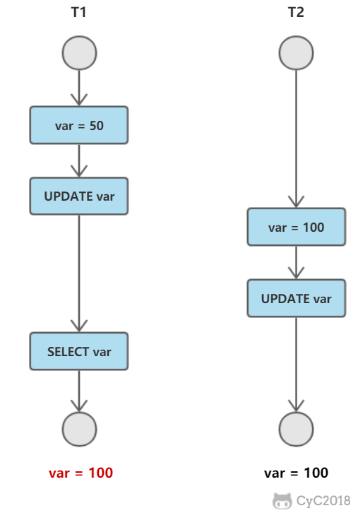

### 读脏数据

T1 修改一个数据，T2 随后读取这个数据。如果 T1 撤销了这次修改，那么 T2 读取的数据是脏数据。

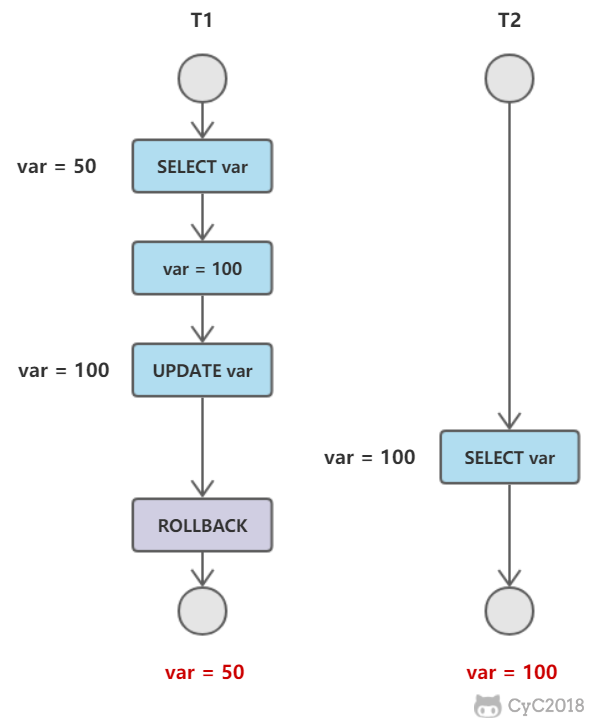

### 不可重复读

T2 读取一个数据，T1 对该数据做了修改。如果 T2 再次读取这个数据，此时读取的结果和第一次读取的结果不同。


### 幻影读

T1 读取某个范围的数据，T2 在这个范围内插入新的数据，T1 再次读取这个范围的数据，此时读取的结果和和第一次读取的结果不同。


------

**产生并发不一致性问题主要原因是破坏了事务的隔离性**，解决方法是通过并发控制来保证隔离性。并发控制可以通过封锁来实现，但是封锁操作需要用户自己控制，相当复杂。数据库管理系统提供了事务的隔离级别，让用户以一种更轻松的方式处理并发一致性问题。

## 隔离级别

### 未提交读（READ UNCOMMITTED）

事务中的修改，即使没有提交，对其它事务也是可见的。

### 提交读（READ COMMITTED）

一个事务只能读取已经提交的事务所做的修改。换句话说，一个事务所做的修改在提交之前对其它事务是不可见的。

### 可重复读（REPEATABLE READ）

保证在同一个事务中多次读取同样数据的结果是一样的。

### 可串行化（SERIALIZABLE）

强制事务串行执行。

需要加锁实现，而其它隔离级别通常不需要。

------

| 隔离级别 | 脏读 | 不可重复读 | 幻影读 |
| -------- | ---- | ---------- | ------ |
| 未提交读 | √    | √          | √      |
| 提交读   | ×    | √          | √      |
| 可重复读 | ×    | ×          | √      |
| 可串行化 | ×    | ×          | ×      |

## 多版本并发控制

多版本并发控制（Multi-Version Concurrency Control, MVCC）是 MySQL 的 InnoDB 存储引擎实现隔离级别的一种具体方式，**用于实现提交读和可重复读这两种隔离级别**。而未提交读隔离级别总是读取最新的数据行，无需使用 MVCC。可串行化隔离级别需要对所有读取的行都加锁，单纯使用 MVCC 无法实现。

### 准备

测试环境：**Mysql 5.7.20-log**

数据库默认隔离级别：**RR（Repeatable Read，可重复读），MVCC主要适用于Mysql的RC,RR隔离级别**

创建一张存储引擎为testmvcc的表，sql为:

```sql
CREATE TABLE testmvcc (
 id int(11) DEFAULT NULL,
 name varchar(11) DEFAULT NULL
) ENGINE=InnoDB DEFAULT CHARSET=utf8;
```

### MVCC

英文全称为Multi-Version Concurrency Control,翻译为中文即 多版本并发控制。在小编看来，他无非就是乐观锁的一种实现方式。在Java编程中，如果把乐观锁看成一个接口，MVCC便是这个接口的一个实现类而已。


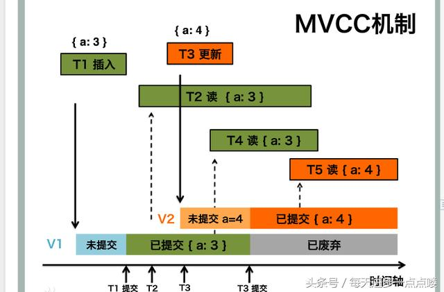

### 基本原理

MVCC的实现，通过保存数据在某个时间点的快照来实现的。这意味着一个事务无论运行多长时间，在同一个事务里能够看到数据一致的视图。根据事务开始的时间不同，同时也意味着在同一个时刻不同事务看到的相同表里的数据可能是不同的。

### 基本特征

- 每行数据都存在一个版本，每次数据更新时都更新该版本。
- 修改时Copy出当前版本随意修改，各个事务之间无干扰。
- 保存时比较版本号，如果成功（commit），则覆盖原记录；失败则放弃copy（rollback）

### InnoDB存储引擎MVCC的实现策略

在每一行数据中额外保存两个隐藏的列：当前行创建时的版本号和删除时的版本号（可能为空，其实还有一列称为回滚指针，用于事务回滚，不在本文范畴）。这里的版本号并不是实际的时间值，而是系统版本号。每开始新的事务，系统版本号都会自动递增。事务开始时刻的系统版本号会作为事务的版本号，用来和查询每行记录的版本号进行比较。

每个事务又有自己的版本号，这样事务内执行CRUD操作时，就通过版本号的比较来达到数据版本控制的目的。

### MVCC下InnoDB的增删查改是怎么work的

1.插入数据（insert）:记录的版本号即当前事务的版本号，执行一条数据语句：insert into testmvcc values(1,"test");

假设事务id为1，那么插入后的数据行如下：


2、在更新操作的时候，采用的是先标记旧的那行记录为已删除，并且删除版本号是事务版本号，然后插入一行新的记录的方式。

比如，针对上面那行记录，事务Id为2 要把name字段更新update table set name= 'new_value' where id=1;


3、删除操作的时候，就把事务版本号作为删除版本号。比如delete from table where id=1;

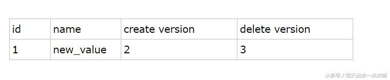

4、查询操作：

从上面的描述可以看到，在查询时要符合以下两个条件的记录才能被事务查询出来：

1) 删除版本号未指定或者大于当前事务版本号，即查询事务开启后确保读取的行未被删除。(即上述事务id为2的事务查询时，依然能读取到事务id为3所删除的数据行)

2) 创建版本号 小于或者等于 当前事务版本号 ，就是说记录创建是在当前事务中（等于的情况）或者在当前事务启动之前的其他事物进行的insert。

（即事务id为2的事务只能读取到create version<=2的已提交的事务的数据集）

> 补充：
>
> 1.MVCC手段只适用于Msyql隔离级别中的读已提交（Read committed）和可重复读（Repeatable Read）.
>
> 2.Read uncimmitted由于存在脏读，即能读到未提交事务的数据行，所以不适用MVCC.
>
> 原因是MVCC的创建版本和删除版本只要在事务提交后才会产生。
>
> 3.串行化由于是会对所涉及到的表加锁，并非行锁，自然也就不存在行的版本控制问题。
>
> 4.通过以上总结，可知，MVCC主要作用于事务性的，有行锁控制的数据库模型。

### 快照读与当前读

#### 1. 快照读

使用 MVCC 读取的是快照中的数据，这样可以减少加锁所带来的开销。

```sql
select * from table ...;
```

#### 2. 当前读

读取的是最新的数据，需要加锁。以下第一个语句需要加 S 锁，其它都需要加 X 锁。

```sql
select * from table where ? lock in share mode;
select * from table where ? for update;
insert;
update;
delete;
```

## Next-Key Locks

Next-Key Locks 是 MySQL 的 InnoDB 存储引擎的一种锁实现。

MVCC 不能解决幻影读问题，Next-Key Locks 就是为了解决这个问题而存在的。在可重复读（REPEATABLE READ）隔离级别下，使用 MVCC + Next-Key Locks 可以解决幻读问题。

### Record Locks

锁定一个记录上的索引，而不是记录本身。

如果表没有设置索引，InnoDB 会自动在主键上创建隐藏的聚簇索引，因此 Record Locks 依然可以使用。

### Gap Locks

锁定索引之间的间隙，但是不包含索引本身。例如当一个事务执行以下语句，其它事务就不能在 t.c 中插入 15。

```sql
SELECT c FROM t WHERE c BETWEEN 10 and 20 FOR UPDATE;
```

### Next-Key Locks

它是 Record Locks 和 Gap Locks 的结合，不仅锁定一个记录上的索引，也锁定索引之间的间隙。例如一个索引包含以下值：10, 11, 13, and 20，那么就需要锁定以下区间：

```
(-∞, 10]
(10, 11]
(11, 13]
(13, 20]
(20, +∞)
```

## 范式

在设计与操作维护数据库时，最关键的问题就是要确保数据能够正确地分布到数据库的表中。使用正确的数据结构，不仅有助于对数据库进行相应的存取操作，还可以极大地简化应用程序中的其他内容(查询、窗体、报表、代码等)，按照“数据库规范化”对表进行设计，其目的就是减少数据库中的数据冗余，以增加数据的一致性。

泛化时在识别数据库中的一个数据元素、关系以及定义所需的表和各表中的项目这些初始工作之后的一个细化的过程。常见的范式有1NF、2NF、3NF、BCNF以及4NF。下面对这几种常见的范式进行简要分析。

**1NF(第一范式)**

第一范式是指数据库表中的每一列都是不可分割的基本数据项，同一列中不能有多个值，即实体中的某个属性不能有多个值或者不能有重复的属性。

如果出现重复的属性，就可能需要定义一个新的实体，新的实体由重复的属性构成，新实体与原实体之间为一对多关系。第一范式的模式要求属性值不可再分裂成更小部分，即属性项不能是属性组合或是由一组属性构成。

简而言之，第一范式就是无重复的列。例如，由“职工号”“姓名”“电话号码”组成的表(一个人可能有一部办公电话和一部移动电话)，这时将其规范化为1NF可以将电话号码分为“办公电话”和“移动电话”两个属性，即职工(职工号，姓名，办公电话，移动电话)。

**2NF(第二范式)**

第二范式(2NF)是在第一范式(1NF)的基础上建立起来的，即满足第二范式(2NF)必须先满足第一范式(1NF)。第二范式(2NF)要求数据库表中的每个实例或行必须可以被唯一地区分。为实现区分通常需要为表加上一个列，以存储各个实例的唯一标识。

如果关系模型R为第一范式，并且R中的每一个非主属性完全函数依赖于R的某个候选键，则称R为第二范式模式(如果A是关系模式R的候选键的一个属性，则称A是R的主属性，否则称A是R的非主属性)。

例如，在选课关系表(学号，课程号，成绩，学分)，关键字为组合关键字(学号，课程号)，但由于非主属性学分仅依赖于课程号，对关键字(学号，课程号)只是部分依赖，而不是完全依赖，因此此种方式会导致数据冗余以及更新异常等问题，解决办法是将其分为两个关系模式：学生表(学号，课程号，分数)和课程表(课程号，学分)，新关系通过学生表中的外关键字课程号联系，在需要时进行连接。

**3NF(第三范式)**

如果关系模型R是第二范式，且每个非主属性都不传递依赖于R的候选键，则称R是第三范式的模式。

以学生表(学号，姓名，课程号，成绩)为例，其中学生姓名无重名，所以该表有两个候选码(学号，课程号)和(姓名，课程号)，故存在函数依赖：学号——>姓名，(学号，课程号)——>成绩，唯一的非主属性成绩对码不存在部分依赖，也不存在传递依赖，所以属性属于第三范式。

**BCNF(BC范式)**

它构建在第三范式的基础上，如果关系模型R是第一范式，且每个属性都不传递依赖于R的候选键，那么称R为BCNF的模式。

假设仓库管理关系表(仓库号，存储物品号，管理员号，数量)，满足一个管理员只在一个仓库工作；一个仓库可以存储多种物品，则存在如下关系：

(仓库号，存储物品号)——>(管理员号，数量)

(管理员号，存储物品号)——>(仓库号，数量)

所以，(仓库号，存储物品号)和(管理员号，存储物品号)都是仓库管理关系表的候选码，表中唯一非关键字段为数量，它是符合第三范式的。但是，由于存在如下决定关系：

(仓库号)——>(管理员号)

(管理员号)——>(仓库号)

即存在关键字段决定关键字段的情况，因此其不符合BCNF。把仓库管理关系表分解为两个关系表仓库管理表(仓库号，管理员号)和仓库表(仓库号，存储物品号，数量)，这样这个数据库表是符合BCNF的，并消除了删除异常、插入异常和更新异常。

**4NF(第四范式)**

设R是一个关系模型，D是R上的多值依赖集合。如果D中存在凡多值依赖X->Y时，X必是R的超键，那么称R是第四范式的模式。

例如，职工表(职工编号，职工孩子姓名，职工选修课程)，在这个表中，同一个职工可能会有多个职工孩子姓名，同样，同一个职工也可能会有多个职工选修课程，即这里存在着多值事实，不符合第四范式。如果要符合第四范式，只需要将上表分为两个表，使它们只有一个多值事实，例如职工表一(职工编号，职工孩子姓名)，职工表二(职工编号，职工选修课程)，两个表都只有一个多值事实，所以符合第四范式。

## MySQL主从复制和读写分离

### 主从复制

主要涉及三个线程：binlog 线程、I/O 线程和 SQL 线程。

- **binlog 线程** ：负责将主服务器上的数据更改写入二进制日志（Binary log）中。
- **I/O 线程** ：负责从主服务器上读取二进制日志，并写入从服务器的中继日志（Relay log）。
- **SQL 线程** ：负责读取中继日志，解析出主服务器已经执行的数据更改并在从服务器中重放（Replay）。


### MySQL 主从同步延时问题（精华）

以前线上确实处理过因为主从同步延时问题而导致的线上的 bug，属于小型的生产事故。

是这个么场景。有个同学是这样写代码逻辑的。先插入一条数据，再把它查出来，然后更新这条数据。在生产环境高峰期，写并发达到了 2000/s，这个时候，主从复制延时大概是在小几十毫秒。线上会发现，每天总有那么一些数据，我们期望更新一些重要的数据状态，但在高峰期时候却没更新。用户跟客服反馈，而客服就会反馈给我们。

我们通过 MySQL 命令：

```
show status
```

查看 `Seconds_Behind_Master`，可以看到从库复制主库的数据落后了几 ms。

一般来说，如果主从延迟较为严重，有以下解决方案：

- 分库，将一个主库拆分为多个主库，每个主库的写并发就减少了几倍，此时主从延迟可以忽略不计。
- 打开 MySQL 支持的并行复制，多个库并行复制。如果说某个库的写入并发就是特别高，单库写并发达到了 2000/s，并行复制还是没意义。
- 重写代码，写代码的同学，要慎重，插入数据时立马查询可能查不到。
- 如果确实是存在必须先插入，立马要求就查询到，然后立马就要反过来执行一些操作，对这个查询**设置直连主库**。**不推荐**这种方法，你要是这么搞，读写分离的意义就丧失了。

### 读写分离

主服务器处理写操作以及实时性要求比较高的读操作，而从服务器处理读操作。

读写分离能提高性能的原因在于：

- 主从服务器负责各自的读和写，极大程度缓解了锁的争用；
- 从服务器可以使用 MyISAM，提升查询性能以及节约系统开销；
- 增加冗余，提高可用性。

读写分离常用代理方式来实现，代理服务器接收应用层传来的读写请求，然后决定转发到哪个服务器。


## 索引优化

### 独立的列

在进行查询时，索引列不能是表达式的一部分，也不能是函数的参数，否则无法使用索引。

例如下面的查询不能使用 actor_id 列的索引：

```sql
SELECT actor_id FROM sakila.actor WHERE actor_id + 1 = 5;
```

### 多列索引

在需要使用多个列作为条件进行查询时，使用多列索引比使用多个单列索引性能更好。例如下面的语句中，最好把 actor_id 和 film_id 设置为多列索引。

```sql
SELECT film_id, actor_ id FROM sakila.film_actor
WHERE actor_id = 1 AND film_id = 1;
```

### 索引列的顺序

让选择性最强的索引列放在前面。

索引的选择性是指：不重复的索引值和记录总数的比值。最大值为 1，此时每个记录都有唯一的索引与其对应。选择性越高，每个记录的区分度越高，查询效率也越高。

例如下面显示的结果中 customer_id 的选择性比 staff_id 更高，因此最好把 customer_id 列放在多列索引的前面。

```sql
SELECT COUNT(DISTINCT staff_id)/COUNT(*) AS staff_id_selectivity,
COUNT(DISTINCT customer_id)/COUNT(*) AS customer_id_selectivity,
COUNT(*)
FROM payment;
   staff_id_selectivity: 0.0001
customer_id_selectivity: 0.0373
               COUNT(*): 16049
```

### 前缀索引

对于 BLOB、TEXT 和 VARCHAR 类型的列，必须使用前缀索引，只索引开始的部分字符。

前缀长度的选取需要根据索引选择性来确定。

### 覆盖索引

索引包含所有需要查询的字段的值。

具有以下优点：

- 索引通常远小于数据行的大小，只读取索引能大大减少数据访问量。
- 一些存储引擎（例如 MyISAM）在内存中只缓存索引，而数据依赖于操作系统来缓存。因此，只访问索引可以不使用系统调用（通常比较费时）。
- 对于 InnoDB 引擎，若辅助索引能够覆盖查询，则无需访问主索引。

## 索引的优点

- 大大减少了服务器需要扫描的数据行数。
- 帮助服务器避免进行排序和分组，以及避免创建临时表（B+Tree 索引是有序的，可以用于 ORDER BY 和 GROUP BY 操作。临时表主要是在排序和分组过程中创建，不需要排序和分组，也就不需要创建临时表）。
- 将随机 I/O 变为顺序 I/O（B+Tree 索引是有序的，会将相邻的数据都存储在一起）。

## 索引的使用条件

- 对于非常小的表、大部分情况下简单的全表扫描比建立索引更高效；
- 对于中到大型的表，索引就非常有效；
- 但是对于特大型的表，建立和维护索引的代价将会随之增长。这种情况下，需要用到一种技术可以直接区分出需要查询的一组数据，而不是一条记录一条记录地匹配，例如可以使用分区技术。

## 数据库 SQL 开发规范

### 1. 建议使用预编译语句进行数据库操作

预编译语句可以重复使用这些计划，减少 SQL 编译所需要的时间，还可以解决动态 SQL 所带来的 SQL 注入的问题。

只传参数，比传递 SQL 语句更高效。

相同语句可以一次解析，多次使用，提高处理效率。

### 2. 避免数据类型的隐式转换

隐式转换会导致索引失效如:

```sql
select name,phone from customer where id = '111';
```

### 3. 充分利用表上已经存在的索引

避免使用双%号的查询条件。如：`a like '%123%'`，（如果无前置%,只有后置%，是可以用到列上的索引的）

一个 SQL 只能利用到复合索引中的一列进行范围查询。如：有 a,b,c 列的联合索引，在查询条件中有 a 列的范围查询，则在 b,c 列上的索引将不会被用到。

在定义联合索引时，如果 a 列要用到范围查找的话，就要把 a 列放到联合索引的右侧，使用 left join 或 not exists 来优化 not in 操作，因为 not in 也通常会使用索引失效。

### 4. 数据库设计时，应该要对以后扩展进行考虑

### 5. 程序连接不同的数据库使用不同的账号，禁止跨库查询

- 为数据库迁移和分库分表留出余地
- 降低业务耦合度
- 避免权限过大而产生的安全风险

### 6. 禁止使用 SELECT * 必须使用 SELECT <字段列表> 查询

**原因：**

- 消耗更多的 CPU 和 IO 以网络带宽资源
- 无法使用覆盖索引
- 可减少表结构变更带来的影响

### 7. 禁止使用不含字段列表的 INSERT 语句

如：

```sql
insert into values ('a','b','c');
```

应使用：

```sql
insert into t(c1,c2,c3) values ('a','b','c');
```

### 8. 避免使用子查询，可以把子查询优化为 JOIN操作

通常子查询在 in 子句中，且子查询中为简单 SQL(不包含 union、group by、order by、limit 从句) 时,才可以把子查询转化为关联查询进行优化。

**子查询性能差的原因：**

子查询的结果集无法使用索引，通常子查询的结果集会被存储到临时表中，不论是内存临时表还是磁盘临时表都不会存在索引，所以查询性能会受到一定的影响。特别是对于返回结果集比较大的子查询，其对查询性能的影响也就越大。

由于子查询会产生大量的临时表也没有索引，所以会消耗过多的 CPU 和 IO 资源，产生大量的慢查询。

### 9. 避免使用 JOIN 关联太多的表

对于 MySQL 来说，是存在关联缓存的，缓存的大小可以由 join_buffer_size 参数进行设置。

在 MySQL 中，对于同一个 SQL 多关联（join）一个表，就会多分配一个关联缓存，如果在一个 SQL 中关联的表越多，所占用的内存也就越大。

如果程序中大量的使用了多表关联的操作，同时 join_buffer_size 设置的也不合理的情况下，就容易造成服务器内存溢出的情况，就会影响到服务器数据库性能的稳定性。

同时对于关联操作来说，会产生临时表操作，影响查询效率，MySQL 最多允许关联 61 个表，建议不超过 5 个。

### 10. 减少同数据库的交互次数

数据库更适合处理批量操作，合并多个相同的操作到一起，可以提高处理效率。

### 11. 对应同一列进行 or 判断时，使用 in 代替 or

in 的值不要超过 500 个，in 操作可以更有效的利用索引，or 大多数情况下很少能利用到索引。

### 12. 禁止使用 order by rand() 进行随机排序

order by rand() 会把表中所有符合条件的数据装载到内存中，然后在内存中对所有数据根据随机生成的值进行排序，并且可能会对每一行都生成一个随机值，如果满足条件的数据集非常大，就会消耗大量的 CPU 和 IO 及内存资源。

推荐在程序中获取一个随机值，然后从数据库中获取数据的方式。

### 13. WHERE 从句中禁止对列进行函数转换和计算

对列进行函数转换或计算时会导致无法使用索引

**不推荐：**

```sql
where date(create_time)='20190101'
```

**推荐：**

```sql
where create_time >= '20190101' and create_time < '20190102'
```

### 14. 在明显不会有重复值时使用 UNION ALL 而不是 UNION

- UNION 会把两个结果集的所有数据放到临时表中后再进行去重操作
- UNION ALL 不会再对结果集进行去重操作

### 15. 拆分复杂的大 SQL 为多个小 SQL

- 大 SQL 逻辑上比较复杂，需要占用大量 CPU 进行计算的 SQL
- MySQL 中，一个 SQL 只能使用一个 CPU 进行计算
- SQL 拆分后可以通过并行执行来提高处理效率

## 分页优化

```sql
select * from table_name limit 10000,10
```

这句 SQL 的执行逻辑是：

1. 从数据表中读取第N条数据添加到数据集中
2. 重复第一步直到 N = 10000 + 10
3. 根据 offset 抛弃前面 10000 条数
4. 返回剩余的 10 条数据

数据库的数据存储是随机的，使用 B+Tree， Hash 等方式组织索引。所以当你让数据库读取第 10001 条数据的时候，数据库就只能一条一条的去查去数

最简单的方法是利用自增索引（假设为id）：

```Java
select * from table_name where (id >= 10000) limit 10
```

但思路是有局限性的，首先必须要有自增索引列，而且数据在逻辑上必须是连续的，其次，你还必须知道特征值。如此苛刻的要求，在实际应用中是不可能满足的

好的方式是利用子查询把原来的基于user的搜索转化为基于主键（id）的搜索，主查询因为已经获得了准确的索引值，所以查询过程也相对较快：

```Java
select * from table_name inner join ( select id from table_name where (user = xxx) limit 10000,10) b using (id)
```

## 存储引擎

### InnoDB

是 MySQL 默认的事务型存储引擎，只有在需要它不支持的特性时，才考虑使用其它存储引擎。

实现了四个标准的隔离级别，默认级别是可重复读（REPEATABLE READ）。在可重复读隔离级别下，通过多版本并发控制（MVCC）+ 间隙锁（Next-Key Locking）防止幻影读。

主索引是聚簇索引，在索引中保存了数据，从而避免直接读取磁盘，因此对查询性能有很大的提升。

内部做了很多优化，包括从磁盘读取数据时采用的可预测性读、能够加快读操作并且自动创建的自适应哈希索引、能够加速插入操作的插入缓冲区等。

支持真正的在线热备份。其它存储引擎不支持在线热备份，要获取一致性视图需要停止对所有表的写入，而在读写混合场景中，停止写入可能也意味着停止读取。

### MyISAM

设计简单，数据以紧密格式存储。对于只读数据，或者表比较小、可以容忍修复操作，则依然可以使用它。

提供了大量的特性，包括压缩表、空间数据索引等。

不支持事务。

不支持行级锁，只能对整张表加锁，读取时会对需要读到的所有表加共享锁，写入时则对表加排它锁。但在表有读取操作的同时，也可以往表中插入新的记录，这被称为并发插入（CONCURRENT INSERT）。

可以手工或者自动执行检查和修复操作，但是和事务恢复以及崩溃恢复不同，可能导致一些数据丢失，而且修复操作是非常慢的。

如果指定了 DELAY_KEY_WRITE 选项，在每次修改执行完成时，不会立即将修改的索引数据写入磁盘，而是会写到内存中的键缓冲区，只有在清理键缓冲区或者关闭表的时候才会将对应的索引块写入磁盘。这种方式可以极大的提升写入性能，但是在数据库或者主机崩溃时会造成索引损坏，需要执行修复操作。

### 比较

- 事务：InnoDB 是事务型的，可以使用 Commit 和 Rollback 语句。
- 并发：MyISAM 只支持表级锁，而 InnoDB 还支持行级锁。
- 外键：InnoDB 支持外键。
- 备份：InnoDB 支持在线热备份。
- 崩溃恢复：MyISAM 崩溃后发生损坏的概率比 InnoDB 高很多，而且恢复的速度也更慢。
- 其它特性：MyISAM 支持压缩表和空间数据索引。

## MySQL之SQL语句优化步骤

#### MySQL查询截取分析步骤：

一、开启慢查询日志，捕获慢SQL

二、explain+慢SQL分析

三、show profile查询SQL语句在服务器中的执行细节和生命周期

四、SQL数据库服务器参数调优

#### 一、开启慢查询日志，捕获慢SQL

##### **1、查看慢查询日志是否开启**

```sql
SHOW VARIABLES LIKE '%slow_query_log%';
```

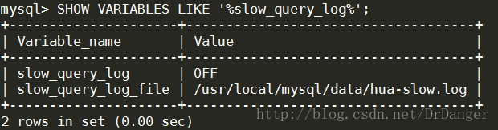

##### **2、开启慢查询日志**

```sql
SET GLOBAL slow_query_log=1;
```

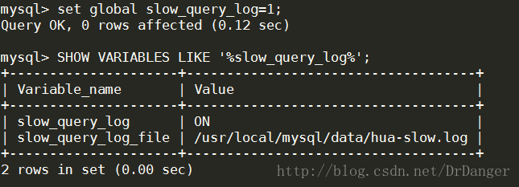

#### **3、查看慢查询日志阙值**

```sql
SHOW [GLOBAL] VARIABLES LIKE '%long_query_time%';
```

这个值表示超过多长时间的SQL语句会被记录到慢查询日志中

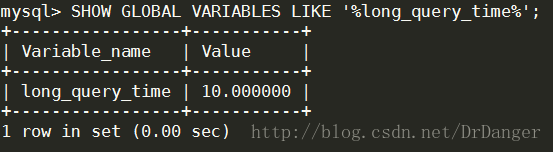

##### **4、设置慢查询日志阙值**

```sql
SET GLOBAL long_query_time=3;
```

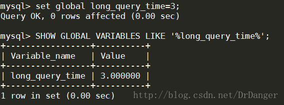

##### **5、查看多少SQL语句超过了阙值**

```sql
SHOW GLOBAL STATUS LIKE '%Slow_queries%';
```

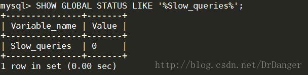

##### 6、MySQL提供的日志分析工具mysqldumpslow

进入MySQL的安装目录中的bin目录下

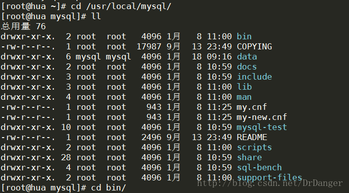

执行 ./mysqldumpslow --help 查看帮助命令

常用参考：

得到返回记录集最多的10个SQL
mysqldumpslow -s r -t 10 slow.log
得到访问次数最多的10个SQL
mysqldumpslow -s c -t 10 slow.log
得到按照时间排序的前10条里面含有左连接的查询语句
mysqldumpslow -s t -t 10 -g "left join" slow.log
使用这些语句时结合| more使用

#### 二、explain+慢SQL分析

使用EXPLAIN关键字可以模拟优化器执行SQL查询语句，从而知道MySQL是 如何处理你的SQL语句的。分析你的查询语句或是表结构的性能瓶颈。

使用方式：Explain+SQL语句

执行计划包含的信息：

+----+-------------+-------+------+---------------+------+---------+------+------+-------+
 |  id  |  select_type |  table  | type  | possible_keys | key   | key_len  | ref     | rows  | Extra   |
+----+-------------+-------+------+---------------+------+---------+------+------+-------+

##### 1、id

SELECT查询的序列号，包含一组数字，表示查询中执行SELECT语句或操作表的顺序

包含三种情况：

1.id相同，执行顺序由上至下

2.id不同，如果是子查询，id序号会递增，id值越大优先级越高，越先被执行

3.id既有相同的，又有不同的。id如果相同认为是一组，执行顺序由上至下； 在所有组中，id值越大优先级越高，越先执行。

##### 2、select_type

**SIMPLE**:简单SELECT查询，查询中不包含子查询或者UNION
**PRIMARY**:查询中包含任何复杂的子部分，最外层的查询
**SUBQUERY**：SELECT或WHERE中包含的子查询部分
**DERIVED**：在FROM中包含的子查询被标记为DERIVER(衍生)， MySQL会递归执行这些子查询，把结果放到临时表中
**UNION**：若第二个SELECT出现UNION，则被标记为UNION, 若UNION包含在FROM子句的子查询中，外层子查询将被标记为DERIVED
**UNION RESULT**：从UNION表获取结果的SELECT

##### 3、table

显示这一行数据是关于哪张表的

##### 4、type  

type显示的是访问类型，是较为重要的一个指标，结果值从最好到最坏依次是：
system>const>eq_ref>ref>fulltext>ref_or_null>index_merge>unique_subquery>index_subquery>range>index>ALL
一般来说，得保证查询至少达到range级别，最好能达到ref。

**system**：表只有一行记录（等于系统表），这是const类型的特例，平时不会出现

**const**：如果通过索引依次就找到了，const用于比较主键索引或者unique索引。 因为只能匹配一行数据，所以很快。如果将主键置于where列表中，MySQL就能将该查询转换为一个常量

**eq_ref**：唯一性索引扫描，对于每个索引键，表中只有一条记录与之匹配。常见于主键或唯一索引扫描

**ref**：非唯一性索引扫描，返回匹配某个单独值的所有行。本质上也是一种索引访问，它返回所有匹配 某个单独值的行，然而它可能会找到多个符合条件的行，所以它应该属于查找和扫描的混合体

**range**：只检索给定范围的行，使用一个索引来选择行。key列显示使用了哪个索引，一般就是在你的where语句中出现between、<、>、in等的查询，这种范围扫描索引比全表扫描要好，因为只需要开始于缩印的某一点，而结束于另一点，不用扫描全部索引

**index**：Full Index Scan ，index与ALL的区别为index类型只遍历索引树，这通常比ALL快，因为索引文件通常比数据文件小。 （也就是说虽然ALL和index都是读全表， 但index是从索引中读取的，而ALL是从硬盘读取的）

**all**：Full Table Scan，遍历全表获得匹配的行

##### 5、possible_keys

显示可能应用在这张表中的索引，一个或多个。 查询涉及到的字段上若存在索引，则该索引将被列出，但不一定被查询实际使用

##### 6、key

实际使用的索引。如果为NULL，则没有使用索引。 

查询中若出现了覆盖索引，则该索引仅出现在key列表中。

##### 7、key_len

表示索引中使用的字节数，可通过该列计算查询中使用的索引的长度。在不损失精度的情况下，长度越短越好。

key_len显示的值为索引字段的最大可能长度，并非实际使用长度，即key_len是根据表定义计算而得，不是通过表内检索出的。

##### 8、ref

显示索引的哪一列被使用了，哪些列或常量被用于查找索引列上的值。

##### 9、rows

根据表统计信息及索引选用情况，大致估算出找到所需记录多需要读取的行数。

##### 10、Extra

包含不适合在其他列中显示但十分重要的额外信息：

1、Using filesort： 说明MySQL会对数据使用一个外部的索引排序，而不是按照表内的索引顺序进行读取。MySQL中无法利用索引完成的排序操作称为“文件排序”
2、Using temporary：  使用了临时表保存中间结果，MySQL在对查询结果排序时使用临时表。常见于排序order by和分组查询group by
3、Using index： 表示相应的SELECT操作中使用了覆盖索引（Covering Index），避免访问了表的数据行，效率不错。 如果同时出现using where，表明索引被用来执行索引键值的查找； 如果没有同时出现using where，表明索引用来读取数据而非执行查找动作 覆盖索引（Covering Index）： 理解方式1：SELECT的数据列只需要从索引中就能读取到，不需要读取数据行，MySQL可以利用索引返回SELECT列表中 的字段，而不必根据索引再次读取数据文件，换句话说查询列要被所建的索引覆盖 理解方式2：索引是高效找到行的一个方法，但是一般数据库也能使用索引找到一个列的数据，因此他不必读取整个行。 毕竟索引叶子节点存储了他们索引的数据；当能通过读取索引就可以得到想要的数据，那就不需要读取行了，一个索引 包含了（覆盖）满足查询结果的数据就叫做覆盖索引 注意： 如果要使用覆盖索引，一定要注意SELECT列表中只取出需要的列，不可SELECT *, 因为如果所有字段一起做索引会导致索引文件过大查询性能下降
6、impossible where： WHERE子句的值总是false，不能用来获取任何元组
7、select tables optimized away： 在没有GROUP BY子句的情况下基于索引优化MIN/MAX操作或者对于MyISAM存储引擎优化COUNT(*)操作， 不必等到执行阶段再进行计算，查询执行计划生成的阶段即完成优化
8、distinct： 优化distinct操作，在找到第一匹配的元祖后即停止找同样值的操作

#### 三、show profile查询SQL语句在服务器中的执行细节和生命周期

Show Profile是MySQL提供可以用来分析当前会话中语句执行的资源消耗情况，可以用于SQL的调优测量
默认关闭，并保存最近15次的运行结果
分析步骤
  1、查看状态：SHOW VARIABLES LIKE 'profiling';
  2、开启：set profiling=on;
  3、查看结果：show profiles;
  4、诊断SQL：show profile cpu,block io for query 上一步SQL数字号码;
​    ALL：显示所有开销信息
​    BLOCK IO：显示IO相关开销
​    CONTEXT SWITCHES：显示上下文切换相关开销
​    CPU：显示CPU相关开销
​    IPC：显示发送接收相关开销
​    MEMORY：显示内存相关开销
​    PAGE FAULTS：显示页面错误相关开销
​    SOURCE：显示和Source_function，Source_file，Source_line相关开销
​    SWAPS：显示交换次数相关开销
注意（遇到这几种情况要优化）
  converting HEAP to MyISAM： 查询结果太大，内存不够用往磁盘上搬
  Creating tmp table：创建临时表
  Copying to tmp table on disk：把内存中的临时表复制到磁盘
  locked

#### 四、SQL数据库服务器参数调优

当order by 和 group by无法使用索引时，增大max_length_for_sort_data参数设置和增大sort_buffer_size参数的设置

## 悲观锁和乐观锁

悲观锁：select for update
乐观锁：先查询一次数据，然后使用查询出来的数据+1进行更新数据，如果失败则循环

## 优化数据访问

### 1. 减少请求的数据量

- 只返回必要的列：最好不要使用 SELECT * 语句。
- 只返回必要的行：使用 LIMIT 语句来限制返回的数据。
- 缓存重复查询的数据：使用缓存可以避免在数据库中进行查询，特别在要查询的数据经常被重复查询时，缓存带来的查询性能提升将会是非常明显的。

### 2. 减少服务器端扫描的行数

最有效的方式是使用索引来覆盖查询。

## mysql表在磁盘中的存储方式

数据库中的数据都存储在表空间中。表空间相当于是从数据库的逻辑存储到磁盘物理存储的一个映射，用于指明数据的物理位置。
一般一个数据库对应若干个表空间，一个表空间对应多个段，一个段对应多个区，一个区对应多个数据块，数据就保存在数据块中。如果再往深层次追究每次查找数据是怎样从磁盘读取的，就要考虑B+树索引的相关内容。  

## SQL语句分析

### 查询语句

说了以上这么多，那么究竟一条 sql 语句是如何执行的呢？其实我们的 sql 可以分为两种，一种是查询，一种是更新（增加，更新，删除）。我们先分析下查询语句，语句如下：

```sql
select * from tb_student  A where A.age='18' and A.name=' 张三 ';
```

结合上面的说明，我们分析下这个语句的执行流程：

- 先检查该语句是否有权限，如果没有权限，直接返回错误信息，如果有权限，在 MySQL8.0 版本以前，会先查询缓存，以这条 sql 语句为 key 在内存中查询是否有结果，如果有直接缓存，如果没有，执行下一步。

- 通过分析器进行词法分析，提取 sql 语句的关键元素，比如提取上面这个语句是查询 select，提取需要查询的表名为 tb_student,需要查询所有的列，查询条件是这个表的 id='1'。然后判断这个 sql 语句是否有语法错误，比如关键词是否正确等等，如果检查没问题就执行下一步。

- 接下来就是优化器进行确定执行方案，上面的 sql 语句，可以有两种执行方案：

  ```
    a.先查询学生表中姓名为“张三”的学生，然后判断是否年龄是 18。
    b.先找出学生中年龄 18 岁的学生，然后再查询姓名为“张三”的学生。
  ```

  那么优化器根据自己的优化算法进行选择执行效率最好的一个方案（优化器认为，有时候不一定最好）。那么确认了执行计划后就准备开始执行了。

- 进行权限校验，如果没有权限就会返回错误信息，如果有权限就会调用数据库引擎接口，返回引擎的执行结果。

### 更新语句

以上就是一条查询 sql 的执行流程，那么接下来我们看看一条更新语句如何执行的呢？sql 语句如下：

```
update tb_student A set A.age='19' where A.name=' 张三 ';
```

我们来给张三修改下年龄，在实际数据库肯定不会设置年龄这个字段的，不然要被技术负责人打的。其实条语句也基本上会沿着上一个查询的流程走，只不过执行更新的时候肯定要记录日志啦，这就会引入日志模块了，MySQL 自带的日志模块式 **binlog（归档日志）** ，所有的存储引擎都可以使用，我们常用的 InnoDB 引擎还自带了一个日志模块 **redo log（重做日志）**，我们就以 InnoDB 模式下来探讨这个语句的执行流程。流程如下：

- 先查询到张三这一条数据，如果有缓存，也是会用到缓存。
- 然后拿到查询的语句，把 age 改为 19，然后调用引擎 API 接口，写入这一行数据，InnoDB 引擎把数据保存在内存中，同时记录 redo log，此时 redo log 进入 prepare 状态，然后告诉执行器，执行完成了，随时可以提交。
- 执行器收到通知后记录 binlog，然后调用引擎接口，提交 redo log 为提交状态。
- 更新完成。

**这里肯定有同学会问，为什么要用两个日志模块，用一个日志模块不行吗?**

这是因为最开始 MySQL 并没与 InnoDB 引擎( InnoDB 引擎是其他公司以插件形式插入 MySQL 的) ，MySQL 自带的引擎是 MyISAM，但是我们知道 redo log 是 InnoDB 引擎特有的，其他存储引擎都没有，这就导致会没有 crash-safe 的能力(crash-safe 的能力即使数据库发生异常重启，之前提交的记录都不会丢失)，binlog 日志只能用来归档。

并不是说只用一个日志模块不可以，只是 InnoDB 引擎就是通过 redo log 来支持事务的。那么，又会有同学问，我用两个日志模块，但是不要这么复杂行不行，为什么 redo log 要引入 prepare 预提交状态？这里我们用反证法来说明下为什么要这么做？

- **先写 redo log 直接提交，然后写 binlog**，假设写完 redo log 后，机器挂了，binlog 日志没有被写入，那么机器重启后，这台机器会通过 redo log 恢复数据，但是这个时候 bingog 并没有记录该数据，后续进行机器备份的时候，就会丢失这一条数据，同时主从同步也会丢失这一条数据。
- **先写 binlog，然后写 redo log**，假设写完了 binlog，机器异常重启了，由于没有 redo log，本机是无法恢复这一条记录的，但是 binlog 又有记录，那么和上面同样的道理，就会产生数据不一致的情况。

如果采用 redo log 两阶段提交的方式就不一样了，写完 binglog 后，然后再提交 redo log 就会防止出现上述的问题，从而保证了数据的一致性。那么问题来了，有没有一个极端的情况呢？假设 redo log 处于预提交状态，binglog 也已经写完了，这个时候发生了异常重启会怎么样呢？ 这个就要依赖于 MySQL 的处理机制了，MySQL 的处理过程如下：

- 判断 redo log 是否完整，如果判断是完整的，就立即提交。
- 如果 redo log 只是预提交但不是 commit 状态，这个时候就会去判断 binlog 是否完整，如果完整就提交 redo log, 不完整就回滚事务。

这样就解决了数据一致性的问题。

## 连接

连接用于连接多个表，使用 JOIN 关键字，并且条件语句使用 ON 而不是 WHERE。

连接可以替换子查询，并且比子查询的效率一般会更快。

可以用 AS 给列名、计算字段和表名取别名，给表名取别名是为了简化 SQL 语句以及连接相同表。

### 内连接

内连接又称等值连接，使用 INNER JOIN 关键字。

```sql
SELECT A.value, B.value
FROM tablea AS A INNER JOIN tableb AS B
ON A.key = B.key;
```

可以不明确使用 INNER JOIN，而使用普通查询并在 WHERE 中将两个表中要连接的列用等值方法连接起来。

```sql
SELECT A.value, B.value
FROM tablea AS A, tableb AS B
WHERE A.key = B.key;
```

### 自连接

自连接可以看成内连接的一种，只是连接的表是自身而已。

一张员工表，包含员工姓名和员工所属部门，要找出与 Jim 处在同一部门的所有员工姓名。

子查询版本

```sql
SELECT name
FROM employee
WHERE department = (
      SELECT department
      FROM employee
      WHERE name = "Jim");
```

自连接版本

```sql
SELECT e1.name
FROM employee AS e1 INNER JOIN employee AS e2
ON e1.department = e2.department
      AND e2.name = "Jim";
```

### 自然连接

自然连接是把同名列通过等值测试连接起来的，同名列可以有多个。

内连接和自然连接的区别：内连接提供连接的列，而自然连接自动连接所有同名列。

```sql
SELECT A.value, B.value
FROM tablea AS A NATURAL JOIN tableb AS B;
```

### 外连接

外连接保留了没有关联的那些行。分为左外连接，右外连接以及全外连接，左外连接就是保留左表没有关联的行。

检索所有顾客的订单信息，包括还没有订单信息的顾客。

```sql
SELECT Customers.cust_id, Orders.order_num
FROM Customers LEFT OUTER JOIN Orders
ON Customers.cust_id = Orders.cust_id;
```

customers 表：

| cust_id | cust_name |
| ------- | --------- |
| 1       | a         |
| 2       | b         |
| 3       | c         |

orders 表：

| order_id | cust_id |
| -------- | ------- |
| 1        | 1       |
| 2        | 1       |
| 3        | 3       |
| 4        | 3       |

结果：

| cust_id | cust_name | order_id |
| ------- | --------- | -------- |
| 1       | a         | 1        |
| 1       | a         | 2        |
| 3       | c         | 3        |
| 3       | c         | 4        |
| 2       | b         | Null     |

## MongoDB使用B树，MySQL使用B+树

* MongoDB 是一种 nosql，也存储在磁盘上，被设计用在 数据模型简单，性能要求高的场合。性能要求高，看看B/B+树的区别第一点：

  > B+树内节点不存储数据，所有 data 存储在叶节点导致查询时间复杂度固定为 log n。而B-树查询时间复杂度不固定，与 key 在树中的位置有关，最好为O(1)

  我们说过，尽可能少的磁盘 IO 是提高性能的有效手段。MongoDB 是聚合型数据库，而 B-树恰好 key 和 data 域聚合在一起。

* Mysql 是一种关系型数据库，区间访问是常见的一种情况，而 B-树并不支持区间访问（可参见上图），而B+树由于数据全部存储在叶子节点，并且通过指针串在一起，这样就很容易的进行区间遍历甚至全部遍历。

  见B/B+树的区别第二点：

  > B+树叶节点两两相连可大大增加区间访问性，可使用在范围查询等，而B-树每个节点 key 和 data 在一起，则无法区间查找。

  其次B+树的查询效率更加稳定，数据全部存储在叶子节点，查询时间复杂度固定为 O(log n)。

  最后第三点：

  > B+树更适合外部存储。由于内节点无 data 域，每个节点能索引的范围更大更精确

## SQL和NoSQL的区别

### 概念

SQL (Structured Query Language) 数据库，指关系型数据库。主要代表：SQL Server，Oracle，MySQL(开源)，PostgreSQL(开源)。

NoSQL（Not Only SQL）泛指非关系型数据库。主要代表：MongoDB，Redis，CouchDB。 

### 区别

#### 1、存储方式

SQL数据存在特定结构的表中；而NoSQL则更加灵活和可扩展，存储方式可以省是JSON文档、哈希表或者其他方式。

#### 2、表/数据集合的数据的关系

在SQL中，必须定义好表和字段结构后才能添加数据，例如定义表的主键(primary key)，索引(index),触发器(trigger),存储过程(stored procedure)等。表结构可以在被定义之后更新，但是如果有比较大的结构变更的话就会变得比较复杂。在NoSQL中，数据可以在任何时候任何地方添加，不需要先定义表。

NoSQL也可以在数据集中建立索引。以MongoDB为例，会自动在数据集合创建后创建唯一值_id字段，这样的话就可以在数据集创建后增加索引。

从这点来看，NoSQL可能更加适合初始化数据还不明确或者未定的项目中。

#### 3、外部数据存储

SQL中如何需要增加外部关联数据的话，规范化做法是在原表中增加一个外键，关联外部数据表。例如需要在借阅表中增加审核人信息，先建立一个审核人表，再在原来的借阅人表中增加审核人外键。

这样如果我们需要更新审核人个人信息的时候只需要更新审核人表而不需要对借阅人表做更新。而在NoSQL中除了这种规范化的外部数据表做法以外，我们还能用如下的非规范化方式把外部数据直接放到原数据集中，以提高查询效率。缺点也比较明显，更新审核人数据的时候将会比较麻烦。

#### 4、SQL中的JOIN查询

SQL中可以使用JOIN表链接方式将多个关系数据表中的数据用一条简单的查询语句查询出来。NoSQL暂未提供类似JOIN的查询方式对多个数据集中的数据做查询。所以大部分NoSQL使用非规范化的数据存储方式存储数据。 

#### 5、数据耦合性

SQL中不允许删除已经被使用的外部数据，例如审核人表中的"熊三"已经被分配给了借阅人熊大，那么在审核人表中将不允许删除熊三这条数据，以保证数据完整性。而NoSQL中则没有这种强耦合的概念，可以随时删除任何数据。

#### 6、事务

SQL中如果多张表数据需要同批次被更新，即如果其中一张表更新失败的话其他表也不能更新成功。这种场景可以通过事务来控制，可以在所有命令完成后再统一提交事务。而NoSQL中没有事务这个概念，每一个数据集的操作都是原子级的。

#### 7、增删改查语法 

#### 8、查询性能

在相同水平的系统设计的前提下，因为NoSQL中省略了JOIN查询的消耗，故理论上性能上是优于SQL的。

### 补充

目前许多大型互联网项目都会选用MySQL（或任何关系型数据库） + NoSQL的组合方案。 

关系型数据库适合存储结构化数据，如用户的帐号、地址：

1）这些数据通常需要做结构化查询（嗯，好像是废话），比如join，这时候，关系型数据库就要胜出一筹

2）这些数据的规模、增长的速度通常是可以预期的

3）事务性、一致性 

NoSQL适合存储非结构化数据，如文章、评论：

1）这些数据通常用于模糊处理，如全文搜索、机器学习

2）这些数据是海量的，而且增长的速度是难以预期的，

3）根据数据的特点，NoSQL数据库通常具有无限（至少接近）伸缩性

4）按key获取数据效率很高，但是对join或其他结构化查询的支持就比较差

基于它们的适用范围不同，目前主流架构才会采用组合方案，一个也不能少。目前为止，还没有出现一个能够通吃各种场景的数据库，而且根据[CAP理论](evernote-html-snippet://link.zhihu.com/?target=http%3A//en.wikipedia.org/wiki/CAP_theorem)，这样的数据库是不存在的。 

## 分库分表

### 分库

分库讲白了就是比如现在你有一个数据库服务器，数据库中有两张表分别是用户表和订单表。如果要分库的话现在你需要买两台机子，搞两个数据库分别放在两台机子上，并且一个数据库放用户表，一个数据库放订单表，这样存储压力就分担到两个服务器上了，但是会带来新的问题，所以东西变复杂了都会有新的问题产生。

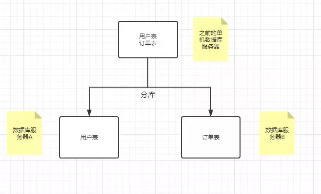

1、联表查询问题 也就是join了，之前在一个数据库里面可以用上join用一条sql语句就可以联表查询得到想要的结果，但是现在分为多个数据库了，所以join用不上了。就比如现在要查注册时间在2019年之后用户的订单信息，你就需要先去数据库A中用户表查询注册在2019年之后的信息，然后得到用户id,再拿这些id去数据库B订单表中查找订单信息，然后再拼接这些信息返回。所以等于得多写一些代码了。

2、事务问题 搞数据库基本上都离不开事务，但是现在不同的数据库事务就不是以前那个简单的本地事务了，而是分布式事务了，而引入分布式事务也提高了系统的复杂性，并且有些效率不高还会影响性能例如Mysql XA。还有基于消息中间件实现分布式事务的等等这里不展开讲述。

### 分表

我们已经做了分库了，但是现在情况是我们的表里面的数据太多了，就一不小心你的公司的产品火了，像抖音这种，所有用户如果就存在一张表里吃不消，所以这时候得分表。分别又分垂直分表和水平分表。

#### 垂直分表

垂直分表的意思形象点就像坐标轴的y轴，把x轴切成了两半，对应到我们的表就是比如我们表有10列，现在一刀切下去，分成了两张表，其中一张表3列，另一张表7列。

这个一刀切下去让两个表分别有几列不是固定的，垂直分表适合表中存在不常用并且占用了大量空间的表拆分出去。

就拿头条的用户信息，比如用户表只有用户id、昵称、手机号、个人简介这4个字段。但是手机号和个人简介这种信息就属于不太常用的，占用的空间也不小，个人简介有些人写了一坨。所以就把手机号和个人简介这两列拆分出去。

那垂直分表影响就是之前只要一个查询的，现在需要两次查询才能拿到分表之前的完整用户表信息。

#### 水平分表

水平分表的意思形象点就像坐标轴的x轴，把y轴切成了两半(当然不仅限于切一刀，可以切好几份)。也拿用户表来说比如现在用户表有5000万行数据，我们切5刀，分成5个表，每个表1000万行数据。

水平分表就适合用户表行数很多的情况下，一般单表行数超过5000万就得分表，如果单表的数据比较复杂那可能2000万甚至1000万就得分了，这个得看实际情况有些表很简单可能一亿行都不用分。所以当一个表行数超过千万级别的时候关注一下，如果没有性能问题就可以再等等看，不要急着分表，因为分表会是带来很多问题。

水平分表的问题比垂直分表就更烦了。

要考虑怎么切，讲的高级点就叫路由

1、按id也就是范围路由，比如id 值1999万的放一张表，1000万1999放一张表，一次类推。这个得试的，因为范围分的大了，可能性能还有问题，范围分的小了。。那表不得多死。这种分法的好处就是容易切啊，简单粗暴，以后新增的数据分表都不会影响到之前的数据，之前的数据都不需要移动。

2、哈希路由 就是取几列哈希一下看看数据哪个库，比如拿id来做哈希，1500取余8等于4，所以这条记录就放在user_4这个表中，2011取余8等于3，所以这条记录就放在user_3中。这种分法好处就是分的很均匀，基本上每个表的数据都差不多，但是以后新增数据又得分表了咋办，以前的数据都得动，比较烦！

3、搞一张表来存储路由关系 还是拿用户表来说，就是弄一个路由表，里面存userId和表编号，表示这个userId是这张user表的的。这种方式也简单，之后又要分表了之后改改路由表，迁移一部分数据。但是这种方法导致每次查询都得查两次，并且如果路由表太大了，那路由表又成为瓶颈了！

### 分库分表引起的问题

1. 事务问题。在执行分库之后，由于数据存储到了不同的库上，数据库事务管理出现了困难。如果依赖数据库本身的分布式事务管理功能去执行事务，将付出高昂的性能代价；如果由应用程序去协助控制，形成程序逻辑上的事务，又会造成编程方面的负担。
2. 跨库跨表的join问题。在执行了分库分表之后，难以避免会将原本逻辑关联性很强的数据划分到不同的表、不同的库上，我们无法join位于不同分库的表，也无法join分表粒度不同的表，结果原本一次查询能够完成的业务，可能需要多次查询才能完成。
3. 额外的数据管理负担和数据运算压力。额外的数据管理负担，最显而易见的就是数据的定位问题和数据的增删改查的重复执行问题，这些都可以通过应用程序解决，但必然引起额外的逻辑运算。