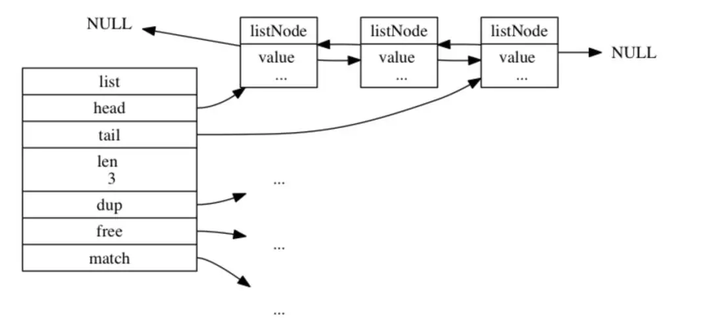
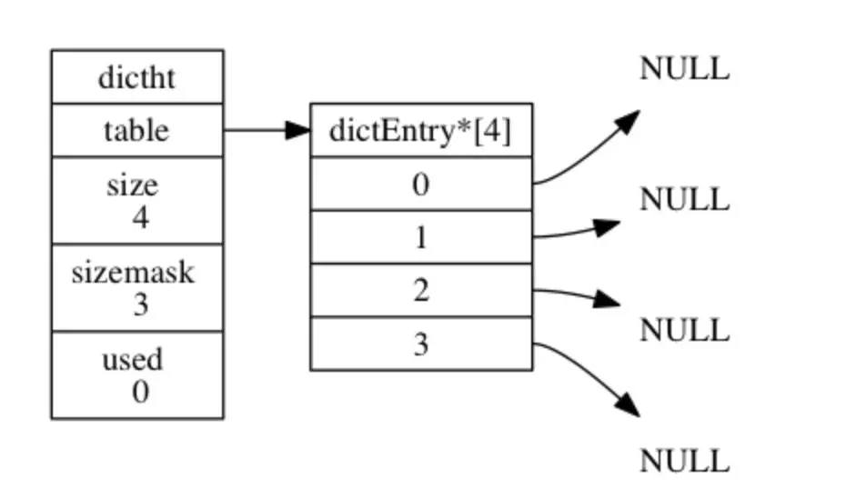
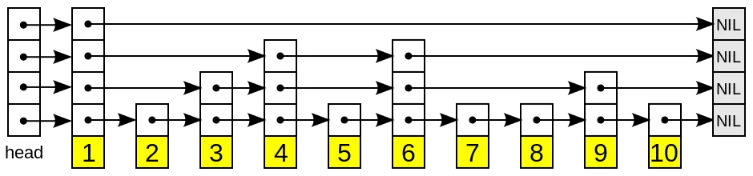
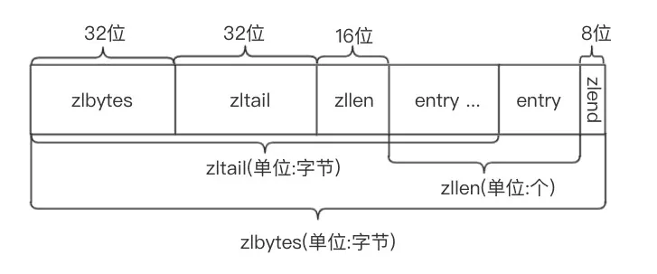
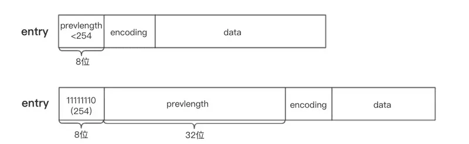
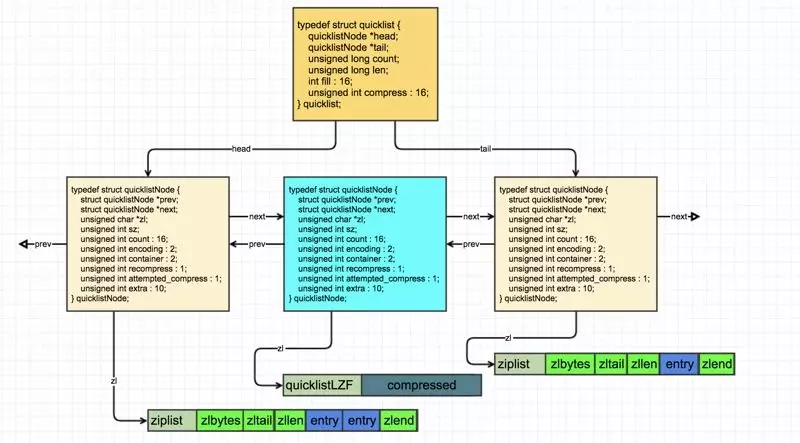

# Redis

## Redis数据结构及底层实现


### 1. 字符串处理(string)

我们都知道redis是用C语言写，但是C语言处理字符串和数组的成本是很高的。

#### 没有数据结构支撑的几个问题

1. 极其容易造成缓冲区溢出问题，比如用`strcat()`，在用这个函数之前必须要先给目标变量分配足够的空间，否则就会溢出。
2. 如果要获取字符串的长度，没有数据结构的支撑，可能就需要遍历，它的复杂度是O(N)
3. 内存重分配。C字符串的每次变更(曾长或缩短)都会对数组作内存重分配。同样，如果是缩短，没有处理好多余的空间，也会造成内存泄漏。

好了，Redis自己构建了一种名叫`Simple dynamic string(SDS)`的数据结构，他分别对这几个问题作了处理。我们先来看看它的结构源码：

```C
struct sdshdr{
    //记录buf数组中已使用字节的数量
    //等于 SDS 保存字符串的长度
    int len;     
    //记录 buf
    数组中未使用字节的数量
    int free;
    //字节数组，用于保存字符串
    char buf[];
}
```

再来说说它的优点：

1. 开发者不用担心字符串变更造成的内存溢出问题。
2. 常数时间复杂度获取字符串长度`len字段`。
3. 空间预分配`free字段`，会默认留够一定的空间防止多次重分配内存。

这就是string的底层实现，更是redis对所有字符串数据的处理方式(SDS会被嵌套到别的数据结构里使用)。

### 2. 链表

> Redis的链表在双向链表上扩展了头、尾节点、元素数等属性。



#### 2.1 源码

ListNode节点数据结构：

```C
typedef  struct listNode{
    //前置节点
    struct listNode *prev;
    //后置节点 
    struct listNode *next;
    //节点的值    
    void *value;
}listNode
```

链表数据结构：

```C
typedef struct list{ 
    //表头节点  
    listNode *head;
    //表尾节点   
    listNode *tail; 
    //链表所包含的节点数量   
    unsigned long len;
    //节点值复制函数    
    void (*free) (void *ptr);   
    //节点值释放函数    
    void (*free) (void *ptr);
    //节点值对比函数    
    int (*match) (void *ptr,void *key);
}list;
```

从上面可以看到，Redis的链表有这几个特点：

1. 可以直接获得头、尾节点。
2. 常数时间复杂度得到链表长度。
3. 是双向链表。

### 3. 字典(Hash)

> Redis的Hash，就是在`数组+链表`的基础上，进行了一些rehash优化等。



#### 3.1 数据结构源码

哈希表：

```C
typedef struct dictht { 
    // 哈希表数组   
    dictEntry **table;
    // 哈希表大小   
    unsigned long size; 
    // 哈希表大小掩码，用于计算索引值    
    // 总是等于 size - 1
    unsigned long sizemask;
    // 该哈希表已有节点的数量    
    unsigned long used;
} dictht;
```

Hash表节点：

```C
typedef struct dictEntry { 
    // 键  
    void *key;  
    // 值 
    union {   
        void *val;    
        uint64_t u64;
        int64_t s64;
    } v;    
    // 指向下个哈希表节点，形成链表    
    struct dictEntry *next;  // 单链表结构
} dictEntry;
```

字典：

```C
typedef struct dict {   
    // 类型特定函数  
    dictType *type;  
    // 私有数据
    void *privdata; 
    // 哈希表  
    dictht ht[2]; 
    // rehash 索引  
    // 当 rehash 不在进行时，值为 -1   
    int rehashidx;
    /* rehashing not in progress if rehashidx == -1 */
} dict;
```

可以看出：

1. Reids的Hash采用链地址法来处理冲突，然后它没有使用红黑树优化。
2. 哈希表节点采用单链表结构。
3. rehash优化。

下面我们讲一下它的rehash优化。

#### 3.2 rehash

> 当哈希表的键对太多或者太少，就需要对哈希表的大小进行调整，redis是如何调整的呢？

1. 我们仔细可以看到`dict`结构里有个字段`dictht ht[2]`代表有两个dictht数组。第一步就是为ht[1]哈希表分配空间，大小取决于ht[0]当前使用的情况。
2. 将保存在ht[0]中的数据rehash(重新计算哈希值)到ht[1]上。
3. 当ht[0]中所有键值对都迁移到ht[1]后，释放ht[0]，将ht[1]设置为ht[0]，并ht[1]初始化，为下一次rehash做准备。

#### 3.3 渐进式rehash

> 我们在3.2中看到，redis处理rehash的流程，但是更细一点的讲，它如何进行数据迁的呢？

这就涉及到了渐进式rehash，redis考虑到大量数据迁移带来的cpu繁忙(可能导致一段时间内停止服务)，所以采用了渐进式rehash的方案。步骤如下：

1. 为ht[1]分配空间，同时持有两个哈希表(一个空表、一个有数据)。
2. 维持一个技术器rehashidx，初始值0。
3. 每次对字典增删改查，会顺带将ht[0]中的数据迁移到ht[1],`rehashidx++`(注意：ht[0]中的数据是只减不增的)。
4. 直到rehash操作完成，rehashidx值设为-1。

它的好处：采用分而治之的思想，将庞大的迁移工作量划分到每一次CURD中，避免了服务繁忙。

### 4. 跳跃表

> 这个数据结构是我面试中见过最多的，它其实特别简单。学过的人可能都知道，它和平衡树性能很相似，但为什么不用平衡树而用skipList呢?



#### 4.1 skipList & AVL 之间的选择

1. 从算法实现难度上来比较，skiplist比平衡树要简单得多。
2. 平衡树的插入和删除操作可能引发子树的调整，逻辑复杂，而skiplist的插入和删除只需要修改相邻节点的指针，操作简单又快速。
3. 查找单个key，skiplist和平衡树的时间复杂度都为O(log n)，大体相当。
4. 在做范围查找的时候，平衡树比skiplist操作要复杂。
5. skiplist和各种平衡树（如AVL、红黑树等）的元素是有序排列的。

可以看到，skipList中的元素是有序的，所以跳跃表在redis中用在有序集合键、集群节点内部数据结构

#### 4.2 源码

跳跃表节点：

```C
typedef struct zskiplistNode {  
    // 后退指针 
    struct zskiplistNode *backward;
    // 分值  
    double score;
    // 成员对象    
    robj *obj; 
    // 层   
    struct zskiplistLevel { 
        // 前进指针     
        struct zskiplistNode *forward;  
        // 跨度    
        unsigned int span;  
    } 
    level[];
} zskiplistNode;
```

跳跃表：

```C
typedef struct zskiplist {  
    // 表头节点和表尾节点   
    struct zskiplistNode *header, *tail;  
    // 表中节点的数量  
    unsigned long length;  
    // 表中层数最大的节点的层数  
    int level;
} zskiplist;
```

它有几个概念：

##### 4.2.1 层(level[])

层，也就是`level[]`字段，层的数量越多，访问节点速度越快。(因为它相当于是索引，层数越多，它索引就越细，就能很快找到索引值)

##### 4.2.2 前进指针(forward)

层中有一个`forward`字段，用于从表头向表尾方向访问。

##### 4.2.3 跨度(span)

用于记录两个节点之间的距离

##### 4.2.4 后退指针(backward)

用于从表尾向表头方向访问。

### 案例

```
level0    1---------->5
level1    1---->3---->5
level2    1->2->3->4->5->6->7->8
```

比如我要找键为6的元素，在level0中直接定位到5，然后再往后走一个元素就找到了。

### 5. 整数集合(intset)

> Reids对整数存储专门作了优化，intset就是redis用于保存整数值的集合数据结构。当一个结合中只包含整数元素，redis就会用这个来存储。

```
127.0.0.1:6379[2]> sadd number 1 2 3 4 5 6(integer) 6
127.0.0.1:6379[2]> object encoding number"intset"
```

#### 源码

intset数据结构：

```C
typedef struct intset {  
    // 编码方式   
    uint32_t encoding;    
    // 集合包含的元素数量  
    uint32_t length; 
    // 保存元素的数组  
    int8_t contents[];
} intset;
```

你肯定很好奇编码方式(encoding)字段是干嘛用的呢？

- 如果 encoding 属性的值为 INTSET_ENC_INT16 ， 那么 contents 就是一个 int16_t 类型的数组， 数组里的每个项都是一个 int16_t 类型的整数值 （最小值为 -32,768 ，最大值为 32,767 ）。
- 如果 encoding 属性的值为 INTSET_ENC_INT32 ， 那么 contents 就是一个 int32_t 类型的数组， 数组里的每个项都是一个 int32_t 类型的整数值 （最小值为 -2,147,483,648 ，最大值为 2,147,483,647 ）。
- 如果 encoding 属性的值为 INTSET_ENC_INT64 ， 那么 contents 就是一个 int64_t 类型的数组， 数组里的每个项都是一个 int64_t 类型的整数值 （最小值为 -9,223,372,036,854,775,808 ，最大值为 9,223,372,036,854,775,807 ）。

说白了就是根据contents字段来判断用哪个int类型更好，也就是对int存储作了优化。

说到优化，那redis如何作的呢？就涉及到了升级。

##### 5.1 encoding升级

如果我们有个Int16类型的整数集合，现在要将65535(int32)加进这个集合，int16是存储不下的，所以就要对整数集合进行升级。

###### 它是怎么升级的呢(过程)？

假如现在有2个int16的元素:1和2，新加入1个int32位的元素65535。

1. 内存重分配，新加入后应该是3个元素，所以分配3*32-1=95位。
2. 选择最大的数65535, 放到(95-32+1, 95)位这个内存段中，然后2放到(95-32-32+1+1, 95-32)位...依次类推。

###### 升级的好处是什么呢？

1. 提高了整数集合的灵活性。
2. 尽可能节约内存(能用小的就不用大的)。

##### 5.2 不支持降级

按照上面的例子，如果我把65535又删掉，encoding会不会又回到Int16呢，答案是不会的。官方没有给出理由，我觉得应该是降低性能消耗吧，毕竟调整一次是O(N)的时间复杂度。

### 6. 压缩列表(ziplist)

> ziplist是redis为了节约内存而开发的顺序型数据结构。它被用在列表键和哈希键中。一般用于小数据存储。

引用https://segmentfault.com/a/1190000016901154中的两个图：





#### 6.1 源码

> ziplist没有明确定义结构体，这里只作大概的演示。

```C
typedef struct entry {   
    /*前一个元素长度需要空间和前一个元素长度*/ 
    unsigned int prevlengh;  
    /*元素内容编码*/  
    unsigned char encoding;  
    /*元素实际内容*/  
    unsigned char *data;
}zlentry;

typedef struct ziplist{   
    /*ziplist分配的内存大小*/  
    uint32_t zlbytes;  
    /*达到尾部的偏移量*/  
    uint32_t zltail;  
    /*存储元素实体个数*/    
    uint16_t zllen;    
    /*存储内容实体元素*/   
    unsigned char* entry[];  
    /*尾部标识*/ 
    unsigned char zlend;
}ziplist;
```

第一次看可能会特别蒙蔽，你细细的把我这段话看完就一定能懂。

##### Entry的分析

entry结构体里面有三个重要的字段：

1. previous_entry_length: 这个字段记录了ziplist中前一个节点的长度，什么意思？就是说通过该属性可以进行指针运算达到表尾向表头遍历，这个字段还有一个大问题下面会讲。
2. encoding:记录了数据类型(int16? string?)和长度。
3. data/content: 记录数据。

##### 连锁更新

###### previous_entry_length字段的分析

上面有说到，previous_entry_length这个字段存放上个节点的长度，那默认长度给分配多少呢?redis是这样分的，如果前节点长度小于254,就分配1字节，大于的话分配5字节，那问题就来了。

如果前一个节点的长度刚开始小于254字节，后来大于254,那不就存放不下了吗？ 这就涉及到previous_entry_length的更新，但是改一个肯定不行阿，后面的节点内存信息都需要改。所以就需要重新分配内存，然后连锁更新包括该受影响节点后面的所有节点。

除了增加新节点会引发连锁更新、删除节点也会触发。

### 7. 快速列表(quicklist)

> 一个由ziplist组成的双向链表。但是一个quicklist可以有多个quicklist节点，它很像B树的存储方式。是在redis3.2版本中新加的数据结构，用在列表的底层实现。



##### 结构体源码

表头结构：

```C
typedef struct quicklist { 
    //指向头部(最左边)quicklist节点的指针  
    quicklistNode *head;   
    //指向尾部(最右边)quicklist节点的指针  
    quicklistNode *tail;   
    //ziplist中的entry节点计数器   
    unsigned long count;    
    /* total count of all entries in all ziplists */  
    //quicklist的quicklistNode节点计数器   
    unsigned int len;    
    /* number of quicklistNodes */  
    //保存ziplist的大小，配置文件设定，占16bits 
    int fill : 16;        
    /* fill factor for individual nodes */  
    //保存压缩程度值，配置文件设定，占16bits，0表示不压缩   
    unsigned int compress : 16; 
    /* depth of end nodes not to compress;0=off */
} quicklist;
```

quicklist节点结构:

```C
typedef struct quicklistNode {  
    struct quicklistNode *prev;  
    //前驱节点指针  
    struct quicklistNode *next; 
    //后继节点指针   
    //不设置压缩数据参数recompress时指向一个ziplist结构   
    //设置压缩数据参数recompress指向quicklistLZF结构 
    unsigned char *zl; 
    //压缩列表ziplist的总长度 
    unsigned int sz;                
    /* ziplist size in bytes */   
    //ziplist中包的节点数，占16 bits长度  
    unsigned int count : 16;      
    /* count of items in ziplist */  
    //表示是否采用了LZF压缩算法压缩quicklist节点，1表示压缩过，2表示没压缩，占2 bits长度    unsigned int encoding : 2;      
    /* RAW==1 or LZF==2 */   
    //表示一个quicklistNode节点是否采用ziplist结构保存数据，2表示压缩了，1表示没压缩，默认是2，占2bits长度  
    unsigned int container : 2;   
    /* NONE==1 or ZIPLIST==2 */  
    //标记quicklist节点的ziplist之前是否被解压缩过，占1bit长度    
    //如果recompress为1，则等待被再次压缩  
    unsigned int recompress : 1;
    /* was this node previous compressed? */   
    //测试时使用  
    unsigned int attempted_compress : 1;
    /* node can't compress; too small */  
    //额外扩展位，占10bits长度   
    unsigned int extra : 10;
    /* more bits to steal for future usage */
} quicklistNode;
```

##### 相关配置

在redis.conf中的ADVANCED CONFIG部分：

```
list-max-ziplist-size -2list-compress-depth 0
```

###### list-max-ziplist-size参数

我们来详细解释一下`list-max-ziplist-size`这个参数的含义。它可以取正值，也可以取负值。

当取正值的时候，表示按照数据项个数来限定每个quicklist节点上的ziplist长度。比如，当这个参数配置成5的时候，表示每个quicklist节点的ziplist最多包含5个数据项。

当取负值的时候，表示按照占用字节数来限定每个quicklist节点上的ziplist长度。这时，它只能取-1到-5这五个值，每个值含义如下：

-5: 每个quicklist节点上的ziplist大小不能超过64 Kb。（注：1kb => 1024 bytes）

-4: 每个quicklist节点上的ziplist大小不能超过32 Kb。

-3: 每个quicklist节点上的ziplist大小不能超过16 Kb。

-2: 每个quicklist节点上的ziplist大小不能超过8 Kb。（-2是Redis给出的默认值）

###### list-compress-depth参数

这个参数表示一个quicklist两端不被压缩的节点个数。注：这里的节点个数是指quicklist双向链表的节点个数，而不是指ziplist里面的数据项个数。实际上，一个quicklist节点上的ziplist，如果被压缩，就是整体被压缩的。

参数list-compress-depth的取值含义如下：

0: 是个特殊值，表示都不压缩。这是Redis的默认值。 1: 表示quicklist两端各有1个节点不压缩，中间的节点压缩。 2: 表示quicklist两端各有2个节点不压缩，中间的节点压缩。 3: 表示quicklist两端各有3个节点不压缩，中间的节点压缩。 依此类推…

Redis对于quicklist内部节点的压缩算法，采用的LZF——一种无损压缩算法。

## Redis为什么用跳表而不用红黑树

Redis是用跳表来实现有序集合。

Redis 中的有序集合支持的核心操作主要有下面这几个：插入一个数据；删除一个数据；查找一个数据；按照区间查找数据（比如查找值在 [100, 356] 之间的数据）；迭代输出有序序列。

其中，插入、删除、查找以及迭代输出有序序列这几个操作，红黑树也可以完成，时间复杂度跟跳表是一样的。但是，按照区间来查找数据这个操作，红黑树的效率没有跳表高。

## Redis持久化机制

很多时候我们需要持久化数据也就是将内存中的数据写入到硬盘里面，大部分原因是为了之后重用数据（比如重启机器、机器故障之后恢复数据），或者是为了防止系统故障而将数据备份到一个远程位置。

Redis不同于Memcached的很重要一点就是，Redis支持持久化，而且支持两种不同的持久化操作。**Redis的一种持久化方式叫快照（snapshotting，RDB），另一种方式是只追加文件（append-only file,AOF）**。

### 快照（snapshotting）持久化（RDB）

Redis可以通过创建快照来获得存储在内存里面的数据在某个时间点上的副本。Redis创建快照之后，可以对快照进行备份，可以将快照复制到其他服务器从而创建具有相同数据的服务器副本（Redis主从结构，主要用来提高Redis性能），还可以将快照留在原地以便重启服务器的时候使用。

快照持久化是Redis默认采用的持久化方式，在redis.conf配置文件中默认有此下配置：

```
save 900 1           #在900秒(15分钟)之后，如果至少有1个key发生变化，Redis就会自动触发BGSAVE命令创建快照。
save 300 10          #在300秒(5分钟)之后，如果至少有10个key发生变化，Redis就会自动触发BGSAVE命令创建快照。
save 60 10000        #在60秒(1分钟)之后，如果至少有10000个key发生变化，Redis就会自动触发BGSAVE命令创建快照。
```

优点：全量数据快照，文件小，恢复快

缺点：无法保存最近一次快照之后的数据

### AOF（append-only file）持久化

与快照持久化相比，AOF持久化 的实时性更好，因此已成为主流的持久化方案。默认情况下Redis没有开启AOF（append only file）方式的持久化，可以通过appendonly参数开启：

```
appendonly yes
```

开启AOF持久化后每执行一条会更改Redis中的数据的命令，Redis就会将该命令写入硬盘中的AOF文件。AOF文件的保存位置和RDB文件的位置相同，都是通过dir参数设置的，默认的文件名是appendonly.aof。

在Redis的配置文件中存在三种不同的 AOF 持久化方式，它们分别是：

```
appendfsync always    #每次有数据修改发生时都会写入AOF文件,这样会严重降低Redis的速度
appendfsync everysec  #每秒钟同步一次，显示地将多个写命令同步到硬盘
appendfsync no        #让操作系统决定何时进行同步
```

为了兼顾数据和写入性能，用户可以考虑 appendfsync everysec选项 ，让Redis每秒同步一次AOF文件，Redis性能几乎没受到任何影响。而且这样即使出现系统崩溃，用户最多只会丢失一秒之内产生的数据。当硬盘忙于执行写入操作的时候，Redis还会优雅的放慢自己的速度以便适应硬盘的最大写入速度。

优点：可读性高，适合保存增量数据，数据不易丢失

缺点：文件体积较大，恢复时间长

### Redis 4.0 对于持久化机制的优化

Redis 4.0 开始支持 RDB 和 AOF 的混合持久化（默认关闭，可以通过配置项 `aof-use-rdb-preamble` 开启）。

如果把混合持久化打开，AOF 重写的时候就直接把 RDB 的内容写到 AOF 文件开头。这样做的好处是可以结合 RDB 和 AOF 的优点, 快速加载同时避免丢失过多的数据。当然缺点也是有的， AOF 里面的 RDB 部分是压缩格式不再是 AOF 格式，可读性较差。

BGSAVE做镜像全量持久化，AOF做增量持久啊。

## 数据淘汰策略

可以设置内存最大使用量，当内存使用量超出时，会施行数据淘汰策略。

Redis 具体有 6 种淘汰策略：

| 策略            | 描述                                                 |
| --------------- | ---------------------------------------------------- |
| volatile-lru    | 从已设置过期时间的数据集中挑选最近最少使用的数据淘汰 |
| volatile-ttl    | 从已设置过期时间的数据集中挑选将要过期的数据淘汰     |
| volatile-random | 从已设置过期时间的数据集中任意选择数据淘汰           |
| allkeys-lru     | 从所有数据集中挑选最近最少使用的数据淘汰             |
| allkeys-random  | 从所有数据集中任意选择数据进行淘汰                   |
| noeviction      | 禁止驱逐数据                                         |

作为内存数据库，出于对性能和内存消耗的考虑，Redis 的淘汰算法实际实现上并非针对所有 key，而是抽样一小部分并且从中选出被淘汰的 key。

使用 Redis 缓存数据时，为了提高缓存命中率，需要保证缓存数据都是热点数据。可以将内存最大使用量设置为热点数据占用的内存量，然后启用 allkeys-lru 淘汰策略，将最近最少使用的数据淘汰。

Redis 4.0 引入了 volatile-lfu 和 allkeys-lfu 淘汰策略，LFU 策略通过统计访问频率，将访问频率最少的键值对淘汰。

## 缓存穿透、缓存击穿、缓存雪崩概念及解决方案

### 缓存穿透

#### 概念

访问一个不存在的key，缓存不起作用，请求会穿透到DB，流量大时DB会挂掉。

#### 解决方案

1. 采用布隆过滤器，使用一个足够大的bitmap，用于存储可能访问的key，不存在的key直接被过滤；
2. 访问key未在DB查询到值，也将空值写进缓存，但可以设置较短过期时间。

### 缓存雪崩

#### 概念

大量的key设置了相同的过期时间，导致在缓存在同一时刻全部失效，造成瞬时DB请求量大、压力骤增，引起雪崩。

#### 解决方案

可以给缓存设置过期时间时加上一个随机值时间，使得每个key的过期时间分布开来，不会集中在同一时刻失效。

### 缓存击穿

#### 概念

一个存在的key，在缓存过期的一刻，同时有大量的请求，这些请求都会击穿到DB，造成瞬时DB请求量大、压力骤增。

#### 解决方案

在访问key之前，采用SETNX（set if not exists）来设置另一个短期key来锁住当前key的访问，访问结束再删除该短期key。

## Redis为什么那么快

* 完全基于内存，绝大部分请求是纯粹的内存操作，非常快速。数据存在内存中，类似于HashMap，HashMap的优势就是查找和操作的时间复杂度都是O(1)；

* 数据结构简单，对数据操作也简单，Redis中的数据结构是专门进行设计的；

* 采用单线程，避免了不必要的上下文切换和竞争条件，也不存在多进程或者多线程导致的切换而消耗 CPU，不用去考虑各种锁的问题，不存在加锁释放锁操作，没有因为可能出现死锁而导致的性能消耗；

* 使用多路I/O复用模型：Redis使用epoll作为I/O多路复用技术的实现，而且Redis将epoll的read、write、close等操作转换成事件，不在网络I/O上耗费太多时间，实现对多个FD的读写，提高性能。

## Redis为什么是单线程的

官方FAQ表示，因为Redis是基于内存的操作，CPU不是Redis的瓶颈，Redis的瓶颈最有可能是机器内存的大小或者网络带宽。既然单线程容易实现，而且CPU不会成为瓶颈，那就顺理成章地采用单线程的方案了（毕竟采用多线程会有很多麻烦！）。

## redis 的并发竞争问题是什么？如何解决这个问题？了解 redis 事务的 CAS 方案吗？

这个也是线上非常常见的一个问题，就是**多客户端同时并发写**一个 key，可能本来应该先到的数据后到了，导致数据版本错了；或者是多客户端同时获取一个 key，修改值之后再写回去，只要顺序错了，数据就错了。

而且 redis 自己就有天然解决这个问题的 CAS 类的乐观锁方案。

某个时刻，多个系统实例都去更新某个 key。可以基于 zookeeper 实现分布式锁。每个系统通过 zookeeper 获取分布式锁，确保同一时间，只能有一个系统实例在操作某个 key，别人都不允许读和写。

你要写入缓存的数据，都是从 mysql 里查出来的，都得写入 mysql 中，写入 mysql 中的时候必须保存一个时间戳，从 mysql 查出来的时候，时间戳也查出来。

每次要**写之前，先判断**一下当前这个 value 的时间戳是否比缓存里的 value 的时间戳要新。如果是的话，那么可以写，否则，就不能用旧的数据覆盖新的数据。

## Redis发布订阅

Redis 发布订阅(pub/sub)是一种消息通信模式：发送者(pub)发送消息，订阅者(sub)接收消息。

Redis 客户端可以订阅任意数量的频道。

下图展示了频道 channel1 ， 以及订阅这个频道的三个客户端 —— client2 、 client5 和 client1 之间的关系：


以下实例演示了发布订阅是如何工作的。在我们实例中我们创建了订阅频道名为 **redisChat**:

```shell
redis 127.0.0.1:6379> SUBSCRIBE redisChat

Reading messages... (press Ctrl-C to quit)
1) "subscribe"
2) "redisChat"
3) (integer) 1
```

现在，我们先重新开启个 redis 客户端，然后在同一个频道 redisChat 发布两次消息，订阅者就能接收到消息。

```shell
redis 127.0.0.1:6379> PUBLISH redisChat "Redis is a great caching technique"

(integer) 1

redis 127.0.0.1:6379> PUBLISH redisChat "Learn redis by runoob.com"

(integer) 1

# 订阅者的客户端会显示如下消息
1) "message"
2) "redisChat"
3) "Redis is a great caching technique"
1) "message"
2) "redisChat"
3) "Learn redis by runoob.com"
```

消息发布是无状态的，无法保证可达。

## Redis主从同步

### 全同步过程

* master 执行 bgsave ，在本地生成一份 rdb 快照文件。
* master node 将 rdb 快照文件发送给 slave node，如果 rdb 复制时间超过 60秒（repl-timeout），那么 slave node 就会认为复制失败，可以适当调大这个参数(对于千兆网卡的机器，一般每秒传输 100MB，6G 文件，很可能超过 60s)
* master node 在生成 rdb 时，会将所有新的写命令缓存在内存中，在 slave node 保存了 rdb 之后，再将新的写命令复制给 slave node。
* 如果在复制期间，内存缓冲区持续消耗超过 64MB，或者一次性超过 256MB，那么停止复制，复制失败。

```
client-output-buffer-limit slave 256MB 64MB 60
```

- slave node 接收到 rdb 之后，清空自己的旧数据，然后重新加载 rdb 到自己的内存中，同时**基于旧的数据版本**对外提供服务。
- 如果 slave node 开启了 AOF，那么会立即执行 BGREWRITEAOF，重写 AOF。

### 增量同步过程

- 如果全量复制过程中，master-slave 网络连接断掉，那么 slave 重新连接 master 时，会触发增量复制。
- master 直接从自己的 backlog 中获取部分丢失的数据，发送给 slave node，默认 backlog 就是 1MB。
- master 就是根据 slave 发送的 psync 中的 offset 来从 backlog 中获取数据的。

## 哨兵

### 哨兵功能

- 集群监控：负责监控 redis master 和 slave 进程是否正常工作。
- 消息通知：如果某个 redis 实例有故障，那么哨兵负责发送消息作为报警通知给管理员。
- 故障转移：如果 master node 挂掉了，会自动转移到 slave node 上。
- 配置中心：如果故障转移发生了，通知 client 客户端新的 master 地址。

## Redis实现点赞

当有用户为一篇文章点赞时，除了要对该文章的 votes 字段进行加 1 操作，还必须记录该用户已经对该文章进行了点赞，防止用户点赞次数超过 1。可以建立文章的已投票用户集合来进行记录。

为了节约内存，规定一篇文章发布满一周之后，就不能再对它进行投票，而文章的已投票集合也会被删除，可以为文章的已投票集合设置一个一周的过期时间就能实现这个规定。