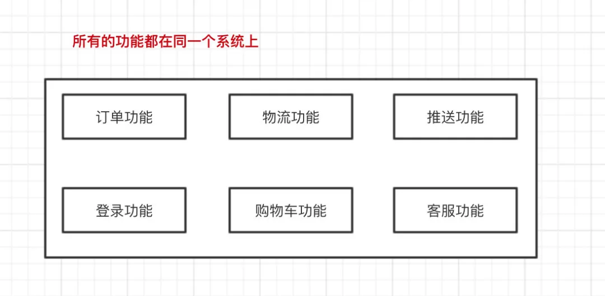
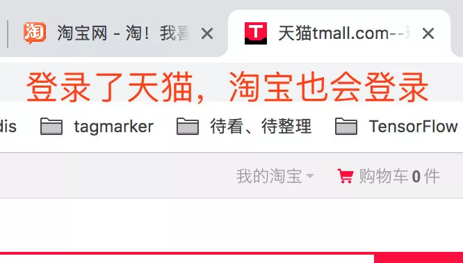
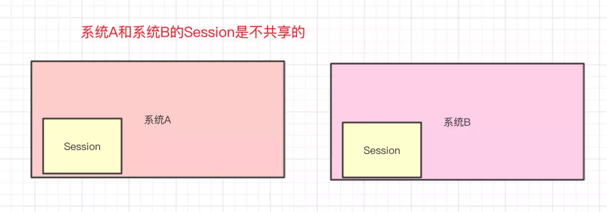
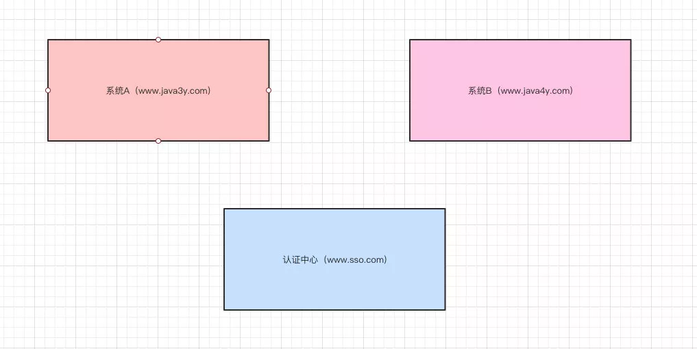

# 单点登录

## 一、什么是单点登录？

单点登录的英文名叫做：Single Sign On（简称**SSO**）。

在**初学/以前**的时候，一般我们就**单系统**，所有的功能都在同一个系统上。



后来，我们为了**合理利用资源和降低耦合性**，于是把单系统**拆分**成多个子系统。

- 回顾：[分布式基础知识](https://mp.weixin.qq.com/s?__biz=MzI4Njg5MDA5NA==&mid=2247484335&idx=1&sn=a871bf871fcaffda0be40e1388a69d7d&scene=21#wechat_redirect)


比如阿里系的**淘宝和天猫**，很明显地我们可以知道这是两个系统，但是你在使用的时候，登录了天猫，淘宝也会自动登录。



简单来说，单点登录就是**在多个系统中，用户只需一次登录，各个系统即可感知该用户已经登录。**

## 二、回顾单系统登录

在我初学JavaWeb的时候，登录和注册是我做得最多的一个功能了（初学Servlet的时候做过、学SpringMVC的时候做过、跟着做项目的时候做过…），反正我也数不清我做了多少次登录和注册的功能了…这里简单讲述一下我们初学时是怎么做登录功能的。

### HTTP是**无状态**的协议

众所周知，HTTP是**无状态**的协议，这意味着**服务器无法确认用户的信息**。于是乎，W3C就提出了：给每一个用户都发一个通行证，无论谁访问的时候都需要携带通行证，这样服务器就可以从通行证上确认用户的信息。通行证就是**Cookie**。

如果说Cookie是检查用户身上的”通行证“来确认用户的身份，那么Session就是通过检查服务器上的”客户明细表“来确认用户的身份的。**Session相当于在服务器中建立了一份“客户明细表”**。

HTTP协议是无状态的，Session不能依据HTTP连接来判断是否为同一个用户。于是乎：服务器向用户浏览器发送了一个名为JESSIONID的Cookie，它的值是Session的id值。**其实Session是依据Cookie来识别是否是同一个用户**。

所以，一般我们单系统实现登录会这样做：

- **登录**：将用户信息保存在Session对象中
- \- 如果在Session对象中能查到，说明已经登录
- 如果在Session对象中查不到，说明没登录（或者已经退出了登录）
- **注销（退出登录）**：从Session中删除用户的信息
- **记住我（关闭掉浏览器后，重新打开浏览器还能保持登录状态）**：配合Cookie来用

我之前Demo的代码，可以参考一下：

```
 /**
 * 用户登陆
 */
@PostMapping(value = "/user/session", produces = {"application/json;charset=UTF-8"})
public Result login(String mobileNo, String password, String inputCaptcha, HttpSession session, HttpServletResponse response) {

    //判断验证码是否正确
    if (WebUtils.validateCaptcha(inputCaptcha, "captcha", session)) {

        //判断有没有该用户
        User user = userService.userLogin(mobileNo, password);
        if (user != null) {
            /*设置自动登陆，一个星期.  将token保存在数据库中*/
            String loginToken = WebUtils.md5(new Date().toString() + session.getId());
            user.setLoginToken(loginToken);
            User user1 = userService.userUpload(user);

            session.setAttribute("user", user1);

            CookieUtil.addCookie(response,"loginToken",loginToken,604800);

            return ResultUtil.success(user1);

        } else {
            return ResultUtil.error(ResultEnum.LOGIN_ERROR);
        }
    } else {
        return ResultUtil.error(ResultEnum.CAPTCHA_ERROR);
    }

}

/**
 * 用户退出
 */
@DeleteMapping(value = "/session", produces = {"application/json;charset=UTF-8"})
public Result logout(HttpSession session,HttpServletRequest request,HttpServletResponse response ) {

    //删除session和cookie
    session.removeAttribute("user");

    CookieUtil.clearCookie(request, response, "loginToken");

    return ResultUtil.success();
}
/**
* @author ozc
* @version 1.0
* <p>
* 拦截器；实现自动登陆功能
*/
public class UserInterceptor implements HandlerInterceptor {


@Autowired
private UserService userService;

public boolean preHandle(HttpServletRequest request, HttpServletResponse response, Object o) throws Exception {
    User sessionUser = (User) request.getSession().getAttribute("user");

    // 已经登陆了，放行
    if (sessionUser != null) {
        return true;
    } else {
        //得到带过来cookie是否存在
        String loginToken = CookieUtil.findCookieByName(request, "loginToken");
        if (StringUtils.isNotBlank(loginToken)) {
            //到数据库查询有没有该Cookie
            User user = userService.findUserByLoginToken(loginToken);
            if (user != null) {
                request.getSession().setAttribute("user", user);
                return true;
            } else {
                //没有该Cookie与之对应的用户(Cookie不匹配)
                CookieUtil.clearCookie(request, response, "loginToken");
                return false;
            }
        } else {

            //没有cookie、也没有登陆。是index请求获取用户信息，可以放行
            if (request.getRequestURI().contains("session")) {
                return true;
            }

            //没有cookie凭证
            response.sendRedirect("/login.html");
            return false;
        }
    }
}
}
```

总结一下上面代码的思路：

- 用户登录时，验证用户的账户和密码
- 生成一个Token保存在数据库中，将Token写到Cookie中
- 将用户数据保存在Session中
- 请求时都会带上Cookie，检查有没有登录，如果已经登录则放行

### Cookie的作用是什么?和Session有什么区别？

Cookie 和 Session都是用来跟踪浏览器用户身份的会话方式，但是两者的应用场景不太一样。

**Cookie 一般用来保存用户信息** 比如①我们在 Cookie 中保存已经登录过得用户信息，下次访问网站的时候页面可以自动帮你登录的一些基本信息给填了；②一般的网站都会有保持登录也就是说下次你再访问网站的时候就不需要重新登录了，这是因为用户登录的时候我们可以存放了一个 Token 在 Cookie 中，下次登录的时候只需要根据 Token 值来查找用户即可(为了安全考虑，重新登录一般要将 Token 重写)；③登录一次网站后访问网站其他页面不需要重新登录。**Session 的主要作用就是通过服务端记录用户的状态。**典型的场景是购物车，当你要添加商品到购物车的时候，系统不知道是哪个用户操作的，因为 HTTP 协议是无状态的。服务端给特定的用户创建特定的 Session 之后就可以标识这个用户并且跟踪这个用户了。

Cookie 数据保存在客户端(浏览器端)，Session 数据保存在服务器端。

Cookie 存储在客户端中，而Session存储在服务器上，相对来说 Session 安全性更高。如果使用 Cookie 的一些敏感信息不要写入 Cookie 中，最好能将 Cookie 信息加密然后使用到的时候再去服务器端解密。

## 三、多系统登录的问题与解决

### 3.1 Session不共享问题

单系统登录功能主要是用Session保存用户信息来实现的，但我们清楚的是：多系统即可能有多个Tomcat，而Session是依赖当前系统的Tomcat，所以系统A的Session和系统B的Session是**不共享**的。



解决系统之间Session不共享问题有一下几种方案：

- Tomcat集群Session全局复制（集群内每个tomcat的session完全同步）【会影响集群的性能呢，不建议】
- 根据请求的IP进行**Hash映射**到对应的机器上（这就相当于请求的IP一直会访问同一个服务器）【如果服务器宕机了，会丢失了一大部分Session的数据，不建议】
- 把Session数据放在Redis中（使用Redis模拟Session）【**建议**】

我们可以将登录功能**单独抽取**出来，做成一个子系统。


SSO（登录系统）的逻辑如下：

```
// 登录功能(SSO单独的服务)
@Override
public TaotaoResult login(String username, String password) throws Exception {

    //根据用户名查询用户信息
    TbUserExample example = new TbUserExample();
    Criteria criteria = example.createCriteria();
    criteria.andUsernameEqualTo(username);
    List<TbUser> list = userMapper.selectByExample(example);
    if (null == list || list.isEmpty()) {
        return TaotaoResult.build(400, "用户不存在");
    }
    //核对密码
    TbUser user = list.get(0);
    if (!DigestUtils.md5DigestAsHex(password.getBytes()).equals(user.getPassword())) {
        return TaotaoResult.build(400, "密码错误");
    }
    //登录成功，把用户信息写入redis
    //生成一个用户token
    String token = UUID.randomUUID().toString();
    jedisCluster.set(USER_TOKEN_KEY + ":" + token, JsonUtils.objectToJson(user));
    //设置session过期时间
    jedisCluster.expire(USER_TOKEN_KEY + ":" + token, SESSION_EXPIRE_TIME);
    return TaotaoResult.ok(token);
}
```

其他子系统登录时，**请求SSO（登录系统）进行登录，将返回的token写到Cookie中**，下次访问时则把Cookie带上：

```
public TaotaoResult login(String username, String password, 
        HttpServletRequest request, HttpServletResponse response) {
    //请求参数
    Map<String, String> param = new HashMap<>();
    param.put("username", username);
    param.put("password", password);
    //登录处理
    String stringResult = HttpClientUtil.doPost(REGISTER_USER_URL + USER_LOGIN_URL, param);
    TaotaoResult result = TaotaoResult.format(stringResult);
    //登录出错
    if (result.getStatus() != 200) {
        return result;
    }
    //登录成功后把取token信息，并写入cookie
    String token = (String) result.getData();
    //写入cookie
    CookieUtils.setCookie(request, response, "TT_TOKEN", token);
    //返回成功
    return result;

}
```

总结：

- SSO系统生成一个token，并将用户信息存到Redis中，并设置过期时间
- 其他系统请求SSO系统进行登录，得到SSO返回的token，写到Cookie中
- 每次请求时，Cookie都会带上，拦截器得到token，判断是否已经登录

到这里，其实我们会发现其实就两个变化：

- **将登陆功能抽取为一个系统（SSO），其他系统请求SSO进行登录**
- **本来将用户信息存到Session，现在将用户信息存到Redis**

### 3.2 Cookie跨域的问题

上面我们解决了Session不能共享的问题，但其实还有另一个问题。**Cookie是不能跨域的**

比如说，我们请求`<https://www.google.com/>`时，浏览器会自动把`google.com`的Cookie带过去给`google`的服务器，而不会把`<https://www.baidu.com/>`的Cookie带过去给`google`的服务器。

这就意味着，**由于域名不同**，用户向系统A登录后，系统A返回给浏览器的Cookie，用户再请求系统B的时候不会将系统A的Cookie带过去。

针对Cookie存在跨域问题，有几种解决方案：

1. 服务端将Cookie写到客户端后，客户端对Cookie进行解析，将Token解析出来，此后请求都把这个Token带上就行了
2. 多个域名共享Cookie，在写到客户端的时候设置Cookie的domain。
3. 将Token保存在SessionStroage中（不依赖Cookie就没有跨域的问题了）

到这里，我们已经可以实现单点登录了。

### 3.3 CAS原理

说到单点登录，就肯定会见到这个名词：CAS （Central Authentication Service），下面说说CAS是怎么搞的。

**如果已经将登录单独抽取成系统出来**，我们还能这样玩。现在我们有两个系统，分别是`www.java3y.com`和`www.java4y.com`，一个SSO`www.sso.com`




首先，用户想要访问系统A`www.java3y.com`受限的资源(比如说购物车功能，购物车功能需要登录后才能访问)，系统A`www.java3y.com`发现用户并没有登录，于是**重定向到sso认证中心，并将自己的地址作为参数**。请求的地址如下：

- `www.sso.com?service=www.java3y.com`

sso认证中心发现用户未登录，将用户引导至登录页面，用户进行输入用户名和密码进行登录，用户与认证中心建立**全局会话（生成一份Token，写到Cookie中，保存在浏览器上）**


随后，认证中心**重定向回系统A**，并把Token携带过去给系统A，重定向的地址如下：

- `www.java3y.com?token=xxxxxxx`

接着，系统A去sso认证中心验证这个Token是否正确，如果正确，则系统A和用户建立局部会话（**创建Session**）。到此，系统A和用户已经是登录状态了。


此时，用户想要访问系统B`www.java4y.com`受限的资源(比如说订单功能，订单功能需要登录后才能访问)，系统B`www.java4y.com`发现用户并没有登录，于是**重定向到sso认证中心，并将自己的地址作为参数**。请求的地址如下：

- `www.sso.com?service=www.java4y.com`

注意，因为之前用户与认证中心`www.sso.com`已经建立了全局会话（当时已经把Cookie保存到浏览器上了），所以这次系统B**重定向**到认证中心`www.sso.com`是可以带上Cookie的。

认证中心**根据带过来的Cookie**发现已经与用户建立了全局会话了，认证中心**重定向回系统B**，并把Token携带过去给系统B，重定向的地址如下：

- `www.java4y.com?token=xxxxxxx`

接着，系统B去sso认证中心验证这个Token是否正确，如果正确，则系统B和用户建立局部会话（**创建Session**）。到此，系统B和用户已经是登录状态了。


看到这里，其实SSO认证中心就类似一个**中转站**。