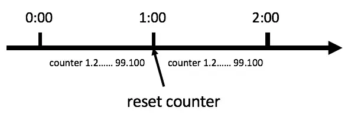
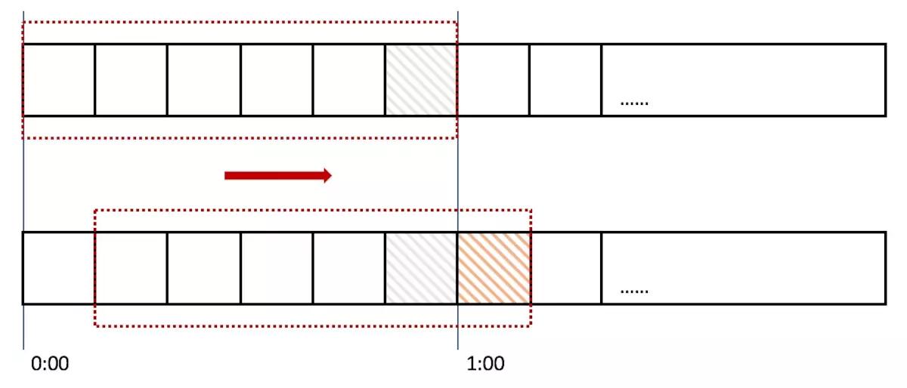
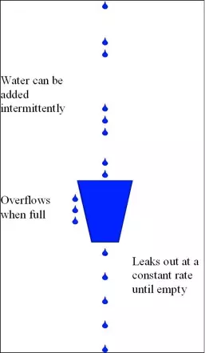
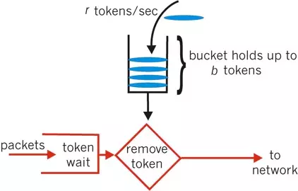
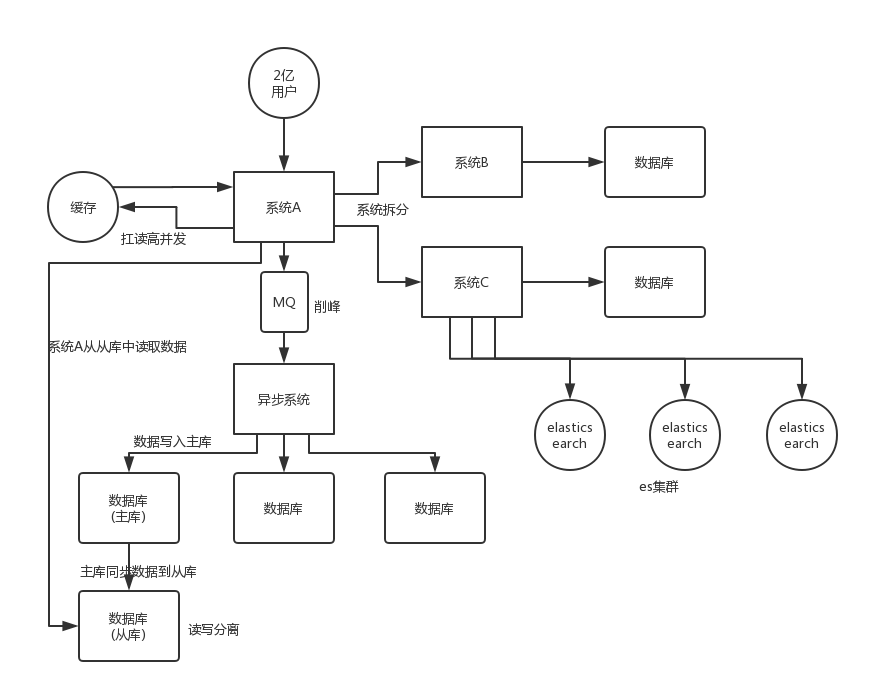

# 高并发系统

## 高并发下保护系统：缓存、服务降级、限流。

###### 1、计数器

计数器就是统计记录单位时间内进入系统或者某一接口的请求次数，在限定的次数内的请求则正常接收处理，超过次数的请求则拒绝掉，或者改为异步处理。



假设我们设定单位时间内进入系统的的最大请求数为100，如果有超过100个请求集中在刷新计数器的临界点前后进入系统，而且单位时间的粒度比较粗的话，那就容易误伤很多正常请求。

```bash
// 算法伪代码
++counter;
if(counter > limit) {
	return '系统繁忙，请稍后再试';
}
```

###### 2、滑动时间窗口

这个名称要跟TCP的窗口滑动区分开来，但是理解之后会发现其实也是有点相似。
计数器算法对流量的限制比较粗放，而滑动时间窗口的算法则是对流量进行更加平稳的控制。上面的计数器的单位时间是1分钟，而在使用滑动时间窗口，可以把1分钟分成6格，每格时间长度是10s，每一格又各自管理一个计数器，单位时间用一个长度为60s的窗口描述。一个请求进入系统，对应的时间格子的计数器便会+1，而每过10s，这个窗口便会向右滑动一格。只要窗口包括的所有格子的计数器总和超过限流上限，便会拒绝后面的请求。



```csharp
// 算法伪代码
var cellIndex = time % cellNum;
++cellCounter[cellIndex];
var sum = 0;
for(var i = cellIndex; i >= cellIndex - cellNum; --i) {
    sum += cellCounter[i];
}
if(sum > limit) {
    return '系统繁忙，请稍后再试';
}
```

###### 3、漏桶算法

漏桶算法，又称leaky bucket。下图是wiki上的漏桶图解：



一个系统处理请求，就像一个固定容量的水桶去溜进来的水，同时也让水流出去，但是它无法预见有多少水流进来和水流进来的速度，它只能够控制从桶底水流出去的速度，多出来的水，就只好让它从桶边流出去了。这个从桶底流出去的水就是系统正常处理的请求，从旁边流出去的水就是系统拒绝掉的请求。如此一来，我们只要监控系统单位时间内处理请求的速率就可以了，速率超过上限后的请求都给拒绝掉就可以了。

```csharp
// 算法伪代码
++counter;
var time = nowTime - (nowTime % interval);
var rate = counter / time;
if(rate> limitRate) {
    return '系统繁忙，请稍后再试';
}
```

###### 4、令牌桶算法



令牌桶即是以一定速率生成token并放入桶中，请求进入系统需要先拿到token才能进行业务处理，无token的请求则拒绝掉。令牌桶算法实际上跟漏桶算法很相似，而实际使用中其实也不需要另起线程生成token，只需要把握好token生成速率和当前应该剩余的token数量即可。

在时间点刷新的临界点上，只要剩余token足够，令牌桶算法会允许对应数量的请求通过，而后刷新时间因为token不足，流量也会被限制在外，这样就比较好的控制了瞬时流量。因此，令牌桶算法也被广泛使用。

## 高并发架构考虑问题可以分为以下 6 点：

- 系统拆分
- 缓存
- MQ
- 分库分表
- 读写分离
- ElasticSearch



### 系统拆分

将一个系统拆分为多个子系统，用 dubbo 来搞。然后每个系统连一个数据库，这样本来就一个库，现在多个数据库，不也可以扛高并发么。

### 缓存

缓存，必须得用缓存。大部分的高并发场景，都是**读多写少**，那你完全可以在数据库和缓存里都写一份，然后读的时候大量走缓存不就得了。毕竟人家 redis 轻轻松松单机几万的并发。所以你可以考虑考虑你的项目里，那些承载主要请求的**读场景，怎么用缓存来抗高并发**。

### MQ

MQ，必须得用 MQ。可能你还是会出现高并发写的场景，比如说一个业务操作里要频繁搞数据库几十次，增删改增删改，疯了。那高并发绝对搞挂你的系统，你要是用 redis 来承载写那肯定不行，人家是缓存，数据随时就被 LRU 了，数据格式还无比简单，没有事务支持。所以该用 mysql 还得用 mysql 啊。那你咋办？用 MQ 吧，大量的写请求灌入 MQ 里，排队慢慢玩儿，**后边系统消费后慢慢写**，控制在 mysql 承载范围之内。所以你得考虑考虑你的项目里，那些承载复杂写业务逻辑的场景里，如何用 MQ 来异步写，提升并发性。MQ 单机抗几万并发也是 ok 的，这个之前还特意说过。

### 分库分表

分库分表，可能到了最后数据库层面还是免不了抗高并发的要求，好吧，那么就将一个数据库拆分为多个库，多个库来扛更高的并发；然后将一个表**拆分为多个表**，每个表的数据量保持少一点，提高 sql 跑的性能。

### 读写分离

读写分离，这个就是说大部分时候数据库可能也是读多写少，没必要所有请求都集中在一个库上吧，可以搞个主从架构，**主库写**入，**从库读**取，搞一个读写分离。**读流量太多**的时候，还可以**加更多的从库**。

### ElasticSearch

Elasticsearch，简称 es。es 是分布式的，可以随便扩容，分布式天然就可以支撑高并发，因为动不动就可以扩容加机器来扛更高的并发。那么一些比较简单的查询、统计类的操作，可以考虑用 es 来承载，还有一些全文搜索类的操作，也可以考虑用 es 来承载。

上面的 6 点，基本就是高并发系统肯定要干的一些事儿，大家可以仔细结合之前讲过的知识考虑一下，到时候你可以系统的把这块阐述一下，然后每个部分要注意哪些问题，之前都讲过了，你都可以阐述阐述，表明你对这块是有点积累的。

说句实话，毕竟你真正厉害的一点，不是在于弄明白一些技术，或者大概知道一个高并发系统应该长什么样？其实实际上在真正的复杂的业务系统里，做高并发要远远比上面提到的点要复杂几十倍到上百倍。你需要考虑：哪些需要分库分表，哪些不需要分库分表，单库单表跟分库分表如何 join，哪些数据要放到缓存里去，放哪些数据才可以扛住高并发的请求，你需要完成对一个复杂业务系统的分析之后，然后逐步逐步的加入高并发的系统架构的改造，这个过程是无比复杂的，一旦做过一次，并且做好了，你在这个市场上就会非常的吃香。

其实大部分公司，真正看重的，不是说你掌握高并发相关的一些基本的架构知识，架构中的一些技术，RocketMQ、Kafka、Redis、Elasticsearch，高并发这一块，你了解了，也只能是次一等的人才。对一个有几十万行代码的复杂的分布式系统，一步一步架构、设计以及实践过高并发架构的人，这个经验是难能可贵的。