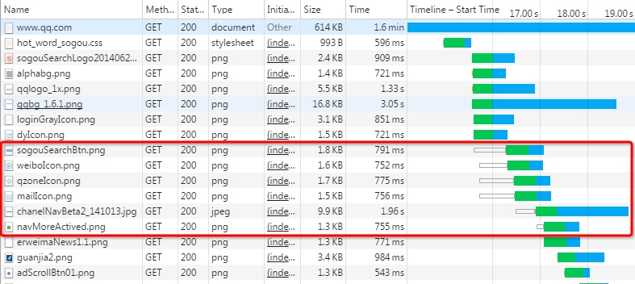
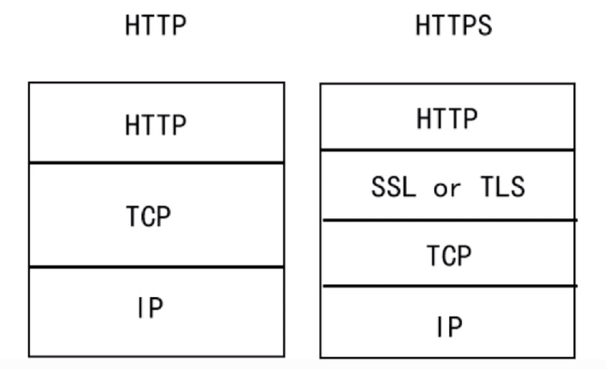

# HTTP

## HTTP请求和响应报文

### 请求报文


### 响应报文


## HTTP1.0和HTTP1.1

1. **长连接** : **在HTTP/1.0中，默认使用的是短连接**，也就是说每次请求都要重新建立一次连接。HTTP 是基于TCP/IP协议的,每一次建立或者断开连接都需要三次握手四次挥手的开销，如果每次请求都要这样的话，开销会比较大。因此最好能维持一个长连接，可以用个长连接来发多个请求。**HTTP 1.1起，默认使用长连接** ,默认开启Connection： keep-alive。
2. **HTTP/1.1的持续连接有非流水线方式和流水线方式** 。流水线方式是客户在收到HTTP的响应报文之前就能接着发送新的请求报文。与之相对应的非流水线方式是客户在收到前一个响应后才能发送下一个请求。
3. **错误状态响应码** :在HTTP1.1中新增了24个错误状态响应码，如409（Conflict）表示请求的资源与资源的当前状态发生冲突；410（Gone）表示服务器上的某个资源被永久性的删除。
4. **缓存处理** :在HTTP1.0中主要使用header里的If-Modified-Since,Expires来做为缓存判断的标准，HTTP1.1则引入了更多的缓存控制策略例如Entity tag，If-Unmodified-Since, If-Match, If-None-Match等更多可供选择的缓存头来控制缓存策略。
5. **带宽优化及网络连接的使用** :HTTP1.0中，存在一些浪费带宽的现象，例如客户端只是需要某个对象的一部分，而服务器却将整个对象送过来了，并且不支持断点续传功能，HTTP1.1则在请求头引入了range头域，它允许只请求资源的某个部分，即返回码是206（Partial Content），这样就方便了开发者自由的选择以便于充分利用带宽和连接。

## HTTP1.X缺陷

HTTP/1.x 实现简单是以牺牲性能为代价的：

- 客户端需要使用多个连接才能实现并发和缩短延迟；
- 不会压缩请求和响应首部，从而导致不必要的网络流量；
- 不支持有效的资源优先级，致使底层 TCP 连接的利用率低下。

## HTTP2.0特性

HTTP/2的通过支持请求与响应的多路复用来减少延迟，通过压缩HTTP首部字段将协议开销降至最低，同时增加对请求优先级和服务器端推送的支持。

### （1）二进制分帧

先来理解几个概念：

帧：HTTP/2 数据通信的最小单位消息：指 HTTP/2 中逻辑上的 HTTP 消息。例如请求和响应等，消息由一个或多个帧组成。

流：存在于连接中的一个虚拟通道。流可以承载双向消息，每个流都有一个唯一的整数ID。

HTTP/2 采用二进制格式传输数据，而非 HTTP 1.x 的文本格式，二进制协议解析起来更高效。 HTTP / 1 的请求和响应报文，都是由起始行，首部和实体正文（可选）组成，各部分之间以文本换行符分隔。HTTP/2 将请求和响应数据分割为更小的帧，并且它们采用二进制编码。

**HTTP/2 中，同域名下所有通信都在单个连接上完成，该连接可以承载任意数量的双向数据流。**每个数据流都以消息的形式发送，而消息又由一个或多个帧组成。多个帧之间可以乱序发送，根据帧首部的流标识可以重新组装。

### （2）多路复用

多路复用，代替原来的序列和阻塞机制。所有就是请求的都是通过一个 TCP连接并发完成。 HTTP 1.x 中，如果想并发多个请求，必须使用多个 TCP 链接，且浏览器为了控制资源，还会对单个域名有 6-8个的TCP链接请求限制，如下图，红色圈出来的请求就因域名链接数已超过限制，而被挂起等待了一段时间。



在 HTTP/2 中，有了二进制分帧之后，HTTP /2 不再依赖 TCP 链接去实现多流并行了，在 HTTP/2中：

- 同域名下所有通信都在单个连接上完成。
- 单个连接可以承载任意数量的双向数据流。
- 数据流以消息的形式发送，而消息又由一个或多个帧组成，多个帧之间可以乱序发送，因为根据帧首部的流标识可以重新组装。

这一特性，使性能有了极大提升：

- **同个域名只需要占用一个 TCP 连接**，消除了因多个 TCP 连接而带来的延时和内存消耗。
- 单个连接上可以并行交错的请求和响应，之间互不干扰。
- 在HTTP/2中，每个请求都可以带一个31bit的优先值，0表示最高优先级， 数值越大优先级越低。有了这个优先值，客户端和服务器就可以在处理不同的流时采取不同的策略，以最优的方式发送流、消息和帧。

### （3）服务器推送

服务端可以在发送页面HTML时主动推送其它资源，而不用等到浏览器解析到相应位置，发起请求再响应。例如服务端可以主动把JS和CSS文件推送给客户端，而不需要客户端解析HTML时再发送这些请求。

服务端可以主动推送，客户端也有权利选择是否接收。如果服务端推送的资源已经被浏览器缓存过，浏览器可以通过发送RST_STREAM帧来拒收。主动推送也遵守同源策略，服务器不会随便推送第三方资源给客户端。

### （4）头部压缩

HTTP 1.1请求的大小变得越来越大，有时甚至会大于TCP窗口的初始大小，因为它们需要等待带着ACK的响应回来以后才能继续被发送。HTTP/2对消息头采用HPACK（专为http/2头部设计的压缩格式）进行压缩传输，能够节省消息头占用的网络的流量。而HTTP/1.x每次请求，都会携带大量冗余头信息，浪费了很多带宽资源。

## HTTP和HTTPS



**SSL（Security Socket Layer，安全套接层）**

* 为网络通信提供安全及数据完整性的一种安全协议
* 是操作系统对外的API，SSL3.0后更名为TLS
* 采用身份验证和数据加密保证网络通信的安全和数据的完整性

**加密的方式**

* 对称加密：加密和解密都使用同一个密钥
* 非对称加密：加密使用的密钥和解密使用的密钥是不相同的
* 哈希算法：将任意长度的信息转换为固定长度的值，算法不可逆
* 数字签名：证明某个消息或文件是某人发出/认同的

**HTTPS数据传输流程**

* 浏览器将支持的加密算法信息发送给服务器
* 服务器选择一套浏览器支持的加密算法，以证书的形式回发浏览器
* 浏览器验证证书的合法性，并结合证书公钥加密信息发送给服务器
* 服务器使用私钥解密信息，验证哈希，加密相应消息回发浏览器
* 浏览器解密响应消息，并对消息进行验真，之后进行加密交互数据

**区别**

* HTTPS需要到CA申请证书，HTTP不需要
* HTTPS密文传输，HTTP明文传输
* 连接方式不同，HTTPS默认使用443端口，HTTP使用80端口
* HTTPS=HTTP+加密+认证+完整性保护，较HTTP安全

## HTTPS

HTTP 有以下安全性问题：

- 使用明文进行通信，内容可能会被窃听；
- 不验证通信方的身份，通信方的身份有可能遭遇伪装；
- 无法证明报文的完整性，报文有可能遭篡改。

HTTPS 并不是新协议，而是让 HTTP 先和 SSL（Secure Sockets Layer）通信，再由 SSL 和 TCP 通信，也就是说 HTTPS 使用了隧道进行通信。

通过使用 SSL，HTTPS 具有了加密（防窃听）、认证（防伪装）和完整性保护（防篡改）。

**HTTPS加密机制**

HTTPS 采用混合的加密机制，使用非对称密钥加密用于传输对称密钥来保证传输过程的安全性，之后使用对称密钥加密进行通信来保证通信过程的效率。

**HTTPS加密过程**

第一次通信的时候服务端发送公钥给客户端，由客户端产生一个对称密钥，通过服务端的公钥加密后发送给服务端，后续的交互中都通过对称密钥进行加密传输。也就是说先通过非对称密钥加密对称密钥，通过对称密钥加密实际请求的内容。

**HTTPS身份认证过程**

服务器提交自己的基本信息想CA机构提出申请，CA机构在给服务器颁发证书的时候，会连同**数字证书**以及**根据证书计算的摘要**一同发送给服务器，且这个摘要是需要**经过CA机构自己的私钥进行加密**的。

服务器在与客户端通信的时候，就会将数字证书和数字签名出示给客户端了。客户端拿到数字证书和数字签名后，**先通过操作系统或者浏览器内置信任的CA机构找到对应CA机构的公钥对数字签名进行解密，然后采用同样的摘要算法计算数字证书的摘要，如果自己计算的摘要与服务器发来的摘要一致，则证书是没有被篡改过的！这样就防止了篡改！第三方拿不到CA机构的私钥，也就无法对摘要进行加密，如果是第三方伪造的签名自然也在客户端也就无法解密，这就防止了伪造！所以数字签名就是通过这种机制来保证数字证书被篡改和被伪造。**

## GET和POST

### 作用

GET 用于获取资源，而 POST 用于传输实体主体。

### 参数

GET 和 POST 的请求都能使用额外的参数，但是 GET 的参数是以查询字符串出现在 URL 中，而 POST 的参数存储在实体主体中。不能因为 POST 参数存储在实体主体中就认为它的安全性更高，因为照样可以通过一些抓包工具（Fiddler）查看。

因为 URL 只支持 ASCII 码，因此 GET 的参数中如果存在中文等字符就需要先进行编码。例如 `中文` 会转换为 `%E4%B8%AD%E6%96%87`，而空格会转换为 `%20`。POST 参数支持标准字符集。

```
GET /test/demo_form.asp?name1=value1&name2=value2 HTTP/1.1
POST /test/demo_form.asp HTTP/1.1
Host: w3schools.com
name1=value1&name2=value2
```

### 安全

安全的 HTTP 方法不会改变服务器状态，也就是说它只是可读的。

GET 方法是安全的，而 POST 却不是，因为 POST 的目的是传送实体主体内容，这个内容可能是用户上传的表单数据，上传成功之后，服务器可能把这个数据存储到数据库中，因此状态也就发生了改变。

安全的方法除了 GET 之外还有：HEAD、OPTIONS。

不安全的方法除了 POST 之外还有 PUT、DELETE。

### 幂等性

幂等的 HTTP 方法，同样的请求被执行一次与连续执行多次的效果是一样的，服务器的状态也是一样的。换句话说就是，幂等方法不应该具有副作用（统计用途除外）。

所有的安全方法也都是幂等的。

在正确实现的条件下，GET，HEAD，PUT 和 DELETE 等方法都是幂等的，而 POST 方法不是。

GET /pageX HTTP/1.1 是幂等的，连续调用多次，客户端接收到的结果都是一样的：

```
GET /pageX HTTP/1.1
GET /pageX HTTP/1.1
GET /pageX HTTP/1.1
GET /pageX HTTP/1.1
```

POST /add_row HTTP/1.1 不是幂等的，如果调用多次，就会增加多行记录：

```
POST /add_row HTTP/1.1   -> Adds a 1nd row
POST /add_row HTTP/1.1   -> Adds a 2nd row
POST /add_row HTTP/1.1   -> Adds a 3rd row
```

DELETE /idX/delete HTTP/1.1 是幂等的，即使不同的请求接收到的状态码不一样：

```
DELETE /idX/delete HTTP/1.1   -> Returns 200 if idX exists
DELETE /idX/delete HTTP/1.1   -> Returns 404 as it just got deleted
DELETE /idX/delete HTTP/1.1   -> Returns 404
```

### 可缓存

如果要对响应进行缓存，需要满足以下条件：

- 请求报文的 HTTP 方法本身是可缓存的，包括 GET 和 HEAD，但是 PUT 和 DELETE 不可缓存，POST 在多数情况下不可缓存的。
- 响应报文的状态码是可缓存的，包括：200, 203, 204, 206, 300, 301, 404, 405, 410, 414, and 501。
- 响应报文的 Cache-Control 首部字段没有指定不进行缓存。

## 在浏览器中输入url地址 ->> 显示主页的过程

百度好像最喜欢问这个问题。

> 打开一个网页，整个过程会使用哪些协议

图解（图片来源：《图解HTTP》）：


总体来说分为以下几个过程:

1. DNS解析
2. TCP连接
3. 发送HTTP请求
4. 服务器处理请求并返回HTTP报文
5. 浏览器解析渲染页面
6. 连接结束

具体可以参考下面这篇文章：<https://segmentfault.com/a/1190000006879700>

## 常见HTTP状态码

* 1xx：指示信息--表示请求已接收，继续处理
* 2xx：成功--表示请求已被成功接收、理解、接受
  * 200 OK：正常返回信息
* 3xx：重定向--要完成请求必须进行更进一步操作
  * 301 Moved Permanently：永久移动
  * 302 Found：临时移动
* 4xx：客户端错误--请求有语法错误或请求无法实现
  * 400 Bad Request：客户端请求有语法错误，不能被服务器理解
  * 401 Unauthorized：请求未经授权，这个状态码必须和WWW-Authenticate报头域一起使用
  * 403 Forbidden：服务器收到请求，但拒绝提供服务
  * 404 Not Found：请求资源不存在
* 5xx：服务器端错误--服务器未能实现合法的请求
  * 500 Internal Server Error：服务器内部错误
  * 502 Bad Gateway：作为网关或者代理工作的服务器尝试执行请求时，从远程服务器接收到了一个无效的响应
  * 503 Server Unavailable：服务器当前不可处理客户端请求，一段时间后可能回复正常

## Cookie和Session

Cookie：服务器发给客户端的特殊信息，以文本形式存放在客户端。客户端再次请求的时候，会把Cookie回发。服务器接收后，会解析Cookie生成与客户端相应的内容。

Session：服务器端的机制，在服务器上保存信息。解析客户端请求并操作session_id，按需保存状态信息。

**区别**

* Cookie数据存放在客户端浏览器上，Session数据存放在服务器上
* Session相对于Cookie更安全
* 若考虑减轻服务器负担，应当使用Cookie

## RESTful API

要弄清楚什么是RESTful API,首先要弄清楚什么是REST。REST -- REpresentational State Transfer，英语的直译就是“表现层状态转移”。如果看这个概念，估计没几个人能明白是什么意思。那下面就让我来用一句人话解释一下什么是RESTful:**URL定位资源，用HTTP动词（GET,POST,PUT,DELETE)描述操作**。

​     Resource：资源，即数据。

​     Representational：某种表现形式，比如用JSON，XML，JPEG等；

​     State Transfer：状态变化。通过HTTP动词实现。

所以RESTful API就是REST风格的API。 那么在什么场景下使用RESTful API呢？在当今的互联网应用的前端展示媒介很丰富。有手机、有平板电脑还有PC以及其他的展示媒介。那么这些前端接收到的用户请求统一由一个后台来处理并返回给不同的前端肯定是最科学和最经济的方式，RESTful API就是一套协议来规范多种形式的前端和同一个后台的交互方式。

RESTful API由后台也就是SERVER来提供前端来调用。前端调用API向后台发起HTTP请求，后台响应请求将处理结果反馈给前端。也就是说RESTful 是典型的基于HTTP的协议。那么RESTful API有哪些设计原则和规范呢？

* 资源。首先是弄清楚资源的概念。资源就是网络上的一个实体，一段文本，一张图片或者一首歌曲。资源总是要通过一种载体来反应它的内容。文本可以用TXT，也可以用HTML或者XML、图片可以用JPG格式或者PNG格式，JSON是现在最常用的资源表现形式。

* 统一接口。RESTful风格的数据元操CRUD（create,read,update,delete）分别对应HTTP方法：GET用来获取资源，POST用来新建资源（也可以用于更新资源），PUT用来更新资源，DELETE用来删除资源，这样就统一了数据操作的接口。

* URI。可以用一个URI（统一资源定位符）指向资源，即每个URI都对应一个特定的资源。要获取这个资源访问它的URI就可以，因此URI就成了每一个资源的地址或识别符。一般的，每个资源至少有一个URI与之对应，最典型的URI就是URL。

* 无状态。所谓无状态即所有的资源都可以URI定位，而且这个定位与其他资源无关，也不会因为其他资源的变化而变化。有状态和无状态的区别，举个例子说明一下，例如要查询员工工资的步骤为第一步：登录系统。第二步：进入查询工资的页面。第三步：搜索该员工。第四步：点击姓名查看工资。这样的操作流程就是有状态的，查询工资的每一个步骤都依赖于前一个步骤，只要前置操作不成功，后续操作就无法执行。如果输入一个URL就可以得到指定员工的工资，则这种情况就是无状态的，因为获取工资不依赖于其他资源或状态，且这种情况下，员工工资是一个资源，由一个URL与之对应可以通过HTTP中的GET方法得到资源，这就是典型的RESTful风格。

说了这么多，到底RESTful长什么样子的呢？

GET:http://www.xxx.com/source/id 获取指定ID的某一类资源。例如GET:http://www.xxx.com/friends/123表示获取ID为123的会员的好友列表。如果不加id就表示获取所有会员的好友列表。

POST:http://www.xxx.com/friends/123表示为指定ID为123的会员新增好友。其他的操作类似就不举例了。

RESTful API还有其他一些规范。1：应该将API的版本号放入URL。GET:http://www.xxx.com/v1/friend/123。或者将版本号放在HTTP头信息中。我个人觉得要不要版本号取决于自己开发团队的习惯和业务的需要，不是强制的。2：URL中只能有名词而不能有动词，操作的表达是使用HTTP的动词GET,POST,PUT,DELETEL。URL只标识资源的地址，既然是资源那就是名词了。3：如果记录数量很多，服务器不可能都将它们返回给用户。API应该提供参数，过滤返回结果。?limit=10：指定返回记录的数量、?page=2&per_page=100：指定第几页，以及每页的记录数。

优点：

1. 前后端分离，减少流量
2. 安全问题集中在接口上，由于接受json格式，防止了注入型等安全问题
3. 前端无关化，后端只负责数据处理，前端表现方式可以是任何前端语言（android，ios,html5）
4. 前端和后端人员更加专注于各自开发，只需接口文档便可完成前后端交互，无需过多相互了解
5. 服务器性能优化：由于前端是静态页面，通过nginx便可获取，服务器主要压力放在了接口上

## HTTP和RPC

在HTTP和RPC的选择上，可能有些人是迷惑的，主要是因为，有些RPC框架配置复杂，如果走HTTP也能完成同样的功能，那么为什么要选择RPC，而不是更容易上手的HTTP来实现了。

本文主要来阐述HTTP和RPC的异同，让大家更容易根据自己的实际情况选择更适合的方案。

- 传输协议
  - RPC，可以基于TCP协议，也可以基于HTTP协议
  - HTTP，基于HTTP协议
- 传输效率
  - RPC，使用自定义的TCP协议，可以让请求报文体积更小，或者使用HTTP2协议，也可以很好的减少报文的体积，提高传输效率
  - HTTP，如果是基于HTTP1.1的协议，请求中会包含很多无用的内容，如果是基于HTTP2.0，那么简单的封装以下是可以作为一个RPC来使用的，这时标准RPC框架更多的是服务治理
- 性能消耗，主要在于序列化和反序列化的耗时
  - RPC，可以基于thrift实现高效的二进制传输
  - HTTP，大部分是通过json来实现的，字节大小和序列化耗时都比thrift要更消耗性能
- 负载均衡
  - RPC，基本都自带了负载均衡策略
  - HTTP，需要配置Nginx，HAProxy来实现
- 服务治理（下游服务新增，重启，下线时如何不影响上游调用者）
  - RPC，能做到自动通知，不影响上游
  - HTTP，需要事先通知，修改Nginx/HAProxy配置

总结：

  RPC主要用于公司内部的服务调用，性能消耗低，传输效率高，服务治理方便。HTTP主要用于对外的异构环境，浏览器接口调用，APP接口调用，第三方接口调用等。