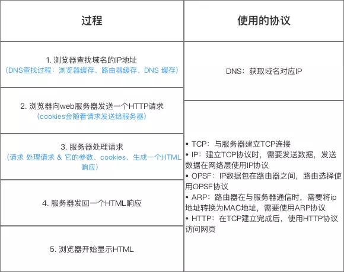

# HTTP

## HTTPS

HTTP 有以下安全性问题：

- 使用明文进行通信，内容可能会被窃听；
- 不验证通信方的身份，通信方的身份有可能遭遇伪装；
- 无法证明报文的完整性，报文有可能遭篡改。

HTTPS 并不是新协议，而是让 HTTP 先和 SSL（Secure Sockets Layer）通信，再由 SSL 和 TCP 通信，也就是说 HTTPS 使用了隧道进行通信。

通过使用 SSL，HTTPS 具有了加密（防窃听）、认证（防伪装）和完整性保护（防篡改）。

**HTTPS加密机制**

HTTPS 采用混合的加密机制，使用非对称密钥加密用于传输对称密钥来保证传输过程的安全性，之后使用对称密钥加密进行通信来保证通信过程的效率。

## GET和POST

### 作用

GET 用于获取资源，而 POST 用于传输实体主体。

### 参数

GET 和 POST 的请求都能使用额外的参数，但是 GET 的参数是以查询字符串出现在 URL 中，而 POST 的参数存储在实体主体中。不能因为 POST 参数存储在实体主体中就认为它的安全性更高，因为照样可以通过一些抓包工具（Fiddler）查看。

因为 URL 只支持 ASCII 码，因此 GET 的参数中如果存在中文等字符就需要先进行编码。例如 `中文` 会转换为 `%E4%B8%AD%E6%96%87`，而空格会转换为 `%20`。POST 参数支持标准字符集。

```
GET /test/demo_form.asp?name1=value1&name2=value2 HTTP/1.1
POST /test/demo_form.asp HTTP/1.1
Host: w3schools.com
name1=value1&name2=value2
```

### 安全

安全的 HTTP 方法不会改变服务器状态，也就是说它只是可读的。

GET 方法是安全的，而 POST 却不是，因为 POST 的目的是传送实体主体内容，这个内容可能是用户上传的表单数据，上传成功之后，服务器可能把这个数据存储到数据库中，因此状态也就发生了改变。

安全的方法除了 GET 之外还有：HEAD、OPTIONS。

不安全的方法除了 POST 之外还有 PUT、DELETE。

### 幂等性

幂等的 HTTP 方法，同样的请求被执行一次与连续执行多次的效果是一样的，服务器的状态也是一样的。换句话说就是，幂等方法不应该具有副作用（统计用途除外）。

所有的安全方法也都是幂等的。

在正确实现的条件下，GET，HEAD，PUT 和 DELETE 等方法都是幂等的，而 POST 方法不是。

GET /pageX HTTP/1.1 是幂等的，连续调用多次，客户端接收到的结果都是一样的：

```
GET /pageX HTTP/1.1
GET /pageX HTTP/1.1
GET /pageX HTTP/1.1
GET /pageX HTTP/1.1
```

POST /add_row HTTP/1.1 不是幂等的，如果调用多次，就会增加多行记录：

```
POST /add_row HTTP/1.1   -> Adds a 1nd row
POST /add_row HTTP/1.1   -> Adds a 2nd row
POST /add_row HTTP/1.1   -> Adds a 3rd row
```

DELETE /idX/delete HTTP/1.1 是幂等的，即使不同的请求接收到的状态码不一样：

```
DELETE /idX/delete HTTP/1.1   -> Returns 200 if idX exists
DELETE /idX/delete HTTP/1.1   -> Returns 404 as it just got deleted
DELETE /idX/delete HTTP/1.1   -> Returns 404
```

### 可缓存

如果要对响应进行缓存，需要满足以下条件：

- 请求报文的 HTTP 方法本身是可缓存的，包括 GET 和 HEAD，但是 PUT 和 DELETE 不可缓存，POST 在多数情况下不可缓存的。
- 响应报文的状态码是可缓存的，包括：200, 203, 204, 206, 300, 301, 404, 405, 410, 414, and 501。
- 响应报文的 Cache-Control 首部字段没有指定不进行缓存。

### XMLHttpRequest

为了阐述 POST 和 GET 的另一个区别，需要先了解 XMLHttpRequest：

> XMLHttpRequest 是一个 API，它为客户端提供了在客户端和服务器之间传输数据的功能。它提供了一个通过 URL 来获取数据的简单方式，并且不会使整个页面刷新。这使得网页只更新一部分页面而不会打扰到用户。XMLHttpRequest 在 AJAX 中被大量使用。

- 在使用 XMLHttpRequest 的 POST 方法时，浏览器会先发送 Header 再发送 Data。但并不是所有浏览器会这么做，例如火狐就不会。
- 而 GET 方法 Header 和 Data 会一起发送。

## 在浏览器中输入url地址 ->> 显示主页的过程

百度好像最喜欢问这个问题。

> 打开一个网页，整个过程会使用哪些协议

图解（图片来源：《图解HTTP》）：



总体来说分为以下几个过程:

1. DNS解析
2. TCP连接
3. 发送HTTP请求
4. 服务器处理请求并返回HTTP报文
5. 浏览器解析渲染页面
6. 连接结束

具体可以参考下面这篇文章：

- <https://segmentfault.com/a/1190000006879700>

## RESTful API

要弄清楚什么是RESTful API,首先要弄清楚什么是REST。REST -- REpresentational State Transfer，英语的直译就是“表现层状态转移”。如果看这个概念，估计没几个人能明白是什么意思。那下面就让我来用一句人话解释一下什么是RESTful:**URL定位资源，用HTTP动词（GET,POST,PUT,DELETE)描述操作**。

​     Resource：资源，即数据。

​     Representational：某种表现形式，比如用JSON，XML，JPEG等；

​     State Transfer：状态变化。通过HTTP动词实现。

所以RESTful API就是REST风格的API。 那么在什么场景下使用RESTful API呢？在当今的互联网应用的前端展示媒介很丰富。有手机、有平板电脑还有PC以及其他的展示媒介。那么这些前端接收到的用户请求统一由一个后台来处理并返回给不同的前端肯定是最科学和最经济的方式，RESTful API就是一套协议来规范多种形式的前端和同一个后台的交互方式。

RESTful API由后台也就是SERVER来提供前端来调用。前端调用API向后台发起HTTP请求，后台响应请求将处理结果反馈给前端。也就是说RESTful 是典型的基于HTTP的协议。那么RESTful API有哪些设计原则和规范呢？

* 资源。首先是弄清楚资源的概念。资源就是网络上的一个实体，一段文本，一张图片或者一首歌曲。资源总是要通过一种载体来反应它的内容。文本可以用TXT，也可以用HTML或者XML、图片可以用JPG格式或者PNG格式，JSON是现在最常用的资源表现形式。

* 统一接口。RESTful风格的数据元操CRUD（create,read,update,delete）分别对应HTTP方法：GET用来获取资源，POST用来新建资源（也可以用于更新资源），PUT用来更新资源，DELETE用来删除资源，这样就统一了数据操作的接口。

* URI。可以用一个URI（统一资源定位符）指向资源，即每个URI都对应一个特定的资源。要获取这个资源访问它的URI就可以，因此URI就成了每一个资源的地址或识别符。一般的，每个资源至少有一个URI与之对应，最典型的URI就是URL。

* 无状态。所谓无状态即所有的资源都可以URI定位，而且这个定位与其他资源无关，也不会因为其他资源的变化而变化。有状态和无状态的区别，举个例子说明一下，例如要查询员工工资的步骤为第一步：登录系统。第二步：进入查询工资的页面。第三步：搜索该员工。第四步：点击姓名查看工资。这样的操作流程就是有状态的，查询工资的每一个步骤都依赖于前一个步骤，只要前置操作不成功，后续操作就无法执行。如果输入一个URL就可以得到指定员工的工资，则这种情况就是无状态的，因为获取工资不依赖于其他资源或状态，且这种情况下，员工工资是一个资源，由一个URL与之对应可以通过HTTP中的GET方法得到资源，这就是典型的RESTful风格。

说了这么多，到底RESTful长什么样子的呢？

GET:http://www.xxx.com/source/id 获取指定ID的某一类资源。例如GET:http://www.xxx.com/friends/123表示获取ID为123的会员的好友列表。如果不加id就表示获取所有会员的好友列表。

POST:http://www.xxx.com/friends/123表示为指定ID为123的会员新增好友。其他的操作类似就不举例了。

RESTful API还有其他一些规范。1：应该将API的版本号放入URL。GET:http://www.xxx.com/v1/friend/123。或者将版本号放在HTTP头信息中。我个人觉得要不要版本号取决于自己开发团队的习惯和业务的需要，不是强制的。2：URL中只能有名词而不能有动词，操作的表达是使用HTTP的动词GET,POST,PUT,DELETEL。URL只标识资源的地址，既然是资源那就是名词了。3：如果记录数量很多，服务器不可能都将它们返回给用户。API应该提供参数，过滤返回结果。?limit=10：指定返回记录的数量、?page=2&per_page=100：指定第几页，以及每页的记录数。

优点：

1. 前后端分离，减少流量
2. 安全问题集中在接口上，由于接受json格式，防止了注入型等安全问题
3. 前端无关化，后端只负责数据处理，前端表现方式可以是任何前端语言（android，ios,html5）
4. 前端和后端人员更加专注于各自开发，只需接口文档便可完成前后端交互，无需过多相互了解
5. 服务器性能优化：由于前端是静态页面，通过nginx便可获取，服务器主要压力放在了接口上

## HTTP和RPC

在HTTP和RPC的选择上，可能有些人是迷惑的，主要是因为，有些RPC框架配置复杂，如果走HTTP也能完成同样的功能，那么为什么要选择RPC，而不是更容易上手的HTTP来实现了。

本文主要来阐述HTTP和RPC的异同，让大家更容易根据自己的实际情况选择更适合的方案。

- 传输协议
  - RPC，可以基于TCP协议，也可以基于HTTP协议
  - HTTP，基于HTTP协议
- 传输效率
  - RPC，使用自定义的TCP协议，可以让请求报文体积更小，或者使用HTTP2协议，也可以很好的减少报文的体积，提高传输效率
  - HTTP，如果是基于HTTP1.1的协议，请求中会包含很多无用的内容，如果是基于HTTP2.0，那么简单的封装以下是可以作为一个RPC来使用的，这时标准RPC框架更多的是服务治理
- 性能消耗，主要在于序列化和反序列化的耗时
  - RPC，可以基于thrift实现高效的二进制传输
  - HTTP，大部分是通过json来实现的，字节大小和序列化耗时都比thrift要更消耗性能
- 负载均衡
  - RPC，基本都自带了负载均衡策略
  - HTTP，需要配置Nginx，HAProxy来实现
- 服务治理（下游服务新增，重启，下线时如何不影响上游调用者）
  - RPC，能做到自动通知，不影响上游
  - HTTP，需要事先通知，修改Nginx/HAProxy配置

总结：

  RPC主要用于公司内部的服务调用，性能消耗低，传输效率高，服务治理方便。HTTP主要用于对外的异构环境，浏览器接口调用，APP接口调用，第三方接口调用等。