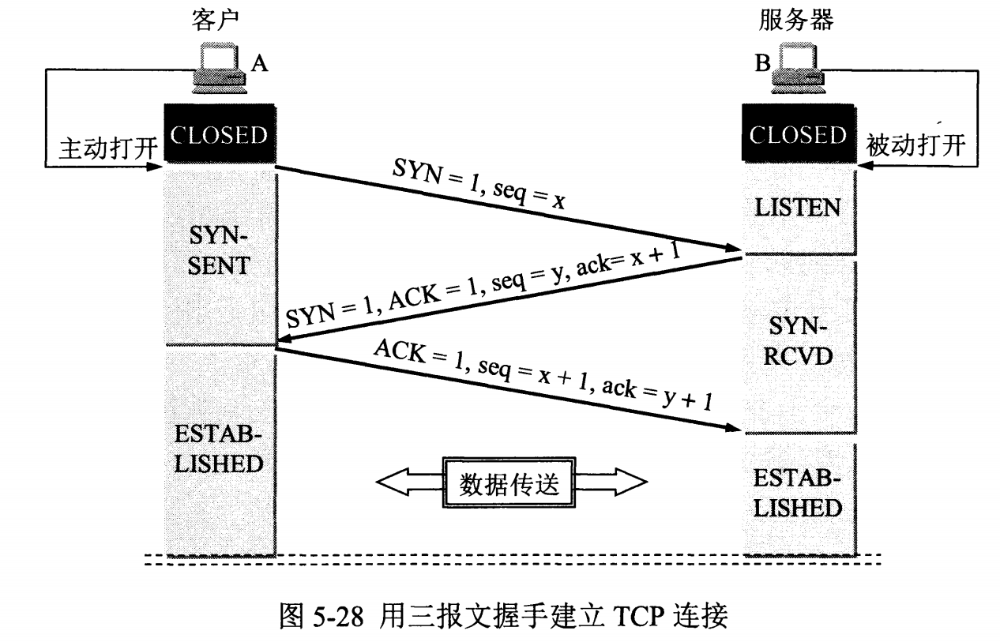
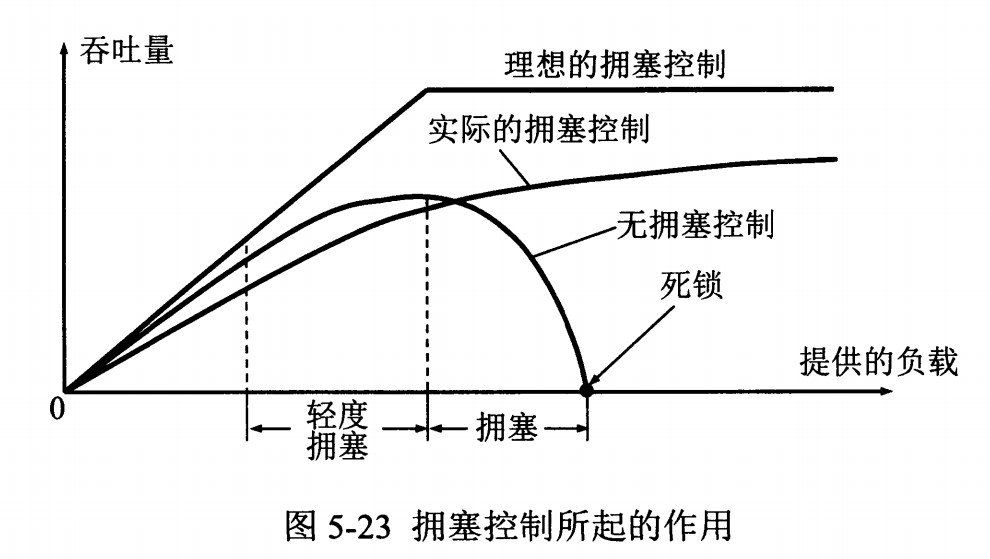

# 计算机网络

## 计算机网络体系结构

### 五层协议

* 应用层：为特定应用程序提供数据传输服务，例如 HTTP、DNS 等协议。数据单位为报文。
* 运输层：为进程提供通用的数据传输服务，提供端对端的接口。传输控制协议 TCP，提供面向连接、可靠的数据传输服务，数据单位为报文段；用户数据报协议 UDP，提供无连接、尽最大努力的数据传输服务，数据单位为用户数据报。
* 网络层：为主机提供数据传输服务，为数据包选择路由。传输单位为数据包，路由器工作在这一层。
* 数据链路层：网络层针对的还是主机之间的数据传输服务，而主机之间可以有很多链路，链路层协议就是为同一链路的主机提供数据传输服务。格式化数据，控制对物理介质的访问，错误检测/纠正（保证传输可靠性）。传输单位为帧，交换机工作在这一层。
* 物理层：考虑的是怎样在传输媒体上传输数据比特流，而不是指具体的传输媒体。

### OSI

其中表示层和会话层用途如下：

- **表示层** ：数据压缩、加密以及数据描述，这使得应用程序不必关心在各台主机中数据内部格式不同的问题。
- **会话层** ：建立及管理会话。

五层协议没有表示层和会话层，而是将这些功能留给应用程序开发者处理。

**OSI仅仅是一种理论规范，一种概念型框架，实际开发中用到的是TCP/IP**

## TCP 的三次握手

假设 A 为客户端，B 为服务器端。

- 首先 B 处于 LISTEN（监听）状态，等待客户的连接请求。
- A 向 B 发送连接请求报文，SYN=1，ACK=0，选择一个初始的序号 x。
- B 收到连接请求报文，如果同意建立连接，则向 A 发送连接确认报文，SYN=1，ACK=1，确认号为 x+1，同时也选择一个初始的序号 y。
- A 收到 B 的连接确认报文后，还要向 B 发出确认，确认号为 y+1，序号为 x+1。
- B 收到 A 的确认后，连接建立。

**三次握手的原因**

第三次握手是为了防止失效的连接请求到达服务器，让服务器错误打开连接。客户端发送的连接请求如果在网络中滞留，那么就会隔很长一段时间才能收到服务器端发回的连接确认。客户端等待一个超时重传时间之后，就会重新请求连接。但是这个滞留的连接请求最后还是会到达服务器，如果不进行三次握手，那么服务器就会打开两个连接。如果有第三次握手，客户端会忽略服务器之后发送的对滞留连接请求的连接确认，不进行第三次握手，因此就不会再次打开连接。

为了初始化Sequence Number的初始值。作为以后数据通信的序号，保证应用层接收到的数据不会因网络的原因而乱序，TCP会用这个序号拼接数据。

**首次握手的隐患——SYN超时**

原因分析

* Server收到Client的SYN，回复SYN-ACK的时候未收到ACK确认
* Server不断重试直到超时，Linux默认等待63秒才断开连接

可能会使Server受到SYN Flood的风险，针对其防护措施

* 超时时间缩短
* 连续收到连续某个IP的重复SYN报文，判断受到攻击，丢弃该IP发送的包

**建立连接后，Client出现故障**

保活机制

* 向对方发送保活探测报文，如未收到响应则继续发送
* 尝试次数达到保活探测数仍未收到相应则中断连接

## TCP四次挥手

以下描述不讨论序号和确认号，因为序号和确认号的规则比较简单。并且不讨论 ACK，因为 ACK 在连接建立之后都为 1。

- A 发送连接释放报文，FIN=1。
- B 收到之后发出确认，此时 TCP 属于半关闭状态，B 能向 A 发送数据但是 A 不能向 B 发送数据。
- 当 B 不再需要连接时，发送连接释放报文，FIN=1。
- A 收到后发出确认，进入 TIME-WAIT 状态，等待 2 MSL（最大报文存活时间）后释放连接。
- B 收到 A 的确认后释放连接。

**四次挥手的原因**

客户端发送了 FIN 连接释放报文之后，服务器收到了这个报文，就进入了 CLOSE-WAIT 状态。这个状态是为了让服务器端发送还未传送完毕的数据，传送完毕之后，服务器会发送 FIN 连接释放报文。

**TIME_WAIT**

客户端接收到服务器端的 FIN 报文后进入此状态，此时并不是直接进入 CLOSED 状态，还需要等待一个时间计时器设置的时间 2MSL。这么做有两个理由：

- 确保最后一个确认报文能够到达。如果 B 没收到 A 发送来的确认报文，那么就会重新发送连接释放请求报文，A 等待一段时间就是为了处理这种情况的发生。
- 等待一段时间是为了让本连接持续时间内所产生的所有报文都从网络中消失，使得下一个新的连接不会出现旧的连接请求报文。

**服务器出现大量CLOSE_WAIT状态的原因**

* 对方关闭socket连接，我方忙于读或写，没有及时关闭连接
  * 检查代码，特别是释放资源的代码
  * 检查配置，特别是处理请求的线程配置

## TCP 协议如何保证可靠传输

1. 应用数据被分割成 TCP 认为最适合发送的数据块。
2. TCP 给发送的每一个包进行编号，接收方对数据包进行排序，把有序数据传送给应用层。
3. **校验和：** TCP 将保持它首部和数据的检验和。这是一个端到端的检验和，目的是检测数据在传输过程中的任何变化。如果收到段的检验和有差错，TCP 将丢弃这个报文段和不确认收到此报文段。
4. TCP 的接收端会丢弃重复的数据。
5. **流量控制：** TCP 连接的每一方都有固定大小的缓冲空间，TCP的接收端只允许发送端发送接收端缓冲区能接纳的数据。当接收方来不及处理发送方的数据，能提示发送方降低发送的速率，防止包丢失。TCP 使用的流量控制协议是可变大小的滑动窗口协议。 （TCP 利用滑动窗口实现流量控制）
6. **拥塞控制：** 当网络拥塞时，减少数据的发送。
7. **ARQ协议：** 也是为了实现可靠传输的，它的基本原理就是每发完一个分组就停止发送，等待对方确认。在收到确认后再发下一个分组。
8. **超时重传：** 当 TCP 发出一个段后，它启动一个定时器，等待目的端确认收到这个报文段。如果不能及时收到一个确认，将重发这个报文段。

## TCP,UDP 协议的区别

**TCP**

* 面向连接的、可靠的、基于字节流的传输层通信协议
* 将应用层的数据流分割成报文段并发给目标节点的TCP层
* 数据包都有序号，对方收到则发送ACK确认，未收到则重传
* 使用校验和来检验数据在传输过程中是否有误

**UDP**

* 面向非连接
* 不维护连接状态，支持同时向多个客户端传输相同的消息
* 数据包报头只有8字节，额外开销较小
* 吞吐量只受限于数据生成速率、传输速率以及机器性能
* 尽最大努力交付，不保证可靠交付，不需要维持复杂的链接状态表

## TCP 滑动窗口

* RTT：发送一个数据包到收到对应的ACK所花费的时间
* RTO：重传时间间隔

滑动窗口协议是传输层进行流量控制和乱序重排的一种措施，接收方通过通告发送方自己的窗口大小，从而控制发送方的发送速度，从而达到防止发送方发送速度过快而导致自己被淹没的目的。

ACK包含两个非常重要的信息：一是期望接收到的下一字节的序号n，该n代表接收方已经接收到了前n-1字节数据。二是当前的窗口大小m，如此发送方在接收到ACK包含的这两个数据后就可以计算出还可以发送多少字节的数据给对方，这就是滑动窗口控制流量的基本原理

TCP的滑动窗口是动态的，应用程序在需要（如内存不足）时，通过API通知TCP协议栈缩小TCP的接收窗口。然后TCP协议栈在下个段发送时包含新的窗口大小通知给对端，对端按通知的窗口来改变发送窗口，以此达到减缓发送速率的目的。

* 接收端还能处理的数据量AdvertisedWindow=MaxRcvBuffer-(LastByteRcvd-LastByteRead)
* 窗口内剩余可发送数据量EffectiveWindow=AdvertisedWindow-(LastByteSent-LastByteAcked)

## TCP 流量控制

流量控制是为了控制发送方发送速率，保证接收方来得及接收。

接收方发送的确认报文中的窗口字段可以用来控制发送方窗口大小，从而影响发送方的发送速率。将窗口字段设置为 0，则发送方不能发送数据。

## TCP 拥塞控制

如果网络出现拥塞，分组将会丢失，此时发送方会继续重传，从而导致网络拥塞程度更高。因此当出现拥塞时，应当控制发送方的速率。这一点和流量控制很像，但是出发点不同。流量控制是为了让接收方能来得及接收，而拥塞控制是为了降低整个网络的拥塞程度。

TCP 主要通过四个算法来进行拥塞控制：慢开始、拥塞避免、快重传、快恢复。

发送方需要维护一个叫做拥塞窗口（cwnd）的状态变量，注意拥塞窗口与发送方窗口的区别：拥塞窗口只是一个状态变量，实际决定发送方能发送多少数据的是发送方窗口。

为了便于讨论，做如下假设：

- 接收方有足够大的接收缓存，因此不会发生流量控制；
- 虽然 TCP 的窗口基于字节，但是这里设窗口的大小单位为报文段。

## 1. 慢开始与拥塞避免

发送的最初执行慢开始，令 cwnd = 1，发送方只能发送 1 个报文段；当收到确认后，将 cwnd 加倍，因此之后发送方能够发送的报文段数量为：2、4、8 ...

注意到慢开始每个轮次都将 cwnd 加倍，这样会让 cwnd 增长速度非常快，从而使得发送方发送的速度增长速度过快，网络拥塞的可能性也就更高。设置一个慢开始门限 ssthresh，当 cwnd >= ssthresh 时，进入拥塞避免，每个轮次只将 cwnd 加 1。

如果出现了超时，则令 ssthresh = cwnd / 2，然后重新执行慢开始。

## 2. 快重传与快恢复

在接收方，要求每次接收到报文段都应该对最后一个已收到的有序报文段进行确认。例如已经接收到 M1 和 M2，此时收到 M4，应当发送对 M2 的确认。

在发送方，如果收到三个重复确认，那么可以知道下一个报文段丢失，此时执行快重传，立即重传下一个报文段。例如收到三个 M2，则 M3 丢失，立即重传 M3。

在这种情况下，只是丢失个别报文段，而不是网络拥塞。因此执行快恢复，令 ssthresh = cwnd / 2 ，cwnd = ssthresh，注意到此时直接进入拥塞避免。

慢开始和快恢复的快慢指的是 cwnd 的设定值，而不是 cwnd 的增长速率。慢开始 cwnd 设定为 1，而快恢复 cwnd 设定为 ssthresh。

## 交换机和路由器

主要的区别体现在一下几个方面：

（1）外形上：
从外形上我们区分两者，交换机通常端口比较多看起来比较笨重，而路由器的端口就少得多体积也小得多，实际上右图并不是真正的路由器只是集成了路由器的功能，除此之外还有交换机的功能（LAN口就是作为交换机的端口来使用，WAN是用于连接外网的端口），而两个天线则是无线AP接入点（即是通常所说的无线局域网wifi）。

（2）工作层次不同：
最初的交换机工作在OSI开放式系统互联模型的数据链路层，也就是第二层，而路由器则工作在OSI模型的网络层，就是第三层。也就是由于这一点所以交换机的原理比较简单，一般都是采用硬件电路实现数据帧的转发，而路由器工作在网络层，肩负着网络互联的重任，要实现更加复杂的协议，具有更加智能的转发决策功能，一般都会在在路由器中跑操作系统，实现复杂的路由算法，更偏向于软件实现其功能。

（3）数据的转发对象不同：
交换机是根据MAC地址转发数据帧，而路由器则是根据IP地址来转发IP数据报/分组。数据帧是在IP数据包/分组的基础上封装了帧头（源MAC和目的MAC等）和帧尾（CRC校验码）。而对于MAC地址和IP地址大家也许就搞不明白了，为何需要两个地址，实际上IP地址决定最终数据包要到达某一台主机，而MAC地址则是决定下一跳将要交互给哪一台设备（一般是路由器或主机）。而且，IP地址是软件实现的，可以描述主机所在的网络，MAC地址是硬件实现的，每一个网卡在出厂的时候都会将全世界唯一的MAC地址固化在网卡的ROM中，所以MAC地址是不能被修改的，但是IP地址是可以被网络管理人员配置修改的。

（4）”分工“不同
交换机主要是用于组建局域网，而路由器则是负责让主机连接外网。多台主机可以通过网线连接到交换机，这时就组建好了局域网，就可以将数据发送给局域网中的其他主机，如我们使用的飞秋、极域电子教室等局域网软件就是通过交换机把数据转发给其他主机的，当然像极域电子教室这样的广播软件是利用广播技术让所有的主机都收到数据的。然而，通过交换机组建的局域网是不能访问外网的（即是Internet）,这时需要路由器来为我们”打开外面精彩世界的大门“，局域网的所有主机使用的都是私网的IP，所以必须通过路由器转化为公网的IP之后才能访问外网。

（5）冲突域和广播域
交换机分割冲突域，但是不分割广播域，而路由器分割广播域。由交换机连接的网段仍属于同一个广播域，广播数据包会在交换机连接的所有网段上传播，在这种情况下会导致广播风暴和安全漏洞问题。而连接在路由器上的网段会被分配不通的广播域，路由器不会转发广播数据。需要说明的是单播的数据包在局域网中会被交换机唯一地送往目标主机，其他主机不会接收到数据，这是区别于原始的集线器的，数据的到达时间由交换机的转发速率决定，交换机会转发广播数据给局域网中的所有主机。

最后需要说明的是：路由器一般有防火墙的功能，能够对一些网络数据包选择性过滤。现在的一些路由器都具备交换机的功能（如上图右），一些交换机具备路由器的功能，被称为3层交换机，广泛使用。相比较而言，路由器的功能较交换机要强大，但是速度也较慢，价格昂贵，三层交换机既有交换机的线性转发报文的能力，又有路由器的良好的路由功能因此得到广泛的使用。

当然关于路由器和交换机的一些介绍远不止这些，上述所说是主要的一些区别，同时也是本人对路由器和交换机的浅显认识，如有其他一些较明显的区别特征望给出宝贵意见。